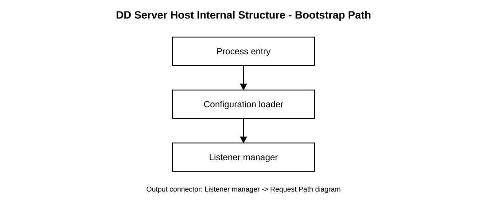
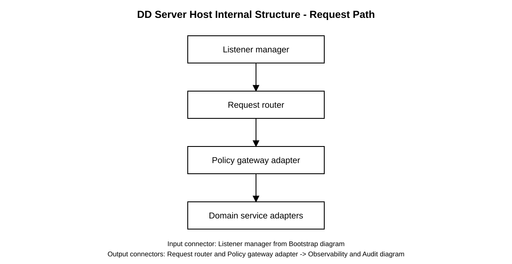
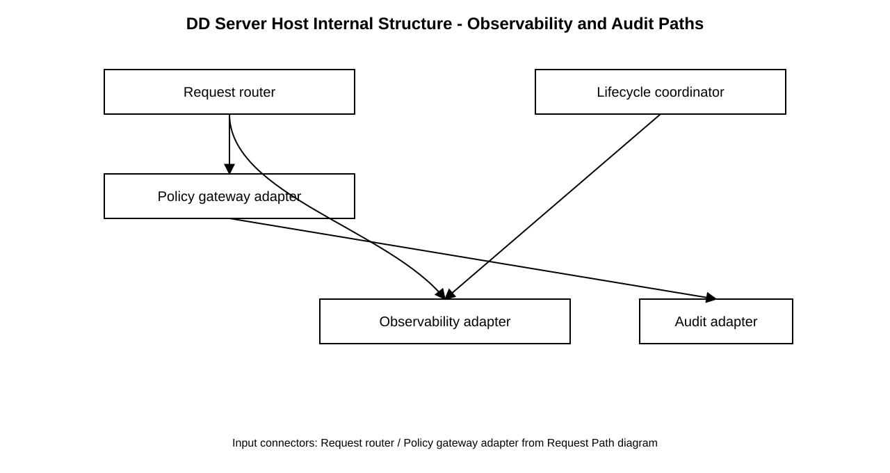

<!--
File: system-documentation/system-artifacts/dd.md

Purpose:
  Detailed Design (DD) for MyLib, refining approved HLA v0.1.2 into
  concrete component interfaces, data models, failure semantics, test intent,
  packaging impact, and traceability.

Lifecycle authority:
  LIFECYCLE.md

Detailed Design refines approved architecture.
It does not authorize implementation.
-->

# Detailed Design (DD)

**Project Name:** MyLib  
**Version:** 0.1  
**Date (YYYY-MM-DD):** 2026-04-28  
**Author(s):** Charles McKnight (maintainers may revise via change control)  
**Status:** Approved  
**Architecture Version Reference:** HLA v0.1.2 **Approved** ([`hla.md`](hla.md "Hla"); approved 2026-04-25)  
**Requirement Version Reference:** SRS v0.9 **Approved** ([`srs.md`](srs.md "Srs"))  
**RTM Version Reference:** 0.1 **Approved** ([`rtm.md`](rtm.md "Rtm"); approved 2026-04-28)  
**Test Plan Version Reference:** 0.1 **Approved** ([`test-plan.md`](test-plan.md "Test Plan"); approved 2026-04-28)  

---

# 1. Design Authority Declaration

Confirm:

- Architecture phase approved? **Yes** — HLA v0.1.2, **2026-04-25**  
- Architectural Component IDs stable? **Yes** — change control and lifecycle rollback apply if IDs or boundaries shift  
- NFR structural intent documented? **Yes** — HLA §8 and SRS NFR-001-NFR-009  
- Advancement to Detailed Design authorized? **Yes** — HLA §15 / Approval, **2026-04-25**  

If any answer becomes “No,” detailed design work must halt and roll back to the earliest impacted phase per [`LIFECYCLE.md`](LIFECYCLE.md "Lifecycle").

---

# 2. Scope of This Design

This DD will refine the approved HLA components:

| HLA Component ID                | DD scope                                                                                                       |
| ------------------------------- | -------------------------------------------------------------------------------------------------------------- |
| **HLA-SHELL**                   | Desktop UI structure, accessibility hooks, theme behavior, settings/help/admin surfaces, native-reader handoff |
| **HLA-CLIENT-ACCESS**           | Client API access, session handling, remote TLS/solo IPC profile handling                                      |
| **HLA-SERVER-HOST**             | Server process entry, listener/binding strategy, request routing, configuration load                           |
| **HLA-DOMAIN**                  | Catalog records, metadata, tags, validation, optimistic concurrency                                            |
| **HLA-INGEST**                  | Import workflow, supported formats, digest calculation, duplicate policy, ingest job state                     |
| **HLA-SEARCH**                  | Full-text index ownership, query grammar implementation, rebuild behavior, keyword fallback                    |
| **HLA-STORAGE**                 | Corpus roots, file references, mediated file access, relink/remove/delete behavior                             |
| **HLA-SECURITY**                | Authentication, RBAC, tenant membership, password/session policy, throttling, bootstrap admin                  |
| **HLA-OCR** / **HLA-BOUND-OCR** | OCR/extraction invocation, containment, provenance, fallback, observability, reproducibility                   |
| **HLA-AUDIT**                   | Security audit event model, append strategy, retention relationship                                            |
| **HLA-OBSLOG**                  | Operational/diagnostic logging, redaction, retention, log locations                                            |
| **HLA-RELEASE**                 | Version/build identity, About/help release surfaces, notices relationship                                      |

Associated requirements: FR-001-FR-041 and NFR-001-NFR-009 as mapped in [`rtm.md`](rtm.md "Rtm").

Explicit exclusions:

- No new architectural components without rollback to Architecture.
- No implementation authorization.
- No packaging-plan approval.
- No test-plan approval.

---

# 3. Architectural Conformance

Approved HLA constraints:

- Shell -> Client Access -> Server Host -> domain services dependency direction.
- Server-side security authority for security-sensitive operations.
- Durable catalog/security state separate from rebuildable search indexes.
- **HLA-BOUND-OCR** contains probabilistic OCR/extraction behavior.
- Solo deployment preserves server authority through loopback or documented local IPC.
- Remote deployment requires TLS or equivalent for non-loopback access.

Confirm:

- No architectural boundaries altered? **Yes**  
- No new external dependencies introduced? **No** — baseline implementation dependencies are now selected in component sections (for example **§4.3.9** and **§4.8.5**); additional dependencies require explicit logging per [`_process/discussion-log.md`](_process/discussion-log.md "Discussion Log") before release adoption  

Detailed Design artifacts SHALL include diagrams where they materially clarify component decomposition, sequence flows, state transitions, deployment/configuration topology, data movement, or failure handling. Mermaid remains the authoring format, and SVG is the publication format for broad Markdown viewer compatibility.

Diagram sources SHALL be stored in [`img-src/`](img-src/ "Mermaid Sources") and rendered to [`img/`](img/ "Diagram Assets"). Vertical orientation (`flowchart TB` and `direction TB`) is the default unless a documented exception is required.

Mermaid source diagrams SHALL set a white-background base theme and wrap the diagram in a top-level white panel so arrows and lines remain readable in dark-mode renderers:

Detailed Design SHALL prefer established design and architecture patterns where applicable (for example, SOLID-oriented component design, Gang of Four object patterns, layering, ports-and-adapters, and similar well-understood approaches) instead of ad-hoc reinvention.

When a custom pattern or deviation from established practice is chosen, DD SHALL document the rationale, alternatives considered, and trade-offs in this artifact and in [`_process/discussion-log.md`](_process/discussion-log.md "Discussion Log") before implementation is authorized.

If no suitable established pattern exists for a specific problem, DD MAY either define a project-specific pattern or record an explicit waiver. Any such definition or waiver SHALL include scope, constraints, rationale, risks, and revisit triggers, and SHALL be logged in [`_process/discussion-log.md`](_process/discussion-log.md "Discussion Log").



Source: [`img-src/dd-refinement-flow.mmd`](img-src/dd-refinement-flow.mmd "Dd Refinement Flow Mermaid Source")

---

# 4. Component Decomposition

This section documents component decomposition. Each component subsection defines responsibilities, non-responsibilities, invariants, interfaces, data contracts, failure behavior, NFR derivation, and test intent before implementation can be authorized.

| DD Section                                                     | Component ID                    | Initial status                    |
| -------------------------------------------------------------- | ------------------------------- | --------------------------------- |
| [§4.1](#41-hla-shell "4.1 HLA-SHELL")                          | **HLA-SHELL**                   | Initial decomposition in progress |
| [§4.2](#42-hla-client-access "4.2 HLA-CLIENT-ACCESS")          | **HLA-CLIENT-ACCESS**           | Initial decomposition in progress |
| [§4.3](#43-hla-server-host "4.3 HLA-SERVER-HOST")              | **HLA-SERVER-HOST**             | Initial decomposition in progress |
| [§4.4](#44-hla-domain "4.4 HLA-DOMAIN")                        | **HLA-DOMAIN**                  | Initial decomposition in progress |
| [§4.5](#45-hla-ingest "4.5 HLA-INGEST")                        | **HLA-INGEST**                  | Initial decomposition in progress |
| [§4.6](#46-hla-search "4.6 HLA-SEARCH")                        | **HLA-SEARCH**                  | Initial decomposition in progress |
| [§4.7](#47-hla-storage "4.7 HLA-STORAGE")                      | **HLA-STORAGE**                 | Initial decomposition in progress |
| [§4.8](#48-hla-security "4.8 HLA-SECURITY")                    | **HLA-SECURITY**                | Initial decomposition in progress |
| [§4.9](#49-hla-ocr--hla-bound-ocr "4.9 HLA-OCR HLA-BOUND-OCR") | **HLA-OCR** / **HLA-BOUND-OCR** | Initial decomposition in progress |
| [§4.10](#410-hla-audit "4.10 HLA-AUDIT")                       | **HLA-AUDIT**                   | Initial decomposition in progress |
| [§4.11](#411-hla-obslog "4.11 HLA-OBSLOG")                     | **HLA-OBSLOG**                  | Initial decomposition in progress |
| [§4.12](#412-hla-release "4.12 HLA-RELEASE")                   | **HLA-RELEASE**                 | Initial decomposition in progress |

Responsibility overlap is prohibited. Architectural change requires rollback to Architecture.

---

## 4.1 HLA-SHELL

**Component ID:** HLA-SHELL  
**Associated Requirement ID(s):** [FR-004](./srs.md#fr-004--deliberate-import "FR-004 Deliberate Import"), [FR-019](./srs.md#fr-019--open-in-native-reader "FR-019 Open in Native Reader"), [FR-020](./srs.md#fr-020--settings-client-preferences "FR-020 Settings Client Preferences"), [FR-021](./srs.md#fr-021--preferred-reader-per-document-type "FR-021 Preferred Reader per Document Type"), [FR-022](./srs.md#fr-022--application-theme "FR-022 Application Theme"), [FR-024](./srs.md#fr-024--shell-accessibility "FR-024 Shell Accessibility"), [FR-025](./srs.md#fr-025--english-ui-v1 "FR-025 English UI v1"), [FR-029](./srs.md#fr-029--operational-and-diagnostic-logging-client-and-server "FR-029 Operational and Diagnostic Logging Client and Server"), [FR-030](./srs.md#fr-030--release-information "FR-030 Release Information"), [FR-031](./srs.md#fr-031--user-account-and-role-administration "FR-031 User Account and Role Administration"), [FR-037](./srs.md#fr-037--catalog-browse-sort-and-pagination "FR-037 Catalog Browse Sort and Pagination"), [FR-039](./srs.md#fr-039--full-text-index-administration "FR-039 Full-Text Index Administration"), [NFR-006](./srs.md#nfr-006--themed-shell-contrast "NFR-006 Themed Shell Contrast"), [NFR-007](./srs.md#nfr-007--end-user-documentation-and-help "NFR-007 End-User Documentation and Help")

**Shell UI/UX design (screens, flows, wireframe log):** [`shell-ui-ux-design.md`](shell-ui-ux-design.md "Shell UI/UX Design") — iterative artifact **subordinate to this section**; captures layout/navigation/detail ahead of **HLA-SHELL** UI implementation.

**Pattern selection:** Presentation-layer shell with view-model/state adapters, command routing to **HLA-CLIENT-ACCESS**, and policy-aware UI gating that reflects but does not enforce security decisions.  
**Pattern rationale:** This keeps UX composition, accessibility, and theme behavior in one layer while preserving strict server authority for protected actions.  
**Alternatives considered:** Embedding business/security decisions directly in UI control logic was rejected due to policy drift and bypass risk.

UI stack decision (v1):

- **Selected stack:** **Qt Quick/QML** shell on top of a C++ application layer.
- **Deferred alternative:** Electron+Vue is not selected for v1 and is reconsidered only if Qt misses documented UX/velocity gates during implementation.
- **Viewer fallback posture:** If in-app PDF search/highlight precision is insufficient, shell flows SHALL provide deterministic server-mediated open handoff (native reader/browser tab) with page/snippet context instead of silent failure.

Qt Quick/QML guardrails (v1):

- QML/Quick owns presentation, interaction flow, and view-state composition.
- Security, authorization, token/session policy, and domain/business decisions SHALL remain in C++ services/view-model adapters and server contracts, not in QML scripts.
- QML-to-C++ integration SHALL use explicit typed bridge/view-model interfaces; direct network/security primitive calls from ad-hoc QML code are prohibited.
- If runtime profiling shows QML/Quick rendering/perf constraints in critical workflows, optimization or targeted native fallback components MAY be introduced without changing the server-authority boundary.

Qt Quick implementation guidance (v1, non-binding mechanics):

- Preferred bridge pattern: `QObject`-based C++ view-model/controller classes exposed to QML with explicit property/signal contracts.
- Bridge DTO posture: map API/domain payloads into narrow UI DTOs before exposing to QML; avoid exposing raw transport/security payload objects directly.
- Signal/slot contract: QML emits intent-level signals (for example `requestSearch`, `submitCorrection`), C++ bridge performs validation/dispatch, then emits structured outcome updates that follow DD status taxonomy.
- Threading posture: long-running/IO/network tasks execute off UI thread; QML thread remains presentation-only.
- Error contract posture: bridge normalizes downstream failures into the canonical envelope/status mapping before binding to QML state.
- Testability posture: bridge interfaces SHOULD be unit-testable without QML runtime; QML view tests focus on rendering/state binding and action wiring, not policy decisions.

### 4.1.1 Responsibilities

HLA-SHELL SHALL:

- Provide primary user interface for browse, search, document actions, settings, help, and release information surfaces.
- Present authentication/session state and invoke server-mediated workflows through **HLA-CLIENT-ACCESS**.
- Provide settings surfaces for client preferences, including reader preferences, theme controls, and client logging controls.
- Provide admin-visible UI surfaces for operations that remain server-authorized (for example account/admin/index actions).
- Launch native-reader flows only via server-mediated authorization and handoff contracts.
- Surface operational outcomes and errors using explicit status classes mapped from downstream contracts.
- Enforce accessibility and themed contrast obligations for shipped shell surfaces.
- Expose discoverable Help affordances to version-matched documentation.

HLA-SHELL SHALL NOT:

- Act as security authority for RBAC/tenant/access control decisions.
- Bypass **HLA-CLIENT-ACCESS** to directly perform protected operations.
- Represent UI visibility as equivalent to permission enforcement.
- Store cleartext credentials or secrets in client diagnostics.
- Claim native reader behavior guarantees beyond documented platform/policy constraints.

Invariants:

- Every protected user action maps to a server-mediated request path.
- Accessibility-critical flows remain reachable and operable through documented keyboard/screen-reader pathways.
- Theme selection persists as client preference and respects contrast requirements for shipped themes.
- Help/version surfaces remain user-discoverable and aligned to running release identity.

### 4.1.2 Interface Contracts

Inbound interfaces:

| Interface                  | Caller           | Contract                                                                                 |
| -------------------------- | ---------------- | ---------------------------------------------------------------------------------------- |
| UI command/action dispatch | User interaction | Routes UI actions to shell handlers and downstream service adapters                      |
| Settings change request    | User/admin       | Validates client preference input and persists preference state through approved path    |
| Help/about request         | User             | Opens help/manual and version information surfaces for running build                     |
| Admin operation request    | Authorized user  | Routes admin actions to server via **HLA-CLIENT-ACCESS** and renders structured outcomes |

Outbound dependencies:

| Target component                                              | Purpose                                                           |
| ------------------------------------------------------------- | ----------------------------------------------------------------- |
| **HLA-CLIENT-ACCESS**                                         | All API/auth/session/operation mediation to server                |
| **HLA-RELEASE** (direct or via client-access/server endpoint) | Version/build identity for About surface                          |
| **HLA-OBSLOG** (client logging controls via client-access)    | Client operational/diagnostic log control and diagnostics         |
| OS integration surfaces                                       | Native reader launch handoff and platform-specific UX affordances |

Input contract posture:

- UI actions SHALL include sufficient context for deterministic command routing and correlation.
- Settings writes SHALL include validated preference payloads and user intent scope.
- Admin UI paths SHALL include server-returned policy context for final operation authorization.

Output contract posture:

- Shell command outcomes SHALL use explicit status classes derived from downstream component contracts.
- Error messages SHALL be actionable and safe, avoiding secret/policy leakage.
- HLA-SHELL status classes SHALL be interpreted as:

| Status class              | Required meaning                                                           | Typical examples                                                    | Required follow-up fields                                                           |
| ------------------------- | -------------------------------------------------------------------------- | ------------------------------------------------------------------- | ----------------------------------------------------------------------------------- |
| `completed`               | User action succeeded and resulting UI state is consistent                 | Search results loaded, settings saved, about dialog shown           | `action_id`, `ui_state_token` (or equivalent), `correlation_id`                     |
| `completed_with_warnings` | Action succeeded but with non-fatal UX or dependency warnings              | Partial result warning, fallback reader warning, stale data warning | All `completed` fields plus `warnings[]`                                            |
| `rejected_validation`     | UI-submitted input invalid before or after server roundtrip                | Invalid settings input, malformed filter values                     | `validation_errors[]`, `error_scope`, `correlation_id`                              |
| `rejected_authentication` | Action blocked by missing/invalid session/auth state                       | Session expired on submit, login required                           | `auth_failure_code`, `reauth_required` (boolean), `correlation_id`                  |
| `rejected_forbidden`      | Action denied by server authorization policy                               | Non-admin invoking admin action                                     | `policy_denial_code`, `correlation_id`                                              |
| `failed_unavailable`      | Action failed due to service/transport/dependency outage                   | Server unreachable, endpoint timeout                                | `failure_code`, `retryable` (boolean), `correlation_id`                             |
| `degraded`                | Action completed with reduced completeness/quality under documented policy | Partial search state, degraded index/relink indicators              | `degradation_code`, `affected_scope`, `next_action_hint`                            |
| `deferred`                | Nonterminal async UI operation queued/postponed with resume path           | Background refresh queued, deferred long-running admin task         | `deferred_reason_code`, `resume_condition` or `deferred_until`, `next_action_owner` |
| `cancelled`               | Action intentionally cancelled by user or policy                           | User cancels dialog flow, duplicate decision cancel propagation     | `cancel_reason_code`, `cancelled_by`, `correlation_id`                              |

- `deferred` SHALL be used only for documented asynchronous operations.
- If no planned resume path exists, status SHALL be `failed_unavailable` rather than `deferred`.

<a id="dd-4121-metadata-enrichment"></a>

### 4.1.2.1 Metadata enrichment during import (optional)

**HLA-SHELL** MAY assist import-time bibliographic entry by surfacing **hints** from (in typical precedence order) embedded PDF/XMP metadata when present, optional **text-derived** suggestions from extraction/OCR previews, and optional **external catalog** lookups. Candidate providers for layered lookup include **Open Library**, **Crossref** (strong for DOI-linked scholarly metadata), and **Library of Congress** search-oriented APIs, subject to each provider’s terms and operational constraints. **Google Books API is excluded** from the product default path due to integration and operational overhead; deployments MAY still add custom providers outside shipped defaults.

Enrichment SHALL remain **assistive only**: **HLA-SHELL SHALL NOT** auto-commit imported catalog metadata from any hint or lookup result. The user **SHALL** explicitly confirm fields (edit/accept/reject per row or explicit “Apply”) before **Start import** commits the payload—consistent with [FR-004](./srs.md#fr-004--deliberate-import "FR-004 Deliberate Import") Notes. Network access for lookups MAY execute in the client bridge or via an operator-approved proxy; telemetry MUST respect [NFR-008](./srs.md#nfr-008--logging-privacy-and-jurisdictional-readiness "NFR-008 Logging Privacy and Jurisdictional Readiness") minimization.

### 4.1.3 Internal Structure

Initial internal modules:

| Module                      | Responsibility                                                                                   |
| --------------------------- | ------------------------------------------------------------------------------------------------ |
| Import metadata assist      | Optional enrichment UX: embedded/extracted hints, ranked external candidates, explicit user apply |
| Shell router/nav controller | Top-level view routing and command dispatch                                                      |
| Auth/session view model     | Login/logout/session-expiry UX state handling                                                    |
| Browse/search workspace     | Catalog browse, search execution, result interaction, filter/sort/paging UX                      |
| Settings workspace          | Preference editing for reader/theme/logging and related validation UX                            |
| Admin workspace             | RBAC-gated admin UI actions and feedback rendering                                               |
| Help/about workspace        | Help/manual entry points and release identity presentation                                       |
| Status/notification mapper  | Maps backend status classes to user-visible notifications and remediation affordances            |
| Accessibility adapter       | Keyboard navigation, focus management, semantic labeling, assistive-technology integration hooks |
| Theme manager               | Theme selection/persistence and contrast-aware token/style mapping                               |

### 4.1.4 Accessibility, Theme, and Help Policy

Accessibility/theme/help baseline:

| Topic                  | DD baseline                                                                                                        |
| ---------------------- | ------------------------------------------------------------------------------------------------------------------ |
| Accessibility target   | Shell UI conforms to WCAG 2.1 AA where applicable to chosen stack                                                  |
| Critical flow coverage | Login, browse/search, open action, settings, help/about, and admin-critical flows included in accessibility checks |
| Selected shell stack   | **Qt Quick/QML + C++ bridge** desktop shell for v1                                                                 |
| Theme set              | Light, dark, and warm sepia shipped themes with required contrast conformance                                      |
| Theme persistence      | Theme preference persists per client install/profile policy                                                        |
| Help discoverability   | User-discoverable Help affordance available from default shell navigation                                          |
| Version alignment      | Help/about surfaces tied to running release identity                                                               |

OCR remediation UI baseline (v1 decision):

- The shell SHALL provide an in-app OCR remediation surface (working name: **OCR Review**) for authorized actors.
- Default authorization posture: uploader of the affected record and administrators (or documented equivalent role) MAY access OCR correction actions.
- The v1 minimum capability is review + edit + submit corrected OCR artifact text for reindex; advanced editing affordances (for example region overlays, side-by-side PDF token alignment, batch correction) remain deferred unless promoted.
- Exact screen layout, interaction model, and keyboard-flow specifics remain a later DD UX-detail pass, but this decision fixes the existence of a user-facing correction surface.

### 4.1.5 Failure Semantics

| Failure                                | Required behavior                                                                                        |
| -------------------------------------- | -------------------------------------------------------------------------------------------------------- |
| Session expires during action          | Surface `rejected_authentication` and reauth guidance without losing unsaved safe context where possible |
| Authorization denial for UI action     | Surface `rejected_forbidden` with safe policy messaging; UI should not imply success                     |
| Server/transport outage                | Surface `failed_unavailable` with retry posture and avoid stale success rendering                        |
| Native reader handoff failure          | Surface actionable failed/degraded state with documented fallback guidance                               |
| Settings validation failure            | Surface `rejected_validation` with field-level guidance; no invalid persistence                          |
| Accessibility fallback needed          | Preserve operable baseline interaction and emit diagnostic for remediation backlog                       |
| Async action unresolved past threshold | Escalate deferred operation per policy to failed/degraded with user-visible guidance                     |

### 4.1.6 Non-Functional Derivation

| NFR                      | HLA-SHELL derivation                                                                                          |
| ------------------------ | ------------------------------------------------------------------------------------------------------------- |
| <nobr>**NFR-006**</nobr> | Implements themed contrast controls and verification hooks across shipped shell themes                        |
| <nobr>**NFR-007**</nobr> | Provides discoverable help/manual access and version-aligned user guidance surfaces                           |
| <nobr>**NFR-005**</nobr> | Ensures policy-honest UX messaging for native-reader handoff, degraded states, and permission-denied outcomes |

### 4.1.7 Testing Alignment

Initial test intent:

- Critical shell workflows map to deterministic status classes under `completed`/`failed_unavailable`/`degraded` scenarios.
- Accessibility checks cover keyboard navigation, focus order, semantic labeling, and critical flow operability.
- Theme switching/persistence works across restarts and meets contrast checks for shipped themes.
- Help entry is discoverable and links to version-matched documentation.
- Admin UI actions cannot bypass server authorization; forbidden outcomes are correctly surfaced.
- Session-expiry and transport-outage cases surface auth/unavailable statuses with safe retry/reauth guidance.
- Native-reader handoff failures produce actionable errors without false-success UI states.
- Deferred async shell operations include required resume metadata and escalation behavior.
- QML/Quick presentation code cannot become policy authority; bridge-layer tests verify that authorization/session decisions remain C++/server enforced.

Canonical `TP-*` identifiers are assigned in [`test-plan.md`](test-plan.md "Test Plan") **§5.1**; RTM records execution mapping and evidence when available.

---

## 4.2 HLA-CLIENT-ACCESS

**Component ID:** HLA-CLIENT-ACCESS  
**Associated Requirement ID(s):** [FR-013](./srs.md#fr-013--server-authority-for-security "FR-013 Server Authority for Security"), [FR-014](./srs.md#fr-014--solo-co-located-deployment "FR-014 Solo Co-Located Deployment"), [FR-016](./srs.md#fr-016--authentication-v1 "FR-016 Authentication v1"), [FR-019](./srs.md#fr-019--open-in-native-reader "FR-019 Open in Native Reader"), [FR-020](./srs.md#fr-020--settings-client-preferences "FR-020 Settings Client Preferences"), [FR-021](./srs.md#fr-021--preferred-reader-per-document-type "FR-021 Preferred Reader per Document Type"), [FR-029](./srs.md#fr-029--operational-and-diagnostic-logging-client-and-server "FR-029 Operational and Diagnostic Logging Client and Server"), [NFR-002](./srs.md#nfr-002--server-side-enforcement "NFR-002 Server-Side Enforcement"), [NFR-004](./srs.md#nfr-004--operator-documentation "NFR-004 Operator Documentation"), [NFR-005](./srs.md#nfr-005--honest-policy-communication "NFR-005 Honest Policy Communication"), [NFR-009](./srs.md#nfr-009--transport-security-remote-access "NFR-009 Transport Security Remote Access")

**Pattern selection:** Client gateway/facade for API communication, transport-profile strategy (solo loopback/local IPC vs remote TLS), and session token adapter isolated from UI concerns.  
**Pattern rationale:** This preserves server-authoritative security while keeping transport/session concerns centralized and testable, with clear separation from shell presentation logic.  
**Alternatives considered:** Letting shell screens call network primitives directly was rejected due to inconsistent auth handling, transport drift, and weaker security posture.

### 4.2.1 Responsibilities

HLA-CLIENT-ACCESS SHALL:

- Provide all client-to-server API communication for authenticated and unauthenticated flows.
- Enforce selected transport profile behavior for solo and remote deployments.
- Manage client-side session material lifecycle (acquire, attach to requests, clear on logout/expiry) without becoming policy authority.
- Surface structured response outcomes and error classifications to **HLA-SHELL** without leaking sensitive data.
- Coordinate open-in-native-reader requests through server-mediated authorization paths.
- Apply client-side request correlation metadata and participate in operational diagnostics for client transport/session behavior.
- Respect client preference settings relevant to access behavior (for example endpoint/profile selection, documented TLS trust configuration UX if applicable).

HLA-CLIENT-ACCESS SHALL NOT:

- Make final authorization/RBAC/tenant decisions (server-only authority).
- Treat hidden UI controls as enforcement.
- Bypass server for protected operations.
- Persist cleartext credentials or long-lived secrets in diagnostic logs.
- Downgrade remote connections to insecure transport as normal behavior.

Invariants:

- Protected operations are always mediated by server APIs.
- Remote profile requests use validated secure transport configuration.
- Session material sent to server is server-issued/recognized; client-generated authorization claims are not trusted.
- Client-access error mapping preserves security boundaries and does not expose secrets.

### 4.2.2 Interface Contracts

Inbound interfaces (from **HLA-SHELL** and local admin surfaces):

| Interface                        | Caller                            | Contract                                                                                                              |
| -------------------------------- | --------------------------------- | --------------------------------------------------------------------------------------------------------------------- |
| Authenticate/login               | **HLA-SHELL**                     | Sends credential payload to server auth endpoint; returns structured auth result and session material only on success |
| Authenticated API request        | **HLA-SHELL** feature flows       | Sends request with required session/token/correlation context and returns structured service outcome                  |
| Logout/session clear             | **HLA-SHELL**                     | Invokes server-side logout/revocation when required and clears client session state                                   |
| Connection/profile setup         | **HLA-SHELL** settings/admin flow | Validates endpoint/profile inputs and persists client preference state where allowed                                  |
| Open-in-reader mediation request | **HLA-SHELL**                     | Requests server-authorized open/download handoff path; returns launchable artifact/reference or denial/error class    |

Outbound dependencies:

| Target component                          | Purpose                                                      |
| ----------------------------------------- | ------------------------------------------------------------ |
| **HLA-SERVER-HOST**                       | Primary API endpoint for all server-bound operations         |
| **HLA-SECURITY** (via server APIs)        | Authentication/session validation and authorization outcomes |
| **HLA-OBSLOG**                            | Client operational/diagnostic logging events and correlation |
| **HLA-RELEASE** (via server/version APIs) | Version/build identity retrieval where surfaced in client    |

Input contract posture:

- Requests SHALL include correlation ID and operation context.
- Authenticated requests SHALL include server-recognized session/token material when required by endpoint policy.
- Remote connection configuration requests SHALL include endpoint identity and trust configuration context.

Output contract posture:

- Responses SHALL classify at least `completed`, `rejected_validation`, `rejected_forbidden`, `rejected_authentication`, `failed_unavailable`, and `deferred` (for asynchronous operations only).
- Client-access operation status classes SHALL be interpreted as:

| Status class              | Required meaning                                                 | Typical examples                                             | Required follow-up fields                                                           |
| ------------------------- | ---------------------------------------------------------------- | ------------------------------------------------------------ | ----------------------------------------------------------------------------------- |
| `completed`               | Request completed successfully and returned expected payload     | Login success, authorized API response, logout success       | `operation_id` (or correlation id), `response_summary`, `correlation_id`            |
| `completed_with_warnings` | Request succeeded with non-fatal warnings affecting UX/quality   | Session nearing expiry warning, fallback endpoint warning    | All `completed` fields plus `warnings[]`                                            |
| `rejected_validation`     | Request rejected due to malformed/invalid client input           | Invalid endpoint URL, malformed request parameters           | `validation_errors[]`, `error_scope`, `correlation_id`                              |
| `rejected_authentication` | Request rejected because authentication/session state is invalid | Invalid credentials, expired/revoked token                   | `auth_failure_code`, `reauth_required` (boolean), `correlation_id`                  |
| `rejected_forbidden`      | Request denied by server-side authorization policy               | Role-based denial, tenant boundary denial                    | `policy_denial_code`, `correlation_id`                                              |
| `failed_unavailable`      | Request could not complete due to transport/dependency outage    | Server unreachable, TLS handshake failure, timeout           | `failure_code`, `retryable` (boolean), `correlation_id`                             |
| `deferred`                | Nonterminal operation queued/postponed with resume path          | Background reconnect attempt, async handoff pending callback | `deferred_reason_code`, `resume_condition` or `deferred_until`, `next_action_owner` |

- `deferred` SHALL NOT be returned for synchronous request paths unless asynchronous behavior is explicitly selected and documented.
- If no planned resume path exists, status SHALL be `failed_unavailable` rather than `deferred`.

### 4.2.3 Internal Structure

Initial internal modules:

| Module                     | Responsibility                                                                                                       |
| -------------------------- | -------------------------------------------------------------------------------------------------------------------- |
| Request facade             | Canonical client API entry points for shell features                                                                 |
| Transport-profile selector | Selects solo vs remote transport behavior and validates profile constraints                                          |
| Session state manager      | Handles token/session storage in memory + approved local persistence (if selected), expiry handling, and clear flows |
| Auth flow adapter          | Login/logout/refresh request orchestration and auth-response mapping                                                 |
| Error/status mapper        | Converts transport/server errors into contract status classes                                                        |
| Correlation/log adapter    | Attaches correlation metadata and emits client diagnostics                                                           |
| Open-handoff adapter       | Handles server-mediated open/download handoff contracts for native reader launch                                     |

### 4.2.4 Transport and Trust Profile Policy

Baseline transport profile:

| Profile           | Required posture                                                   | DD constraints                                                                                             |
| ----------------- | ------------------------------------------------------------------ | ---------------------------------------------------------------------------------------------------------- |
| Solo co-located   | Loopback or documented local IPC; secure-by-local-boundary posture | Must preserve server authority model and avoid accidental remote exposure                                  |
| Remote multi-user | TLS (or equivalent secure channel) required by default             | Certificate/trust handling must be explicit and operator-documentable; warning bypass cannot be normalized |

Trust-handling expectations:

- Remote trust failures SHALL produce actionable but safe errors; client UX SHALL not train users to bypass certificate validation.
- Any trust-on-first-use behavior requires explicit DD decision, operator documentation, and risk disclosure.
- Session/token transport over non-secure remote channels is prohibited.

### 4.2.5 Failure Semantics

| Failure                               | Required behavior                                                                                            |
| ------------------------------------- | ------------------------------------------------------------------------------------------------------------ |
| Server unreachable                    | Return `failed_unavailable` with retry guidance; no fabricated success                                       |
| TLS/trust validation failure (remote) | Return `failed_unavailable` with remediation class; no insecure fallback by default                          |
| Invalid credentials/session           | Return `rejected_authentication` and clear or constrain local session state per policy                       |
| Authorization denial from server      | Return `rejected_forbidden` without exposing sensitive policy internals                                      |
| Token expiry during operation         | Return `rejected_authentication` with reauth-required guidance and idempotent retry posture where applicable |
| Malformed client request input        | Return `rejected_validation` before network call where deterministic local validation exists                 |
| Async handoff not yet complete        | Return deferred only with explicit resume condition and owner                                                |

### 4.2.6 Non-Functional Derivation

| NFR                      | HLA-CLIENT-ACCESS derivation                                                                                    |
| ------------------------ | --------------------------------------------------------------------------------------------------------------- |
| <nobr>**NFR-002**</nobr> | Preserves server-side enforcement by treating client as transport/session mediator, not policy authority        |
| <nobr>**NFR-004**</nobr> | Requires operator/user docs for connection profile setup, trust handling, and client-side logging controls      |
| <nobr>**NFR-005**</nobr> | Enforces honest client messaging around transport limits, trust failures, and native-reader handoff constraints |
| <nobr>**NFR-009**</nobr> | Requires secure remote transport posture with explicit solo-local exception                                     |

### 4.2.7 Testing Alignment

Initial test intent:

- Login/logout/session flows return deterministic status classes for success, auth rejection, and transport failures.
- Protected API calls cannot succeed with missing/invalid/expired session material.
- Remote TLS trust failures reject connections without insecure downgrade.
- Authorization denials are surfaced as forbidden without leaking sensitive policy internals.
- Solo profile does not accidentally target non-local endpoints without explicit configuration.
- Open-in-reader server-mediated handoff enforces access denials and surfaces actionable errors.
- Deferred responses appear only for documented asynchronous operations and include required resume metadata.
- Client diagnostics include correlation IDs and exclude credentials/session secrets.

Canonical `TP-*` identifiers are assigned in [`test-plan.md`](test-plan.md "Test Plan") **§5.1**; RTM records execution mapping and evidence when available.

---

## 4.3 HLA-SERVER-HOST

**Component ID:** HLA-SERVER-HOST  
**Associated Requirement ID(s):** [FR-013](./srs.md#fr-013--server-authority-for-security "FR-013 Server Authority for Security"), [FR-014](./srs.md#fr-014--solo-co-located-deployment "FR-014 Solo Co-Located Deployment"), [FR-015](./srs.md#fr-015--multi-user-server-deployment "FR-015 Multi-User Server Deployment"), [FR-029](./srs.md#fr-029--operational-and-diagnostic-logging-client-and-server "FR-029 Operational and Diagnostic Logging Client and Server"), [NFR-001](./srs.md#nfr-001--corpus-scale-qualitative "NFR-001 Corpus Scale Qualitative"), [NFR-002](./srs.md#nfr-002--server-side-enforcement "NFR-002 Server-Side Enforcement"), [NFR-004](./srs.md#nfr-004--operator-documentation "NFR-004 Operator Documentation"), [NFR-005](./srs.md#nfr-005--honest-policy-communication "NFR-005 Honest Policy Communication"), [NFR-008](./srs.md#nfr-008--logging-privacy-and-jurisdictional-readiness "NFR-008 Logging Privacy and Jurisdictional Readiness"), [NFR-009](./srs.md#nfr-009--transport-security-remote-access "NFR-009 Transport Security Remote Access")

**Pattern selection:** Layered architecture for boundary enforcement, policy-gateway/guard for pre-domain security checks, adapter/facade boundaries for downstream services and observability, and strategy-style deployment-profile handling (solo vs remote) as a controlled variation point.  
**Pattern rationale:** These patterns preserve HLA dependency direction, centralize security and audit interception, and keep transport/profile policy changes isolated from domain logic.  
**Alternatives considered:** Ad-hoc endpoint-specific wiring and mixed host/domain orchestration were rejected to avoid duplicated policy checks, weaker traceability, and harder testability.

### 4.3.1 Responsibilities

HLA-SERVER-HOST SHALL:

- Own server process startup, shutdown, and lifecycle coordination.
- Load server configuration needed before request handling, including deployment profile, bind endpoint, storage/config paths, logging bootstrap settings, and transport profile references.
- Bind the server to the approved deployment profile:
  - Solo profile: loopback or documented local IPC only.
  - Remote profile: network listener using TLS or equivalent documented secure channel.
- Accept inbound client API requests only through the configured listener.
- Route requests to server-side domain services without implementing those services directly.
- Provide the server-side choke point where authentication, authorization, tenant policy, audit, and operational logging are invoked by downstream service paths.
- Expose health/version/bootstrap-discovery endpoints only where they do not bypass security policy or leak protected data.
- Refuse to start or handle protected requests when binding, transport configuration, required secrets, or solo-profile exposure settings are invalid.

HLA-SERVER-HOST SHALL NOT:

- Implement authentication, RBAC, tenant membership, password hashing, or session policy. Those remain **HLA-SECURITY** responsibilities.
- Own catalog, metadata, tags, search index, OCR, audit storage, or corpus file semantics.
- Trust client-supplied role, tenant, or authorization decisions.
- Treat UI hiding, local process colocation, or loopback access as authorization.
- Silently downgrade remote transport security to cleartext.
- Select a concrete framework/runtime in this section without a logged framework/library decision.

Invariants:

- Every remote-capable request path reaches server-side policy enforcement before protected data or mutation.
- Solo and remote deployments use the same logical server authority model.
- Remote profiles do not expose credentials or session tokens over cleartext transport.
- The active deployment profile is explicit and observable in operator diagnostics without exposing secrets.

### 4.3.2 Interface Contracts

Public inbound surfaces:

| Interface                    | Scope                 | Contract                                                                                                                                                                         |
| ---------------------------- | --------------------- | -------------------------------------------------------------------------------------------------------------------------------------------------------------------------------- |
| Client API listener          | Solo and remote       | Accepts requests from **HLA-CLIENT-ACCESS** and dispatches to domain services after transport/session prerequisites are met                                                      |
| Health/status endpoint       | Operator/support      | Reports process liveness and coarse readiness without protected corpus, account, tenant, or secret data                                                                          |
| Version endpoint             | Client/operator       | Returns release/build identity supplied by **HLA-RELEASE**                                                                                                                       |
| Bootstrap discovery endpoint | First-run/admin setup | Exposes only enough state to complete [FR-032](./srs.md#fr-032--initial-administrator-bootstrap "FR-032 Initial Administrator Bootstrap") without bypassing later authentication |

Internal outbound interfaces:

| Target component | Purpose                                                                |
| ---------------- | ---------------------------------------------------------------------- |
| **HLA-SECURITY** | Authentication/session validation, authorization, tenant policy checks |
| **HLA-DOMAIN**   | Catalog and metadata service routing                                   |
| **HLA-INGEST**   | Import workflow routing                                                |
| **HLA-SEARCH**   | Query and index-administration routing                                 |
| **HLA-STORAGE**  | Corpus/file-reference operation routing                                |
| **HLA-AUDIT**    | Security-relevant event emission                                       |
| **HLA-OBSLOG**   | Operational/diagnostic event emission                                  |
| **HLA-RELEASE**  | Version/build identity retrieval                                       |

Input contracts:

- Requests SHALL carry a deployment-profile-compatible transport context.
- Authenticated operations SHALL carry server-recognized session/token material, not client-asserted roles.
- v1 authenticated API calls SHALL use **`Authorization: Bearer <access_jwt>`** for access tokens. Refresh token exchange, explicit logout/revocation, and password-change restricted flows SHALL use explicit authentication endpoints (not cookies) with CSRF-resistant request shapes for browser-embedded clients if introduced later.
- Mutating operations SHALL carry request identity, tenant context, and correlation ID sufficient for audit/diagnostic linkage.

Output contracts:

- Responses SHALL distinguish authentication failure, authorization denial, validation failure, conflict, unavailable dependency, and server fault where doing so does not leak protected information.
- Server-host errors SHALL be safe for users/operators and SHALL NOT include cleartext secrets, passwords, tokens, full document text, or protected corpus content.

Protected-request gateway sequence:

1. Validate listener/profile posture and transport preconditions for the active deployment profile.
2. Resolve request identity and correlation context.
3. Invoke authentication/session validation through **HLA-SECURITY**.
4. Invoke authorization/tenant policy evaluation through **HLA-SECURITY** before domain/service dispatch.
5. Emit required audit and operational diagnostics for the request path.
6. Dispatch to the destination service only after prior gates succeed.

Server-host response taxonomy (host-layer contract):

| Host status class               | Required meaning                                                                                                                    | Typical mapping targets   |
| ------------------------------- | ----------------------------------------------------------------------------------------------------------------------------------- | ------------------------- |
| `rejected_unauthenticated`      | Request did not present valid server-recognized credentials/session                                                                 | HTTP 401 / equivalent     |
| `rejected_forbidden`            | Request authenticated but lacks required authorization/tenant scope                                                                 | HTTP 403 / equivalent     |
| `rejected_invalid_request`      | Request failed host-layer preconditions (profile/transport/required host metadata) before service execution                         | HTTP 400/422 / equivalent |
| `failed_dependency_unavailable` | Required downstream dependency (security, audit, domain, ingest, search, storage, observability) unavailable for this request class | HTTP 503 / equivalent     |
| `failed_host_fault`             | Unexpected host-layer fault prevented safe completion                                                                               | HTTP 500 / equivalent     |

Host status classes are transport-neutral semantic outcomes, not a commitment to a specific protocol. DD/API design MAY map them to protocol-native codes while preserving the semantics above.

### 4.3.3 Internal Structure

Initial internal modules:

| Module                 | Responsibility                                                                                                       |
| ---------------------- | -------------------------------------------------------------------------------------------------------------------- |
| Process entry          | Parse invocation mode, initialize runtime, coordinate shutdown                                                       |
| Configuration loader   | Load and validate deployment profile, bind settings, path settings, transport references, logging bootstrap settings |
| Listener manager       | Bind loopback/local IPC or remote TLS/equivalent listener according to deployment profile                            |
| Request router         | Dispatch request categories to domain services without embedding domain logic                                        |
| Policy gateway adapter | Ensure protected request paths invoke **HLA-SECURITY** before service execution                                      |
| Observability adapter  | Emit operational/diagnostic events and correlation IDs through **HLA-OBSLOG**                                        |
| Audit adapter          | Emit security-relevant events through **HLA-AUDIT** where required                                                   |
| Lifecycle coordinator  | Manage readiness, graceful shutdown, dependency availability, and background job coordination hooks                  |





Sources:
- [`img/dd-server-host-internal-structure-bootstrap.svg`](img/dd-server-host-internal-structure-bootstrap.svg "Dd Server Host Internal Structure Bootstrap")
- [`img/dd-server-host-internal-structure-request-path.svg`](img/dd-server-host-internal-structure-request-path.svg "Dd Server Host Internal Structure Request Path")
- [`img/dd-server-host-internal-structure-observability-path.svg`](img/dd-server-host-internal-structure-observability-path.svg "Dd Server Host Internal Structure Observability Path")
- decomposition reference: [`img-src/dd-server-host-internal-structure.mmd`](img-src/dd-server-host-internal-structure.mmd "Dd Server Host Internal Structure Mermaid Source")

### 4.3.4 Deployment Profiles

| Profile           | Binding posture                  | Transport posture                                               | Required DD proof                                                                                                                                                                                  |
| ----------------- | -------------------------------- | --------------------------------------------------------------- | -------------------------------------------------------------------------------------------------------------------------------------------------------------------------------------------------- |
| Solo co-located   | Loopback `HTTP/S` endpoint only  | TLS not required if the API is not exposed beyond local machine | Binding validation prevents accidental remote exposure; operator docs explain local trust boundary                                                                                                 |
| Remote multi-user | Operator-configured network bind | TLS or equivalent documented secure channel required            | DD defines minimum protocol/cipher posture, certificate and trust-anchor configuration, trusted CA/private CA handling, client trust UX, and startup failure behavior for invalid transport config |

Solo-profile IPC for v1 is standardized on loopback `HTTP/S` shared with **HLA-CLIENT-ACCESS**. This preserves the same server-authority boundary used in remote mode while remaining operator-friendly for diagnostics and support. DD SHALL treat non-loopback solo bindings as invalid configuration, SHALL NOT assume browser-only/public HTTP exposure, and SHALL keep transport semantics aligned with the authenticated server API boundary.

Local-only installs MAY use non-TLS loopback/local IPC, or a self-signed certificate if the chosen local transport requires HTTPS. Distributed remote deployments SHALL use a certificate chain that clients can validate through an explicit trust configuration, such as a public CA or an operator-managed private CA. For commercial/organizational multi-user deployments, client-validatable TLS is mandatory (self-signed-as-normal is prohibited). For family/home multi-user installs on trusted local networks, the product MAY support a documented low-friction profile (for example operator-managed self-signed/private-CA trust bootstrap) where exposure scope is explicitly local and operator messaging is clear about trust assumptions. The v1 baseline assumes operators provide and renew server certificates; product documentation SHALL include detailed guidance for obtaining and configuring certificates, including a public-CA path such as Let's Encrypt / ACME where applicable. Built-in ACME automation is optional future scope unless explicitly selected later in DD. DD SHALL explicitly address private CA deployments, trust-on-first-use vs explicit trust configuration, certificate rotation, hostname/IP mismatch behavior, and clear operator/user messaging. The design SHALL NOT rely on users bypassing certificate warnings as a normal workflow for distributed systems.

v1 trust bootstrap modes:

- **Mode A (commercial/organizational default):** Public CA or operator-managed private CA with explicit client trust configuration; required for normal distributed production operation.
- **Mode B (family/home local-network profile):** Operator-managed self-signed or private-CA bootstrap allowed only for explicitly local/trusted-network deployments with clear trust messaging and no bypass-warning workflow.
- **Mode C (solo local):** Loopback HTTP by default; optional local HTTPS with operator-managed self-signed trust if requested.

Transport floor (remote multi-user):

- Minimum TLS protocol: **TLS 1.2**; preferred default: **TLS 1.3** where available.
- Weak/legacy protocol versions (SSL, TLS 1.0/1.1) are prohibited.
- HTTP fallback is permitted only for loopback/local-only profiles; it is not permitted for distributed remote exposure in release defaults.

Trusted-local-network clarification:

- “Trusted local network” means non-publicly-routable/private address scope (for example RFC1918 ranges) under operator control.
- Authorization rules do not relax on trusted local networks; RBAC/tenant/security policy enforcement remains identical to public-network deployments.
- The difference is transport/trust bootstrap burden and exposure assumptions, not authorization semantics.

### 4.3.5 Failure Semantics

| Failure                                                       | Required behavior                                                                                                                                      |
| ------------------------------------------------------------- | ------------------------------------------------------------------------------------------------------------------------------------------------------ |
| Invalid deployment profile                                    | Server does not start request handling; operator-visible diagnostic explains the invalid profile                                                       |
| Solo profile binds non-local endpoint                         | Server does not start request handling                                                                                                                 |
| Remote profile lacks valid TLS/equivalent configuration       | Server does not start request handling unless explicitly configured as non-production/dev-only and unavailable in release defaults                     |
| Remote client does not trust the configured certificate       | Connection is rejected with clear remediation guidance; users are not instructed to bypass certificate validation as normal operation                  |
| Remote certificate expires                                    | Remote profile rejects protected request handling until a valid certificate is configured; operator diagnostic identifies certificate expiration       |
| Certificate reload request with valid replacement material    | Apply hot-reload without full process restart when supported by runtime; new connections use new cert chain while in-flight requests drain normally    |
| Certificate/key change requires unsupported runtime primitive | Enter documented restart-required path with operator-visible preflight warning and bounded restart guidance                                            |
| Access token nearing expiration during active session         | Client uses refresh flow (`auth/refresh`) without server restart; protected operations continue only after successful refresh policy checks            |
| Required config path unavailable                              | Server does not start request handling or enters documented maintenance/error state with no protected request handling                                 |
| Downstream service unavailable                                | Request returns unavailable/degraded error; no silent mutation                                                                                         |
| Security dependency unavailable                               | Protected request is rejected before reaching domain services                                                                                          |
| Audit/observability dependency unavailable                    | Behavior follows DD policy: audit-critical paths reject protected requests if audit is mandatory; operational diagnostics degrade without leaking data |
| Graceful shutdown requested                                   | Stop accepting new requests, allow bounded in-flight completion, cancel/rollback safe operations per service contracts                                 |

### 4.3.6 Non-Functional Derivation

| NFR                      | HLA-SERVER-HOST derivation                                                                                                                                                                                   |
| ------------------------ | ------------------------------------------------------------------------------------------------------------------------------------------------------------------------------------------------------------ |
| <nobr>**NFR-001**</nobr> | Keeps API host logically stateless where feasible; does not own catalog/index state; preserves future shared-store/multi-instance path                                                                       |
| <nobr>**NFR-002**</nobr> | Provides server-side routing choke point; protected requests invoke **HLA-SECURITY** before service execution                                                                                                |
| <nobr>**NFR-004**</nobr> | Requires operator-visible config, bind, TLS, backup/log path, and startup failure documentation                                                                                                              |
| <nobr>**NFR-005**</nobr> | Does not overstate guarantees for native reader handoff or operator-managed exposure                                                                                                                         |
| <nobr>**NFR-008**</nobr> | Emits only minimized server-host operational data; separates operational diagnostics from security audit records; depends on **HLA-OBSLOG** for sink, retention, redaction, and jurisdictional configuration |
| <nobr>**NFR-009**</nobr> | Enforces remote secure-channel requirement and local-only solo exception                                                                                                                                     |

Certificate/trust baseline is selected jointly between **HLA-SERVER-HOST** and **HLA-CLIENT-ACCESS** with profile-specific modes above. Any change that introduces new framework/library dependencies, persistent trust stores, certificate generation helpers, ACME automation, or materially different operator workflows SHALL be logged as a new DD decision before release adoption.

### 4.3.7 Server Operational and Diagnostic Logging

HLA-SERVER-HOST SHALL emit server-host operational and diagnostic events through **HLA-OBSLOG**. This section defines the producer-side contract only; durable log sinks, retention, redaction implementation, export format, and log-location policy remain **HLA-OBSLOG** responsibilities.

Server-host event categories:

| Event category              | Required content posture                                                                                                                                                                                            |
| --------------------------- | ------------------------------------------------------------------------------------------------------------------------------------------------------------------------------------------------------------------- |
| Startup/shutdown            | Version, deployment profile, coarse lifecycle state, and safe config identifiers; no secrets or full config values                                                                                                  |
| Bind/listener state         | Listener type, bind success/failure class, local-vs-remote posture, and remediation code; no credentials or tokens                                                                                                  |
| Transport/certificate state | Certificate validity window, trust-mode category, expiration warning class, and rotation/reload outcome; no private key, certificate secret, or bypass instruction                                                  |
| Request routing             | Correlation ID, route category, method/action family, status class, duration bucket, and dependency outcome; no full document text, OCR output, passwords, access JWTs, refresh material, or authorization material |
| Dependency readiness        | Coarse availability for security, audit, storage, search, ingest, and observability dependencies; no protected payloads                                                                                             |
| Configuration validation    | Error class and field family needed for remediation; no cleartext secrets, private paths unless explicitly necessary, or full environment dumps                                                                     |
| Graceful shutdown           | Shutdown reason category, bounded drain outcome, and cancelled operation count/category; no protected payloads                                                                                                      |

Privacy constraints:

- Diagnostic and operational logs SHALL NOT contain passwords, access JWTs, refresh token material, private keys, full document text, OCR text output, document payload bytes, cleartext secrets, or unnecessary account/tenant identifiers.
- File paths, document titles, IP addresses, hostnames, account names, and tenant names MAY be personal data in EU or similar jurisdictions. HLA-SERVER-HOST SHALL emit them only when operationally necessary and SHALL support **HLA-OBSLOG** redaction, hashing, truncation, or suppression policy.
- Security-relevant events SHALL be emitted through **HLA-AUDIT** according to audit policy. Operational logs SHALL NOT be treated as an audit substitute.
- Correlation IDs SHALL allow audit and diagnostic records to be joined without duplicating sensitive fields across log families.
- Default diagnostic verbosity SHALL be conservative. Debug/trace logging SHALL be disabled by default and, if enabled, SHALL be operator-visible, bounded by role/policy, and suitable for time-limited troubleshooting.
- Operator documentation SHALL describe server-host log families, default locations once selected, retention policy once selected, privacy implications, and safe support-bundle handling.

If the operational logging sink is unavailable after startup, HLA-SERVER-HOST MAY degrade to a minimal safe fallback such as console/platform service logging, provided fallback output follows the same privacy constraints. If mandatory audit emission is unavailable for audit-critical paths, protected request handling SHALL be rejected according to **HLA-AUDIT** policy rather than silently proceeding.

### 4.3.8 Testing Alignment

Initial test intent:

- Startup fails for invalid deployment profile.
- Solo profile cannot bind wildcard/non-loopback endpoints.
- Remote profile refuses startup without valid TLS/equivalent configuration.
- Remote client rejects untrusted certificates with clear remediation guidance.
- Certificate rotation or replacement does not require weakening remote transport validation.
- Expired remote certificate prevents protected request handling and produces clear operator diagnostics.
- Health/version endpoints do not expose protected data.
- Protected API route cannot reach domain service without server-side security invocation.
- Missing/invalid `Authorization: Bearer` access token is rejected with host-layer `rejected_unauthenticated` before domain dispatch.
- Protected API route follows the defined gateway sequence (transport/profile checks -> identity/correlation -> authn -> authz -> audit/diagnostics -> dispatch).
- Host-layer failures map to the server-host response taxonomy with stable semantics independent of transport protocol.
- Server startup, listener, transport, dependency readiness, request routing, and shutdown events are emitted to **HLA-OBSLOG** with correlation IDs where applicable.
- Correlation IDs appear in operational diagnostics without leaking secrets.
- Diagnostic logs exclude passwords, tokens, private keys, full document text, OCR output, cleartext secrets, and protected payloads.
- Debug/trace logging is disabled by default and cannot be enabled invisibly.
- Graceful shutdown stops new requests and handles in-flight requests according to bounded policy.

Canonical `TP-*` identifiers are assigned in [`test-plan.md`](test-plan.md "Test Plan") **§5.1**; RTM records execution mapping and evidence when available.

### 4.3.9 Implementation Stack Baseline (v1)

This subsection records the v1 server-host implementation downselect and baseline dependencies. These selections satisfy the framework/library decision logging requirement for this component and SHALL be kept under explicit version pinning and change control.

| Area                           | v1 baseline selection                                                                                      | Notes and guardrails                                                                                                                     |
| ------------------------------ | ---------------------------------------------------------------------------------------------------------- | ---------------------------------------------------------------------------------------------------------------------------------------- |
| Server implementation language | **C++** (modern standard baseline: C++20 or later)                                                         | Chosen for maintainer fluency, packaging control, and OCR/ingest performance headroom                                                    |
| HTTP server/runtime model      | **Boost.Beast + Asio** (`Boost 1.86.0`)                                                                    | Async host model with explicit lifecycle/shutdown/backpressure handling                                                                  |
| TLS/secure transport           | **OpenSSL 3.0.14**                                                                                         | Remote profile TLS posture and certificate validation requirements from §4.3.4 remain mandatory                                          |
| Password hashing primitive     | **Argon2id** via C/C++ binding (`libargon2` API-level baseline; concrete package pin tracked per platform) | Binding package/version remains tracked under **HLA-SECURITY** and release manifests                                                     |
| Token format support           | **Access JWT** + **opaque refresh** (no cookie session model)                                              | JWT signing/verification uses **`jwt-cpp 0.7.1`** integrated with **OpenSSL 3.0.14** and **nlohmann/json**; policy details in **§4.8.5** |
| Logging and formatting         | **spdlog 1.14.1** + **fmt 11.0.2**                                                                         | Structured/safe logging constraints from §4.3.7 are unchanged                                                                            |
| Serialization                  | **nlohmann/json 3.11.3**                                                                                   | May be replaced for performance only with compatibility tests and logged decision                                                        |
| Test framework                 | **Catch2 3.7.1**                                                                                           | Test-plan phase will bind concrete case IDs and coverage thresholds                                                                      |

Database/store posture for host-routed services:

- Solo/co-located deployments SHALL use **SQLite** as the default durable store.
- Remote multi-user deployments SHALL support a **PostgreSQL** backend via the same service/repository contracts.
- Application contracts SHALL remain backend-agnostic; persistence implementation differences SHALL NOT change API semantics without a logged design decision.

Dependency-management and reproducibility guardrails:

- Dependency versions SHALL be pinned and tracked in repository-managed manifests/lock posture.
- Toolchain/build profiles SHALL be documented for Windows, macOS, and Linux.
- Runtime/library upgrades that affect transport, security, query semantics, OCR behavior, or artifact reproducibility SHALL be logged in [`_process/discussion-log.md`](_process/discussion-log.md "Discussion Log") before release adoption.

### 4.3.10 Host runtime guardrails (v1 defaults)

Unless explicitly overridden by documented operator configuration:

| Guardrail                                             | Default                                                                                         |
| ----------------------------------------------------- | ----------------------------------------------------------------------------------------------- |
| Max request-line size                                 | 8 KiB                                                                                           |
| Max cumulative request-header size                    | 16 KiB                                                                                          |
| Max request body size (general API)                   | 1 MiB                                                                                           |
| Max request body size (ingest/admin import endpoints) | 32 MiB                                                                                          |
| TLS handshake timeout                                 | 10 seconds                                                                                      |
| Request header read timeout                           | 10 seconds                                                                                      |
| Request body read timeout                             | 60 seconds                                                                                      |
| Response write timeout                                | 60 seconds                                                                                      |
| Keep-alive idle timeout                               | 75 seconds                                                                                      |
| Max concurrent open connections per host instance     | 1024                                                                                            |
| Max in-flight protected requests                      | 256                                                                                             |
| Overload behavior                                     | Reject excess work with unavailable/backpressure response; do not silently queue unbounded work |
| Graceful shutdown drain window                        | 30 seconds (then cancel/rollback per service safety contract)                                   |

### 4.3.10.1 Remote certificate/trust runbook baseline (v1)

This subsection defines the minimum operator runbook depth required for remote multi-user certificate and trust handling. Product/operator documentation SHALL implement these procedures without changing their security posture.

Runbook scope:

- Applies to remote multi-user deployments only (Mode A and Mode B in **§4.3.4**).
- Covers issuance/bootstrap, install/activation, renewal/rotation, failure remediation, and verification.
- Does not permit insecure downgrade or warning-bypass workflow as normal operation.

Allowed issuance/bootstrap paths:

| Path                                    | Allowed profile  | Baseline requirements                                                                                                              |
| --------------------------------------- | ---------------- | ---------------------------------------------------------------------------------------------------------------------------------- |
| Public CA (including ACME-issued certs) | Mode A (default) | Leaf cert + full chain + key configured; SAN includes operator-published hostnames; automated/manual renewal documented            |
| Operator-managed private CA             | Mode A or Mode B | CA hierarchy and trust-anchor distribution documented; client trust stores explicitly managed; issuance/renewal ownership assigned |
| Self-signed leaf (no CA hierarchy)      | Mode B only      | Restricted to explicitly local/trusted-network use; explicit trust bootstrap instructions and risk messaging required              |

Install and activation baseline:

1. Stage replacement certificate material (`leaf`, `intermediate/fullchain`, `private key`) in configured paths with least-privilege permissions.
2. Run preflight checks (key/cert pair match, validity window, SAN/hostname alignment, chain completeness).
3. Execute host certificate reload endpoint/command where supported; otherwise follow restart-required path with bounded drain window.
4. Verify post-activation state through client connection and server diagnostic checks before declaring success.

Renewal and rotation baseline:

- Expiry warning thresholds SHALL be operator-visible at minimum at **30 days**, **14 days**, and **7 days** before not-after.
- Renewal responsibility SHALL be explicitly assigned (automation owner or manual owner) per deployment.
- Planned rotation SHALL include rollback-ready previous certificate material until verification completes.
- Key-compromise suspicion SHALL force keypair replacement (not cert-only renewal) and immediate trust-impact review.

Client trust distribution baseline:

- Public-CA path relies on OS/browser trust roots; private-CA/self-signed paths require explicit client trust-anchor installation guidance per supported OS.
- Trust bootstrap instructions SHALL include validation checks, removal/rollback steps, and warnings against ad-hoc warning bypass.
- Hostname/certificate mismatch handling SHALL instruct correction of DNS/SAN/configuration, not client warning override.

Failure playbooks (minimum):

| Failure class                                           | Required runbook action                                                                                                                                |
| ------------------------------------------------------- | ------------------------------------------------------------------------------------------------------------------------------------------------------ |
| Certificate expired or expiring inside emergency window | Renew/reissue immediately, activate replacement, verify remote handshake; protected remote handling remains unavailable until valid material is active |
| Hostname mismatch (SAN/CN vs endpoint)                  | Reissue certificate with correct SAN set or correct endpoint configuration; verify using target hostname                                               |
| Chain incomplete/untrusted issuer                       | Install full intermediate chain or distribute required private-CA root/intermediate trust anchor to clients                                            |
| Key/certificate mismatch                                | Replace with matching keypair material; rerun preflight before activation                                                                              |
| Reload unsupported or failed                            | Execute documented restart-required path with graceful drain; verify listener state and cert fingerprint after restart                                 |
| Suspected private-key compromise                        | Revoke/replace affected certs as applicable, rotate keys, redistribute trust where needed, audit incident timeline                                     |

Verification checklist (minimum):

- Host-side: certificate not-after window, SAN set, and trust-mode category are visible in diagnostics without secret leakage.
- Client-side: TLS handshake succeeds without warning bypass against intended hostname.
- Policy-side: remote profile still rejects invalid/untrusted certificates after rotation (negative test retained).

### 4.3.11 Ready-for-approval checklist

| Topic                                                           | Status                    | Notes                                                                                                                                                       |
| --------------------------------------------------------------- | ------------------------- | ----------------------------------------------------------------------------------------------------------------------------------------------------------- |
| Server-authority gateway and host response taxonomy             | **Complete**              | Defined in **§4.3.2** with explicit pre-dispatch security sequence                                                                                          |
| Deployment profile split (solo vs remote)                       | **Complete**              | Defined in **§4.3.4** including loopback-only solo and remote secure-channel posture                                                                        |
| TLS trust bootstrap modes                                       | **Complete**              | Mode A/B/C policy defined in **§4.3.4**                                                                                                                     |
| Transport floor and HTTP fallback posture                       | **Complete**              | TLS minimum + legacy prohibition + local-only HTTP fallback in **§4.3.4**                                                                                   |
| Certificate lifecycle behavior                                  | **Complete**              | Hot-reload vs restart-required semantics in **§4.3.5**                                                                                                      |
| Host runtime guardrails (size/timeout/concurrency/backpressure) | **Complete**              | v1 defaults in **§4.3.10**                                                                                                                                  |
| Host stack version baseline                                     | **Partial**               | Core pins set in **§4.3.9**; Argon2 binding package pin remains tracked under **HLA-SECURITY** release manifests                                            |
| Operator runbook depth (cert issuance/renewal/trust bootstrap)  | **Complete**              | Baseline runbook requirements and failure playbooks defined in **§4.3.10.1**; publishable operator procedures still derive from this contract under NFR-004 |
| Test IDs in component-local testing alignment                   | **Deferred by lifecycle** | Test intent is defined in **§4.3.8**; canonical test IDs are assigned in Test Plan phase                                                                    |

---

## 4.4 HLA-DOMAIN

**Component ID:** HLA-DOMAIN  
**Associated Requirement ID(s):** [FR-001](./srs.md#fr-001--catalog-records "FR-001 Catalog Records"), [FR-002](./srs.md#fr-002--metadata-fields "FR-002 Metadata Fields"), [FR-003](./srs.md#fr-003--tags "FR-003 Tags"), [FR-037](./srs.md#fr-037--catalog-browse-sort-and-pagination "FR-037 Catalog Browse Sort and Pagination"), [FR-040](./srs.md#fr-040--metadata-validation "FR-040 Metadata Validation"), [FR-041](./srs.md#fr-041--concurrent-metadata-updates "FR-041 Concurrent Metadata Updates"), [NFR-001](./srs.md#nfr-001--corpus-scale-qualitative "NFR-001 Corpus Scale Qualitative"), [NFR-004](./srs.md#nfr-004--operator-documentation "NFR-004 Operator Documentation"), [NFR-005](./srs.md#nfr-005--honest-policy-communication "NFR-005 Honest Policy Communication"), [NFR-008](./srs.md#nfr-008--logging-privacy-and-jurisdictional-readiness "NFR-008 Logging Privacy and Jurisdictional Readiness")

**Pattern selection:** Domain-service layer with repository boundaries, command/query separation for mutation vs retrieval paths, validator pipeline for metadata rules, and optimistic-concurrency guard on mutating operations.  
**Pattern rationale:** This keeps the catalog model authoritative, centralizes validation and conflict policy, and prevents ingest/search/storage concerns from embedding record semantics.  
**Alternatives considered:** Letting each caller implement metadata/tag validation or conflict behavior was rejected due to policy drift, inconsistent user outcomes, and weaker traceability.

### 4.4.1 Responsibilities

HLA-DOMAIN SHALL:

- Own authoritative catalog record lifecycle semantics for create, read, update, and remove/archive behavior.
- Own canonical metadata and tag rules at the domain boundary, including required-field checks, type/value validation, and normalization policy as defined by DD.
- Enforce optimistic concurrency behavior for metadata/tag mutations per [FR-041](./srs.md#fr-041--concurrent-metadata-updates "FR-041 Concurrent Metadata Updates").
- Provide browse/list/read models for catalog views and APIs, including deterministic sort/pagination behavior required by [FR-037](./srs.md#fr-037--catalog-browse-sort-and-pagination "FR-037 Catalog Browse Sort and Pagination").
- Persist and expose domain state transitions required by ingest/storage/search integration (for example import-created, degraded missing-file state, removed/archive state) without owning file-byte operations.
- Coordinate with **HLA-STORAGE** and **HLA-SEARCH** through explicit contracts while remaining authoritative for record identity and catalog truth.
- Emit required audit/diagnostic events through adapters without embedding sink-specific behavior.

HLA-DOMAIN SHALL NOT:

- Own authentication, RBAC, tenant membership evaluation, or session checks; those remain **HLA-SECURITY** responsibilities.
- Read/write corpus bytes directly; those remain **HLA-STORAGE** responsibilities.
- Implement indexing engine internals, query parsing/ranking logic, or OCR extraction behavior.
- Perform UI-only validation as authoritative enforcement; server-side domain validation is required for all protected mutation paths.
- Silently apply last-write-wins on concurrent metadata updates.

Invariants:

- Catalog record identity and canonical metadata state are authoritative in **HLA-DOMAIN**.
- Every mutating domain operation passes validation and concurrency checks before commit.
- Conflict outcomes are explicit and deterministic; no silent overwrite on version mismatch.
- Domain responses are policy-honest and do not claim guarantees not enforced by server behavior.
- Domain-level diagnostics avoid full protected payloads and unnecessary personal data.

### 4.4.2 Interface Contracts

Inbound interfaces:

| Interface                   | Caller                                                                                 | Contract                                                                                                                |
| --------------------------- | -------------------------------------------------------------------------------------- | ----------------------------------------------------------------------------------------------------------------------- |
| Create/import record        | **HLA-INGEST** via **HLA-SERVER-HOST**                                                 | Creates catalog record and associations from validated ingest payload and returns authoritative record identity/version |
| Read/list/browse records    | **HLA-SERVER-HOST** / **HLA-CLIENT-ACCESS** mediation, **HLA-SEARCH** enrichment paths | Returns catalog views filtered by authorization context supplied upstream and shaped for browse/read use                |
| Update metadata/tags        | **HLA-SERVER-HOST** routes for interactive/admin operations                            | Validates mutation payload, enforces optimistic concurrency, commits or returns explicit validation/conflict result     |
| Remove/archive record       | Admin/remediation flow via **HLA-SERVER-HOST**                                         | Applies catalog removal/archive semantics distinct from storage byte deletion                                           |
| Mark degraded/restore state | **HLA-STORAGE**, ingest/repair flows                                                   | Applies domain state transitions for missing/relinked references with traceable reason codes                            |

Outbound dependencies:

| Target component | Purpose                                                                                                                |
| ---------------- | ---------------------------------------------------------------------------------------------------------------------- |
| **HLA-SECURITY** | Receives evaluated policy context and principal scope from upstream checks; may request policy enrichment where needed |
| **HLA-STORAGE**  | Resolve/update reference associations and reflect missing/relink outcomes in domain state                              |
| **HLA-SEARCH**   | Publish/update canonical record fields required for indexing/search projections                                        |
| **HLA-AUDIT**    | Emit security-relevant domain mutations and conflict-sensitive admin actions where required                            |
| **HLA-OBSLOG**   | Emit operational/diagnostic events for validation failures, conflict classes, and dependency outcomes                  |

Input contract posture:

- Mutating requests SHALL include record identity (or creation context), caller/policy context from upstream enforcement, correlation ID, and concurrency token/version where applicable.
- Validation requests SHALL use explicit field-level payloads and SHALL reject ambiguous partial mutations unless DD defines merge semantics explicitly.
- Browse/list requests SHALL include deterministic sort and pagination parameters, including documented defaults and bounds.

Output contract posture:

- Mutations SHALL return explicit classes from the defined status taxonomy (`completed`, `rejected_validation`, `rejected_conflict`, `rejected_forbidden`, `failed_unavailable`) and operation-specific not-found/read outcomes where applicable.
- Conflict responses SHALL include actionable resolution posture (for example refresh and retry guidance) without leaking protected details.
- Browse/list responses SHALL provide stable ordering semantics and pagination cursors/offset semantics per DD.
- Domain mutation status classes SHALL be interpreted as:

| Status class          | Required meaning                                                                      | Typical examples                                                        | Required follow-up fields                                                                       |
| --------------------- | ------------------------------------------------------------------------------------- | ----------------------------------------------------------------------- | ----------------------------------------------------------------------------------------------- |
| `completed`           | Mutation committed successfully and authoritative version advanced                    | Metadata update accepted; tag update accepted; remove/archive committed | `record_id`, `record_version`, `updated_fields` (or mutation summary), `correlation_id`         |
| `rejected_validation` | Mutation rejected due to domain validation rules with no state change                 | Invalid field value, missing required field, invalid tag payload        | `validation_errors[]`, `error_scope`, `record_version` (current if available), `correlation_id` |
| `rejected_conflict`   | Mutation rejected due to optimistic concurrency/version mismatch with no state change | Stale update token, concurrent edit already committed                   | `conflict_code`, `current_record_version`, `retry_hint`, `correlation_id`                       |
| `rejected_forbidden`  | Mutation denied by policy/authorization context before commit                         | Role lacks permission, tenant scope mismatch                            | `policy_denial_code`, `correlation_id`                                                          |
| `failed_unavailable`  | Mutation not committed due to dependency/persistence unavailability                   | Repository unavailable, required dependency timeout                     | `failure_code`, `retryable` (boolean), `correlation_id`                                         |

- For domain mutation APIs, `deferred` is not a valid completion class; callers receive either committed, rejected, or `failed_unavailable` outcomes.

### 4.4.3 Internal Structure

Initial internal modules:

| Module                       | Responsibility                                                                         |
| ---------------------------- | -------------------------------------------------------------------------------------- |
| Catalog service              | Record lifecycle orchestration and canonical state management                          |
| Metadata validator           | Field-level validation, normalization, and constraint checks                           |
| Tag policy service           | Tag create/update semantics, dedup/normalization policy, and tag constraints           |
| Concurrency guard            | Version token checks and conflict classification for mutable operations                |
| Browse query service         | Deterministic sorting, paging, and read-model assembly                                 |
| State-transition coordinator | Domain status transitions (active/degraded/removed/archive) and reason taxonomy        |
| Repository adapter           | Durable persistence abstraction for records, metadata, tags, versions, and state flags |
| Domain event adapter         | Audit and operational event publication with correlation metadata                      |

### 4.4.4 Validation and Concurrency Policy

Validation baseline:

| Topic         | DD baseline                                                                                    |
| ------------- | ---------------------------------------------------------------------------------------------- |
| Authority     | Server-side domain validation is authoritative for all record metadata/tag mutations           |
| Field model   | Required/optional semantics for metadata fields follow SRS and DD-defined schema constraints   |
| Error model   | Validation errors are structured and actionable; no silent coercion of invalid values          |
| Normalization | Normalization rules are explicit and consistent across create/update/import paths              |
| Extensibility | Validation framework allows future field additions without breaking existing accepted payloads |

Concurrency baseline:

| Topic             | DD baseline                                                                                      |
| ----------------- | ------------------------------------------------------------------------------------------------ |
| Strategy          | Optimistic concurrency at record level using version token/revision                              |
| Conflict trigger  | Mutation token mismatch between request and current stored version                               |
| Conflict outcome  | Mutation rejected with explicit conflict classification; caller refresh/retry required           |
| Forbidden default | Silent last-write-wins behavior is prohibited unless SRS is reopened and decision logged         |
| Scope             | Applies to metadata/tag mutation paths and any domain operation modifying canonical record state |

### 4.4.5 Browse and Read Semantics

Browse/list baseline:

- Domain browse responses SHALL be deterministic for documented sort keys and tie-break behavior.
- Pagination semantics (offset/page or cursor) SHALL be explicit and stable under steady catalog state.
- Domain SHALL provide enough structured fields for shell browse/search result composition without exposing unnecessary internals.
- Authorization filtering remains server-enforced upstream; domain contracts SHALL not assume client-side filtering as a safety mechanism.

### 4.4.6 Integration Boundaries

Boundary expectations:

| Boundary          | Required behavior                                                                                                                 |
| ----------------- | --------------------------------------------------------------------------------------------------------------------------------- |
| Domain ↔ Storage  | Domain owns canonical record and reference association semantics; storage owns byte access and missing/relink detection mechanics |
| Domain ↔ Search   | Domain provides canonical record identity/metadata projection; search owns derived index and query execution                      |
| Domain ↔ Ingest   | Ingest orchestrates import pipeline; domain remains authority for persisted record validity and canonical mutation rules          |
| Domain ↔ Security | Security enforces identity/authorization; domain consumes authorized context and never bypasses server policy checks              |

### 4.4.7 Failure Semantics

| Failure                                                       | Required behavior                                                      |
| ------------------------------------------------------------- | ---------------------------------------------------------------------- |
| Metadata validation failure                                   | Reject mutation with field-level classification; no partial commit     |
| Concurrency token mismatch                                    | Reject mutation with explicit conflict result and retry posture        |
| Referenced record not found                                   | Return not-found classification without creating implicit replacements |
| Persistence unavailable                                       | Return unavailable/degraded result; no silent data loss                |
| Dependency unavailable (storage/search)                       | Surface `failed_unavailable` classification with no false success      |
| Unauthorized mutation attempt reaching domain boundary        | Reject as forbidden and emit audit where policy requires               |
| State transition conflict (for example relink vs remove race) | Return deterministic conflict outcome; no ambiguous mixed state        |

### 4.4.8 Non-Functional Derivation

| NFR                      | HLA-DOMAIN derivation                                                                                                          |
| ------------------------ | ------------------------------------------------------------------------------------------------------------------------------ |
| <nobr>**NFR-001**</nobr> | Encapsulates catalog read/write behavior behind stable contracts supporting scale-oriented query and pagination evolution      |
| <nobr>**NFR-004**</nobr> | Requires documentation of metadata validation rules, conflict semantics, browse/pagination behavior, and remediation workflows |
| <nobr>**NFR-005**</nobr> | Enforces honest mutation/read outcomes (validation/conflict/degraded) without overstating consistency guarantees               |
| <nobr>**NFR-008**</nobr> | Limits sensitive metadata in diagnostics and relies on OBSLOG/AUDIT policies for minimization and retention posture            |

### 4.4.9 Testing Alignment

Initial test intent:

- Create/read/update/remove/archive operations preserve authoritative record identity and version semantics.
- Metadata validation rejects invalid field values with deterministic structured errors.
- Tag operations enforce normalization/dedup policy and persist expected results.
- Concurrent metadata updates trigger optimistic-concurrency conflicts; no silent overwrite.
- Browse/list sort and pagination behavior remains stable under steady-state fixtures.
- Missing/relinked storage signals drive explicit domain degraded/restore transitions.
- Domain mutation outcomes correctly classify `completed`, `rejected_validation`, `rejected_conflict`, not-found, and `failed_unavailable`.
- Domain diagnostics and audit events avoid protected payload leakage and preserve correlation IDs.

Canonical `TP-*` identifiers are assigned in [`test-plan.md`](test-plan.md "Test Plan") **§5.1**; RTM records execution mapping and evidence when available.

---

## 4.5 HLA-INGEST

**Component ID:** HLA-INGEST  
**Associated Requirement ID(s):** [FR-004](./srs.md#fr-004--deliberate-import "FR-004 Deliberate Import"), [FR-005](./srs.md#fr-005--supported-document-types-v1 "FR-005 Supported Document Types v1"), [FR-006](./srs.md#fr-006--full-text-indexing-when-permitted "FR-006 Full-Text Indexing when permitted"), [FR-009](./srs.md#fr-009--keywords-when-indexing-blocked "FR-009 Keywords When Indexing Blocked"), [FR-010](./srs.md#fr-010--duplicate-detection-digest "FR-010 Duplicate Detection Digest"), [FR-011](./srs.md#fr-011--missing-file-detection-and-relink "FR-011 Missing File Detection and Relink"), [FR-023](./srs.md#fr-023--ocr-for-searchability "FR-023 OCR for Searchability"), [FR-039](./srs.md#fr-039--full-text-index-administration "FR-039 Full-Text Index Administration"), [NFR-001](./srs.md#nfr-001--corpus-scale-qualitative "NFR-001 Corpus Scale Qualitative"), [NFR-004](./srs.md#nfr-004--operator-documentation "NFR-004 Operator Documentation"), [NFR-005](./srs.md#nfr-005--honest-policy-communication "NFR-005 Honest Policy Communication"), [NFR-008](./srs.md#nfr-008--logging-privacy-and-jurisdictional-readiness "NFR-008 Logging Privacy and Jurisdictional Readiness")

**Pattern selection:** Pipeline/workflow orchestration for staged import execution, policy-gated decision points for duplicate/indexability outcomes, and adapter boundaries for digesting, extraction/OCR invocation, storage access, and domain/search updates.  
**Pattern rationale:** These patterns keep ingest deterministic and auditable, isolate probabilistic OCR/extraction behind an explicit boundary, and prevent storage/search/domain concerns from being coupled into one monolithic import path.  
**Alternatives considered:** A single opaque import function with direct writes to every downstream store was rejected due to weak observability, hard-to-test failure semantics, and higher risk of partial inconsistency.

### 4.5.1 Responsibilities

HLA-INGEST SHALL:

- Orchestrate deliberate import workflows from authorized requests, including preflight checks, duplicate detection, ingest execution, and completion/failure reporting.
- Validate supported type eligibility for v1 ingest paths and return explicit unsupported-type outcomes.
- Compute and persist content digest metadata (algorithm + value) per [FR-010](./srs.md#fr-010--duplicate-detection-digest "FR-010 Duplicate Detection Digest") through coordinated domain/storage contracts.
- Enforce duplicate-decision gating (no silent skip/merge/replace defaults) before committing conflicting imports.
- Coordinate storage byte-access and reference establishment through **HLA-STORAGE**.
- Create/update canonical catalog records through **HLA-DOMAIN** with authoritative import state and ingest provenance.
- Invoke indexing-related processing through **HLA-SEARCH** and probabilistic extraction/OCR through **HLA-OCR** only via the defined boundary contract.
- Classify indexability outcomes (indexed, OCR-derived indexed, index-blocked, indexing-failed/deferred) with explicit user/operator-visible semantics.
- Emit audit-relevant and operational diagnostics with correlation IDs for import traces.

HLA-INGEST SHALL NOT:

- Own canonical catalog validation/concurrency semantics (belongs to **HLA-DOMAIN**).
- Own corpus byte persistence implementation (belongs to **HLA-STORAGE**).
- Own query grammar/ranking/index retrieval behavior (belongs to **HLA-SEARCH**).
- Implement OCR engine internals or bypass **HLA-BOUND-OCR** containment.
- Silently resolve duplicate candidates without explicit actor decision.
- Expose successful-import status when downstream mandatory stages failed.

Invariants:

- Every import workflow has a traceable ingest job identity and correlation context.
- Duplicate candidates require explicit decision before final commit path.
- OCR/extraction calls occur only through the **HLA-OCR** boundary contract, never by direct engine coupling in ingest.
- Import outcomes are explicit about deterministic vs probabilistic processing used.
- Partial failures produce documented recoverable states; no ambiguous silent success.

### 4.5.2 Interface Contracts

Inbound interfaces:

| Interface               | Caller                                               | Contract                                                                                                                                    |
| ----------------------- | ---------------------------------------------------- | ------------------------------------------------------------------------------------------------------------------------------------------- |
| Start import            | Authorized client/admin path via **HLA-SERVER-HOST** | Accepts source reference, declared/derived document type, actor context, and import options; returns ingest job identity and initial status |
| Decide duplicate action | Interactive/admin flow                               | Accepts explicit duplicate decision (cancel or approved continuation options per DD) and resumes/ends staged workflow                       |
| Query ingest status     | Client/admin/support                                 | Returns ingest job lifecycle state, stage outcomes, and actionable failure/degraded details                                                 |
| Retry/reprocess stage   | Admin/maintenance                                    | Re-executes failed/deferred stages under policy and idempotency rules                                                                       |

Outbound dependencies:

| Target component                | Purpose                                                                                            |
| ------------------------------- | -------------------------------------------------------------------------------------------------- |
| **HLA-SECURITY**                | Receives authorization/policy context; enforces role constraints for import and admin operations   |
| **HLA-STORAGE**                 | Reads source bytes, establishes/validates corpus references, reports missing/unreadable conditions |
| **HLA-DOMAIN**                  | Creates/updates canonical catalog records and ingest-associated state/provenance                   |
| **HLA-SEARCH**                  | Index write/update hooks and reindex coordination outcomes                                         |
| **HLA-OCR** / **HLA-BOUND-OCR** | OCR/extraction invocation using explicit request/response envelope and provenance metadata         |
| **HLA-AUDIT**                   | Import-related security and administrative event recording where required                          |
| **HLA-OBSLOG**                  | Operational/diagnostic ingest events, stage timings, failure classes, and correlation data         |

Input contract posture:

- Start-import requests SHALL include actor/policy context, source identity, and source accessibility context.
- Duplicate-decision requests SHALL include ingest job identity and explicit actor-selected action.
- Retry/reprocess requests SHALL include targeted stage scope and idempotency controls.

Output contract posture:

- Ingest responses SHALL distinguish accepted, awaiting-duplicate-decision, processing, completed, failed, deferred, and cancelled states.
- Completion outcomes SHALL include classification of index path used (direct text, OCR-derived, blocked, deferred/failure).
- Error outcomes SHALL be actionable but SHALL avoid protected payload disclosure.
- Ingest status classes SHALL be interpreted as:

| Status class              | Required meaning                                                                                                   | Typical examples                                                                     | Required follow-up fields                                                                                  |
| ------------------------- | ------------------------------------------------------------------------------------------------------------------ | ------------------------------------------------------------------------------------ | ---------------------------------------------------------------------------------------------------------- |
| `accepted`                | Request validated and ingest job created; execution may not have started                                           | Import request admitted into workflow                                                | `ingest_job_id`, `created_at`, `initial_stage`, `correlation_id`                                           |
| `awaiting_decision`       | Workflow is intentionally blocked pending explicit actor decision                                                  | Duplicate candidate detected; waiting for cancel/continue decision                   | `blocking_reason_code`, `decision_options[]`, `decision_deadline` (if policy defines), `next_action_owner` |
| `processing`              | Workflow is actively executing one or more stages                                                                  | Digest in progress, OCR stage running, search update running                         | `active_stage`, `started_at`, `progress_hint` (optional), `correlation_id`                                 |
| `completed`               | All mandatory stages succeeded for the declared ingest policy                                                      | Catalog committed and indexing path completed as required by policy                  | `final_stage`, `indexability_class`, `record_id`, `record_version`, `completed_at`                         |
| `completed_with_warnings` | Mandatory stages completed, but non-fatal warnings require visibility                                              | Completed with low-confidence OCR warning; fallback extractor warning                | All `completed` fields plus `warnings[]`                                                                   |
| `failed`                  | Workflow cannot continue without new explicit action; terminal for current attempt                                 | Unsupported type, unrecoverable storage/domain failure, invalid request              | `failure_code`, `failure_class`, `retryable` (boolean), `remediation_hint`                                 |
| `deferred`                | Workflow intentionally paused for planned resume due to external dependency or policy gating, not terminal failure | OCR worker unavailable temporarily; maintenance-window hold; queued reprocess policy | `deferred_reason_code`, `resume_condition` or `deferred_until`, `next_action_owner`, `next_action_hint`    |
| `cancelled`               | Workflow intentionally ended by explicit actor/policy cancellation                                                 | Duplicate dialog cancel, operator cancel action                                      | `cancel_reason_code`, `cancelled_by`, `cancelled_at`                                                       |

- `deferred` SHALL NOT be used when no planned resume path exists; that case SHALL be `failed`.
- `deferred` SHALL always carry explicit owner and resume condition metadata.

### 4.5.3 Internal Structure

Initial internal modules:

| Module                         | Responsibility                                                                    |
| ------------------------------ | --------------------------------------------------------------------------------- |
| Intake validator               | Validates import request shape, type support, and policy prerequisites            |
| Digest service adapter         | Computes digest and surfaces algorithm/value for duplicate checks                 |
| Duplicate decision coordinator | Detects duplicate candidates and enforces explicit decision gates                 |
| Workflow orchestrator          | Executes staged ingest pipeline and lifecycle transitions                         |
| Storage handoff adapter        | Coordinates source byte reads and corpus reference establishment                  |
| Domain write adapter           | Commits canonical record/provenance state updates                                 |
| OCR boundary adapter           | Invokes **HLA-OCR** via boundary contract and captures provenance/failure signals |
| Search update adapter          | Triggers index update/rebuild hooks and records indexing outcomes                 |
| Ingest status repository       | Persists ingest job state, stage outcomes, and retry metadata                     |
| Ingest event adapter           | Emits audit and operational diagnostics with correlation context                  |

### 4.5.4 Workflow and State Model

Baseline ingest stages:

| Stage                        | Required behavior                                                                          |
| ---------------------------- | ------------------------------------------------------------------------------------------ |
| Request accepted             | Validate request and initialize ingest job record                                          |
| Type and access preflight    | Confirm supported format and source accessibility                                          |
| Digest and duplicate check   | Compute digest, detect candidate duplicate, gate on explicit decision                      |
| Storage/domain establish     | Persist/associate storage reference and canonical catalog record state                     |
| Indexability decision        | Determine direct index path, OCR-required path, blocked path, or deferred path             |
| OCR/extraction (if required) | Invoke **HLA-OCR** boundary and capture probabilistic provenance and quality/failure class |
| Search/index update          | Submit index data to **HLA-SEARCH** and classify completion/deferred/failure outcome       |
| Finalization                 | Commit final ingest status and user/operator-facing summary                                |

State posture:

- Required high-level states: `accepted`, `awaiting_decision`, `processing`, `completed`, `degraded`, `failed`, `cancelled`.
- State transitions SHALL be monotonic and auditable; illegal transitions are rejected.
- Retry/reprocess semantics SHALL be explicit at stage granularity.

### 4.5.5 OCR Boundary Contract Expectations

HLA-INGEST boundary requirements for upcoming **HLA-OCR/HLA-BOUND-OCR** section:

- Ingest SHALL submit OCR/extraction requests with document identity, source reference context, operation intent, and correlation IDs.
- Ingest SHALL treat OCR/extraction outputs as probabilistic artifacts and SHALL persist provenance indicators so downstream behavior remains honest.
- Ingest SHALL capture at least: extraction path used, engine/model identity (when available), confidence/quality class (if provided), and failure/degradation class.
- Ingest SHALL not interpret OCR success as guaranteed semantic correctness; user/operator messaging must preserve uncertainty posture.
- When OCR/extraction is unavailable or fails, ingest SHALL return explicit deferred/failed indexing outcomes and SHALL not silently mark full success.

### 4.5.6 Failure Semantics

| Failure                             | Required behavior                                                                                                    |
| ----------------------------------- | -------------------------------------------------------------------------------------------------------------------- |
| Unsupported type                    | Import rejected with explicit unsupported-type classification                                                        |
| Source inaccessible/unreadable      | Import enters failed/degraded outcome with actionable remediation                                                    |
| Duplicate detected without decision | Import remains blocked in awaiting-decision state                                                                    |
| Duplicate decision cancelled        | Import ends as cancelled with no silent commit                                                                       |
| Domain commit failure               | Import marks failed/deferred; no false completed status                                                              |
| Storage association failure         | Import marks failed/degraded with explicit storage-failure class                                                     |
| OCR boundary unavailable/failure    | Indexing path marked deferred/failed/OCR-unavailable; catalog commit behavior follows documented policy              |
| Search/index update failure         | Import completes with explicit indexing-degraded status or fails per policy; never reported as fully indexed success |
| Ingest state persistence failure    | Operation fails safely and reports unavailable/error classification; no silent loss of control state                 |

### 4.5.7 Non-Functional Derivation

| NFR                      | HLA-INGEST derivation                                                                                                               |
| ------------------------ | ----------------------------------------------------------------------------------------------------------------------------------- |
| <nobr>**NFR-001**</nobr> | Stage-oriented ingest workflow supports scale-aware batching/retry and prevents monolithic import failure cascades                  |
| <nobr>**NFR-004**</nobr> | Requires operator documentation for duplicate-decision policy, ingest statuses, retry/reprocess controls, and OCR-degraded handling |
| <nobr>**NFR-005**</nobr> | Enforces honest communication of duplicate, OCR, and indexing outcomes without overstating reliability                              |
| <nobr>**NFR-008**</nobr> | Constrains ingest diagnostics to minimized metadata and excludes sensitive payload/body content in logs                             |

### 4.5.8 Testing Alignment

Initial test intent:

- Deliberate import requires authorized path and records ingest job lifecycle state.
- Unsupported formats are rejected deterministically.
- Duplicate detection blocks commit until explicit actor decision is provided.
- Duplicate cancel path leaves no silent imported record.
- Successful ingest computes/persists digest algorithm + value and links to canonical record.
- Ingest-to-domain/storage handoff failures produce explicit failed/degraded outcomes.
- OCR-required fixtures invoke boundary path and persist probabilistic provenance markers.
- OCR failure/unavailability yields explicit indexing-degraded outcome (not silent success).
- Search/index update failures produce documented partial/degraded outcomes.
- Ingest diagnostics and audit events include correlation IDs and exclude protected payload content.

Canonical `TP-*` identifiers are assigned in [`test-plan.md`](test-plan.md "Test Plan") **§5.1**; RTM records execution mapping and evidence when available.

---

## 4.6 HLA-SEARCH

**Component ID:** HLA-SEARCH  
**Associated Requirement ID(s):** [FR-006](./srs.md#fr-006--full-text-indexing-when-permitted "FR-006 Full-Text Indexing when permitted"), [FR-007](./srs.md#fr-007--full-text-search "FR-007 Full-Text Search"), [FR-008](./srs.md#fr-008--tag-filtering "FR-008 Tag Filtering"), [FR-009](./srs.md#fr-009--keywords-when-indexing-blocked "FR-009 Keywords When Indexing Blocked"), [FR-038](./srs.md#fr-038--search-query-semantics-and-results "FR-038 Search Query Semantics and Results"), [FR-039](./srs.md#fr-039--full-text-index-administration "FR-039 Full-Text Index Administration"), [NFR-001](./srs.md#nfr-001--corpus-scale-qualitative "NFR-001 Corpus Scale Qualitative"), [NFR-004](./srs.md#nfr-004--operator-documentation "NFR-004 Operator Documentation"), [NFR-005](./srs.md#nfr-005--honest-policy-communication "NFR-005 Honest Policy Communication"), [NFR-008](./srs.md#nfr-008--logging-privacy-and-jurisdictional-readiness "NFR-008 Logging Privacy and Jurisdictional Readiness")

**Pattern selection:** Query service + index maintenance service split, parser/normalizer pipeline for deterministic query semantics, and adapter boundaries for index engine persistence and rebuild execution modes.  
**Pattern rationale:** This keeps canonical record ownership in **HLA-DOMAIN** while allowing **HLA-SEARCH** to evolve query/index internals behind stable contracts and explicit admin controls.  
**Alternatives considered:** Querying directly from canonical domain storage or embedding search grammar logic into client code was rejected for scale, consistency, and server-authority reasons.

### 4.6.1 Responsibilities

HLA-SEARCH SHALL:

- Own full-text index lifecycle for allowed content, including create/update/rebuild and integrity checks.
- Execute search queries against indexed text and keyword fallbacks where full indexing is blocked.
- Enforce normative query semantics and precedence rules defined for v1 grammar.
- Apply tag-filter and record-context constraints using canonical record context from **HLA-DOMAIN** where needed.
- Expose index administration operations (status, rebuild trigger/control, maintenance mode where selected).
- Classify search/index outcomes with explicit status semantics, including degraded modes.
- Consume OCR-derived/corrected artifacts through **HLA-OCR**/**HLA-INGEST** contracts without treating OCR output as canonical truth.
- Emit operational diagnostics and required audit events for admin search operations.

HLA-SEARCH SHALL NOT:

- Own canonical catalog metadata or record-authoritative state (belongs to **HLA-DOMAIN**).
- Read corpus bytes directly (belongs to **HLA-STORAGE**).
- Bypass server-side authorization/policy checks for query or admin actions.
- Claim deterministic correctness for probabilistic OCR-derived text matches.
- Silently discard malformed query input without user-visible classification.

Invariants:

- Index is derived/rebuildable; catalog remains authoritative.
- Query parsing/normalization behavior is deterministic for documented grammar.
- Search responses clearly indicate degraded or fallback paths.
- Rebuild/index admin operations are explicit, auditable, and policy-gated.

### 4.6.2 Interface Contracts

Inbound interfaces:

| Interface            | Caller                                         | Contract                                                                                                              |
| -------------------- | ---------------------------------------------- | --------------------------------------------------------------------------------------------------------------------- |
| Execute query        | Authorized client flow via **HLA-SERVER-HOST** | Accepts query string, filter/sort/paging context, and returns ranked/ordered record references with query diagnostics |
| Index update hook    | **HLA-INGEST**, correction/reindex flows       | Accepts index document payloads/projections for add/update/remove operations                                          |
| Rebuild control      | Admin/maintenance path                         | Starts, monitors, pauses/cancels (if supported), and finalizes index rebuild operations                               |
| Rebuild/status query | Client/admin/support                           | Returns current index health, freshness, and rebuild lifecycle state                                                  |

Outbound dependencies:

| Target component                | Purpose                                                                                                  |
| ------------------------------- | -------------------------------------------------------------------------------------------------------- |
| **HLA-DOMAIN**                  | Resolve canonical record context, visibility scope, metadata/tag projections, and stable record identity |
| **HLA-SECURITY**                | Receives policy context for search/admin operation authorization                                         |
| **HLA-OCR** / **HLA-BOUND-OCR** | Consumes OCR-derived/corrected text artifacts via defined ingest/OCR paths                               |
| **HLA-AUDIT**                   | Security-relevant admin operations (rebuild start/stop/mode change, policy-sensitive actions)            |
| **HLA-OBSLOG**                  | Query diagnostics, parse errors, index maintenance events, and degradation/failure telemetry             |

Input contract posture:

- Query requests SHALL include query text, requested page/limit or cursor context, and optional filters.
- Query grammar processing SHALL follow published precedence/associativity rules and deterministic malformed-query handling.
- Rebuild/admin requests SHALL include operation scope and execution mode (online vs maintenance) when policy permits.

Output contract posture:

- Query and index-admin responses SHALL use explicit status classes.
- Search result payloads SHALL include enough diagnostics to distinguish exact, fallback, and degraded outcomes without leaking protected payloads.
- Malformed query responses SHALL be actionable and non-crashing.
- Search operation status classes SHALL be interpreted as:

| Status class              | Required meaning                                                                         | Typical examples                                                                                              | Required follow-up fields                                                                               |
| ------------------------- | ---------------------------------------------------------------------------------------- | ------------------------------------------------------------------------------------------------------------- | ------------------------------------------------------------------------------------------------------- |
| `completed`               | Query/admin operation completed successfully with expected outputs                       | Query parsed/executed, results returned, rebuild status fetched                                               | `operation_id` (or query correlation id), `result_count` or operation summary, `correlation_id`         |
| `completed_with_warnings` | Operation completed, but non-fatal issues affected completeness or quality               | Partial index freshness lag, keyword fallback mixed with full-text, non-critical parser normalization warning | All `completed` fields plus `warnings[]` and `warning_scope`                                            |
| `rejected_validation`     | Request rejected for invalid query/admin input                                           | Malformed parentheses, unsupported option combination, invalid rebuild mode value                             | `validation_errors[]`, `error_scope`, `correlation_id`                                                  |
| `rejected_forbidden`      | Request denied by authorization/policy                                                   | Non-admin rebuild trigger, tenant-restricted search scope request                                             | `policy_denial_code`, `correlation_id`                                                                  |
| `failed_unavailable`      | Operation could not complete due to dependency/service outage                            | Index store unavailable, required domain projection unavailable                                               | `failure_code`, `retryable` (boolean), `correlation_id`                                                 |
| `degraded`                | Query executed but result quality/completeness is reduced under documented policy        | OCR artifact unavailable for subset, stale shard/index segment, timeout cutoff with partial return policy     | `degradation_code`, `affected_scope`, `next_action_hint`, `correlation_id`                              |
| `deferred`                | Nonterminal admin/maintenance operation intentionally postponed with planned resume path | Rebuild queued, maintenance-window hold, background worker capacity delay                                     | `deferred_reason_code`, `resume_condition` or `deferred_until`, `next_action_owner`, `next_action_hint` |

- `deferred` SHALL NOT be used for immediate query execution responses unless query execution is explicitly asynchronous by selected design.
- If no planned resume path exists for an admin/maintenance operation, status SHALL be `failed_unavailable` rather than `deferred`.

### 4.6.3 Internal Structure

Initial internal modules:

| Module                   | Responsibility                                                                                       |
| ------------------------ | ---------------------------------------------------------------------------------------------------- |
| Query parser/normalizer  | Parses grammar, applies precedence/associativity, validates syntax, and builds executable query plan |
| Query execution service  | Executes query plans against index artifacts and applies scoring/order semantics                     |
| Filter/facet coordinator | Applies tag and metadata filter constraints and integrates domain visibility context                 |
| Result assembler         | Maps index hits to canonical record references and returns stable paging/sort outputs                |
| Index write service      | Handles add/update/remove index mutations from ingest/correction flows                               |
| Rebuild orchestrator     | Controls full/incremental rebuild lifecycle, mode handling, and progress state                       |
| Index health monitor     | Tracks freshness, integrity checks, and degraded-state indicators                                    |
| Search event adapter     | Emits audit and operational diagnostics with correlation and classification metadata                 |

### 4.6.4 Query Semantics and Fallback Policy

Grammar/semantics baseline:

| Topic               | DD baseline                                                                        |
| ------------------- | ---------------------------------------------------------------------------------- |
| Operators           | Supports AND/OR/NOT with documented precedence/associativity rules                 |
| Grouping            | Parenthesized grouping supported with deterministic malformed-input classification |
| Phrases             | Double-quoted phrase units supported with documented tokenization limitations      |
| Default conjunction | Bare terms combine with implicit AND unless overridden by explicit operators       |
| Case behavior       | Case-insensitive for basic Latin text as required by SRS                           |

Fallback behavior:

- Records matched only via keyword lists (when indexing blocked) SHALL participate per documented query semantics.
- When mixed full-text and keyword fallback paths are used, responses SHALL indicate fallback participation.
- OCR-derived match pathways SHALL remain explicitly identified as probabilistic/degraded where applicable.

### 4.6.5 Index Lifecycle and Administration

Index admin baseline:

| Topic               | DD baseline                                                                                   |
| ------------------- | --------------------------------------------------------------------------------------------- |
| Rebuild modes       | Online vs maintenance mode remains DD-selected and policy-documented                          |
| Trigger posture     | Rebuild trigger is admin/equivalent-role gated                                                |
| Progress model      | Rebuild exposes lifecycle states and progress classes for operator visibility                 |
| Failure handling    | Rebuild failures are explicit, resumable/retriable where possible, and never silently ignored |
| Consistency posture | Rebuild completion updates freshness/health indicators before normal state claim              |

Lifecycle states (initial):

- `idle`, `queued`, `running`, `completed`, `completed_with_warnings`, `failed`, `cancelled`, `deferred`.

### 4.6.6 Failure Semantics

| Failure                                   | Required behavior                                                                               |
| ----------------------------------------- | ----------------------------------------------------------------------------------------------- |
| Malformed query                           | Reject with actionable validation errors; no server fault                                       |
| Unsupported query construct               | Reject with deterministic validation classification                                             |
| Index unavailable                         | Return `failed_unavailable` or degraded outcome per operation policy                            |
| Domain context unavailable                | Return `failed_unavailable` or degraded outcome; no false success                               |
| Rebuild trigger unauthorized              | Reject as forbidden and emit required audit event                                               |
| Rebuild failure mid-run                   | Mark rebuild failed/degraded with recovery guidance; preserve audit/diagnostic trace            |
| OCR-derived artifact missing during query | Return degraded query status when policy allows partial results; otherwise `failed_unavailable` |
| Result assembly conflict/staleness        | Return deterministic degradation/failure classification with retry hint                         |

### 4.6.7 Non-Functional Derivation

| NFR                      | HLA-SEARCH derivation                                                                                                    |
| ------------------------ | ------------------------------------------------------------------------------------------------------------------------ |
| <nobr>**NFR-001**</nobr> | Derived index architecture supports scale-oriented query/rebuild strategies independent of canonical catalog persistence |
| <nobr>**NFR-004**</nobr> | Requires operator docs for query semantics, rebuild mode defaults, admin controls, and degraded-state interpretation     |
| <nobr>**NFR-005**</nobr> | Enforces honest messaging around fallback matches, OCR-derived uncertainty, and degraded index outcomes                  |
| <nobr>**NFR-008**</nobr> | Search diagnostics avoid protected payload leakage while preserving actionable parse/failure classes                     |

### 4.6.8 Testing Alignment

Initial test intent:

- Query grammar fixtures validate AND/OR/NOT precedence, phrase handling, and grouping behavior.
- Malformed query fixtures produce deterministic `rejected_validation` outcomes with actionable errors.
- Tag filtering and keyword fallback paths produce expected search inclusion/exclusion behavior.
- Mixed full-text and keyword fallback queries report `completed_with_warnings` or `degraded` as documented.
- Rebuild admin operations enforce authorization and lifecycle state transitions.
- Rebuild failures produce explicit `failed`/`deferred`/`degraded` classifications with recovery hints.
- OCR-derived artifact absence or staleness yields documented degraded/failure behavior.
- Search diagnostics and audit events include correlation IDs and exclude restricted payloads.

Canonical `TP-*` identifiers are assigned in [`test-plan.md`](test-plan.md "Test Plan") **§5.1**; RTM records execution mapping and evidence when available.

### 4.6.9 Search Engine Baseline and Multi-User Path

v1 search-engine baseline:

- **SQLite FTS** is the baseline search engine for initial single-user and remote deployments.
- Query semantics required by [FR-038](./srs.md#fr-038--search-query-semantics-and-results "FR-038 Search Query Semantics and Results") remain a server-owned contract independent of engine internals.
- Engine changes SHALL preserve status taxonomy and failure semantics defined in this section.

Multi-user scale path:

| Candidate                 | Current posture                                                                           | DD expectation before adoption                                                                            |
| ------------------------- | ----------------------------------------------------------------------------------------- | --------------------------------------------------------------------------------------------------------- |
| **Meilisearch**           | First external-engine candidate for operational simplicity and integration velocity       | Define deployment topology, consistency model, rebuild/backfill behavior, and failure/degradation mapping |
| **OpenSearch**            | Higher-feature later candidate when advanced distributed search capabilities are required | Define operator burden, resource footprint, security posture, and schema/migration controls               |
| **Tantivy-based service** | Research candidate for custom embedded/external search service path                       | Define ownership model, integration effort, and lifecycle maintenance burden                              |

Transition-gate protocol (defined now; numeric thresholds deferred):

- Until baseline production-like telemetry exists, numeric cutoffs are provisional and SHALL NOT be treated as final adoption gates.
- The transition decision SHALL be based on sustained evidence (not one-off spikes) across a documented observation window per deployment profile.

Required measurement dimensions:

| Dimension           | Minimum metric set                                                       |
| ------------------- | ------------------------------------------------------------------------ |
| Query latency       | P50/P95/P99 for representative query classes                             |
| Index freshness     | Ingest/correction to searchable lag distribution                         |
| Rebuild behavior    | Full/incremental rebuild duration and interruption recovery outcomes     |
| Reliability posture | Error/degraded rates by operation class (`execute`, `update`, `rebuild`) |
| Capacity context    | Corpus size, indexed text volume, and concurrent query load              |

Required workload shape documentation:

- Representative query mix (simple terms, boolean/phrase, filter-heavy).
- Peak/administrative windows (rebuild overlap, concurrent ingest + search).
- Deployment profile and hardware class used for measurement.

Decision gate posture:

- If sustained measurements show unmet search SLOs under expected workload after documented tuning, the team SHALL execute external-engine evaluation starting with **Meilisearch**.
- Engine migration remains a controlled DD decision and SHALL preserve **HLA-SEARCH** response/status semantics and traceability contracts.
- Numeric thresholds and sample-size minimums SHALL be finalized after first telemetry baseline capture and logged in the decision log.

Viewer/search-boundary reminder:

- Boolean/fuzzy/regex query semantics are owned by **HLA-SEARCH**, not by PDF viewer APIs.
- Viewer engines may provide literal in-document find capabilities, but those SHALL be treated as UI navigation helpers rather than authoritative corpus-query semantics.

---

## 4.7 HLA-STORAGE

**Component ID:** HLA-STORAGE  
**Associated Requirement ID(s):** [FR-001](./srs.md#fr-001--catalog-records "FR-001 Catalog Records"), [FR-010](./srs.md#fr-010--duplicate-detection-digest "FR-010 Duplicate Detection Digest"), [FR-011](./srs.md#fr-011--missing-file-detection-and-relink "FR-011 Missing File Detection and Relink"), [FR-012](./srs.md#fr-012--remove-from-catalog-vs-delete-on-disk "FR-012 Remove from Catalog vs. Delete on Disk"), [FR-019](./srs.md#fr-019--open-in-native-reader "FR-019 Open in Native Reader"), [FR-036](./srs.md#fr-036--library-corpus-and-storage-model "FR-036 Library Corpus and Storage Model"), [NFR-001](./srs.md#nfr-001--corpus-scale-qualitative "NFR-001 Corpus Scale Qualitative"), [NFR-004](./srs.md#nfr-004--operator-documentation "NFR-004 Operator Documentation"), [NFR-008](./srs.md#nfr-008--logging-privacy-and-jurisdictional-readiness "NFR-008 Logging Privacy and Jurisdictional Readiness")

**Pattern selection:** Repository/service boundary for corpus-reference operations, capability-checked file-access gateway for open/read/delete flows, and adapter isolation for filesystem provider specifics (with future backend portability preserved).  
**Pattern rationale:** This keeps byte-location concerns isolated from catalog/search logic, enforces server-authorized access to corpus bytes, and allows storage backend evolution without changing upstream service contracts.  
**Alternatives considered:** Direct path usage from domain/ingest/search services and UI-driven file operations were rejected due to policy bypass risk, relink inconsistency, and poor traceability.

### 4.7.1 Responsibilities

HLA-STORAGE SHALL:

- Maintain server-authoritative document-byte references for catalog-associated records, including active path/object reference and storage-root association metadata required by DD.
- Resolve and validate access to corpus bytes under operator-configured storage roots and policy constraints.
- Provide mediated read/open access used by ingest, search/indexing pipelines, and user-initiated open-in-reader flows.
- Detect and classify missing/unreadable/moved references and surface remediation state for [FR-011](./srs.md#fr-011--missing-file-detection-and-relink "FR-011 Missing File Detection and Relink").
- Execute controlled relink operations that replace a broken reference only through explicit, policy-authorized actions.
- Support remove-vs-delete semantics for [FR-012](./srs.md#fr-012--remove-from-catalog-vs-delete-on-disk "FR-012 Remove from Catalog vs. Delete on Disk"), including explicit elevated authorization checks for on-disk deletion.
- Provide deterministic outcomes for path normalization, duplicate reference handling, and race-aware file existence checks as defined by DD.
- Emit storage operational diagnostics to **HLA-OBSLOG** and security-relevant events to **HLA-AUDIT** where required.

HLA-STORAGE SHALL NOT:

- Own RBAC, tenant membership, session validation, or authentication decisions; those remain **HLA-SECURITY** responsibilities.
- Own catalog metadata semantics, search ranking, OCR extraction behavior, or digest policy decisions beyond storage-side data needed to support those services.
- Silently rebind a missing record to an arbitrary candidate file.
- Delete bytes as a side effect of catalog-only remove operations.
- Expose unrestricted host filesystem traversal outside configured corpus roots.
- Select a concrete storage/database framework in this section without a logged framework/library decision.

Invariants:

- Every corpus-byte read/open/delete operation is server-mediated and policy-checked before execution.
- A catalog record reference is either resolvable or explicitly marked degraded/missing; silent ambiguous states are prohibited.
- Relink operations are explicit, auditable, and never inferred from heuristics without operator-approved flow.
- Remove-from-catalog and delete-on-disk remain distinct operation classes end-to-end.
- Storage diagnostics and audit events never include full document payload bytes or unnecessary personal data.

### 4.7.2 Interface Contracts

Inbound interfaces:

| Interface               | Caller                                                                                | Contract                                                                                                                        |
| ----------------------- | ------------------------------------------------------------------------------------- | ------------------------------------------------------------------------------------------------------------------------------- |
| Resolve reference       | **HLA-DOMAIN**, **HLA-SEARCH**, **HLA-INGEST**, open flow through **HLA-SERVER-HOST** | Resolves record-associated byte reference to an access result (available, missing, unreadable, unauthorized, invalid)           |
| Stream/read bytes       | **HLA-INGEST**, **HLA-SEARCH**, open flow through **HLA-SERVER-HOST**                 | Returns bounded read stream/handle when access is authorized and reference is valid                                             |
| Detect reference health | Scheduled/triggered checks via **HLA-SERVER-HOST** or storage maintenance path        | Evaluates whether stored references remain valid and emits remediation signals                                                  |
| Relink reference        | Authorized admin/remediation path                                                     | Replaces broken reference with validated new reference under documented policy and audit                                        |
| Remove/delete operation | Domain/admin path via **HLA-SERVER-HOST**                                             | Performs catalog-reference removal and optionally on-disk deletion only with explicit elevated confirmation and policy approval |

Outbound dependencies:

| Target component | Purpose                                                                                                              |
| ---------------- | -------------------------------------------------------------------------------------------------------------------- |
| **HLA-SECURITY** | Authorization and tenant policy checks for resolve/read/relink/remove/delete actions                                 |
| **HLA-DOMAIN**   | Catalog association updates for relink/remove state transitions                                                      |
| **HLA-AUDIT**    | Security-relevant events for relink, delete-on-disk, and policy denials where required                               |
| **HLA-OBSLOG**   | Operational diagnostics for reference health, file-access failures, path policy violations, and maintenance outcomes |

Input contract posture:

- Operations SHALL include record identity, tenant/context identity where applicable, principal/correlation context, and requested action class.
- Relink input SHALL include explicit target candidate and SHALL be validated against root/policy constraints before commit.
- Delete-on-disk requests SHALL include explicit confirmation intent separate from catalog-remove intent.

Output contract posture:

- Responses SHALL classify at least: `resolved`, `missing`, `unreadable`, `rejected_forbidden`, `rejected_invalid_root`, `rejected_conflict`, and `failed_unavailable`.
- Failure responses SHALL avoid leaking unrestricted filesystem layout, protected tenant context, or secret material.
- Open/read contracts SHALL provide enough structured error detail for user-facing degraded-state messaging without bypass guidance.
- Storage operation status classes SHALL be interpreted as:

| Status class            | Required meaning                                                    | Typical examples                                             | Required follow-up fields                                                                  |
| ----------------------- | ------------------------------------------------------------------- | ------------------------------------------------------------ | ------------------------------------------------------------------------------------------ |
| `resolved`              | Requested reference/action completed successfully under policy      | Reference resolved, read stream granted, relink committed    | `record_id`, `reference_id` (or equivalent), `correlation_id`, operation-specific metadata |
| `missing`               | Reference does not currently resolve to accessible bytes            | File moved/deleted, missing object reference                 | `missing_reason_code`, `record_id`, `remediation_hint`, `correlation_id`                   |
| `unreadable`            | Reference exists but cannot be read due to host/provider conditions | Permission denied at host, I/O read failure                  | `read_failure_code`, `retryable` (boolean), `correlation_id`                               |
| `rejected_forbidden`    | Operation denied by policy/authorization scope                      | Non-admin delete attempt, tenant scope violation             | `policy_denial_code`, `correlation_id`                                                     |
| `rejected_invalid_root` | Candidate/target violates configured root policy                    | Traversal escape attempt, target outside approved roots      | `root_policy_code`, `target_class`, `correlation_id`                                       |
| `rejected_conflict`     | Operation conflicts with current state/version and is not committed | Concurrent relink/remove race, stale operation token         | `conflict_code`, `retry_hint`, `correlation_id`                                            |
| `failed_unavailable`    | Operation could not complete due to dependency/provider outage      | Filesystem unavailable, provider timeout                     | `failure_code`, `retryable` (boolean), `correlation_id`                                    |
| `deferred`              | Operation intentionally postponed with planned resume path          | Scheduled health scan deferred, deferred maintenance recheck | `deferred_reason_code`, `resume_condition` or `deferred_until`, `next_action_owner`        |

- For synchronous read/open/relink/delete request paths, `deferred` SHOULD be avoided and replaced with immediate success/rejection/failure unless an asynchronous policy is explicitly selected and documented.

### 4.7.3 Internal Structure

Initial internal modules:

| Module                    | Responsibility                                                               |
| ------------------------- | ---------------------------------------------------------------------------- |
| Reference repository      | Durable record-to-byte-reference persistence and retrieval                   |
| Root policy validator     | Validates configured storage roots and access boundaries                     |
| Path/reference resolver   | Canonicalizes references and resolves current access state                   |
| Access gateway            | Mediates read/open/delete primitives with policy enforcement hooks           |
| Relink coordinator        | Orchestrates explicit relink validation, commit, and post-update signaling   |
| Remove/delete coordinator | Enforces remove-vs-delete separation and confirmation/authorization checks   |
| Health scanner            | Scheduled/on-demand reference validation and degraded-state detection        |
| Storage event adapter     | Emits storage diagnostics and required audit events with correlation context |

### 4.7.4 Storage Model and Root Policy

Baseline model:

| Topic             | DD baseline                                                                                                                               |
| ----------------- | ----------------------------------------------------------------------------------------------------------------------------------------- |
| Backend type      | Filesystem-backed corpus references in v1; object-store backends remain deferred unless requirements/HLA are reopened                     |
| Root posture      | One or more operator-configured corpus roots with explicit normalization and validation rules                                             |
| Reference form    | Durable reference descriptor associated to catalog record (path/object reference plus metadata needed for validation/migration)           |
| Authority         | Server is authoritative for whether a reference is resolvable and accessible for a given principal/context                                |
| Migration/re-root | Changing root paths requires documented migration/relink workflow; no implicit global rebasing without explicit operation and diagnostics |

Root-policy expectations:

- Access SHALL be constrained to approved corpus roots unless a documented exception flow is authorized.
- Relative-path and traversal attempts that escape configured roots SHALL be rejected and logged as policy violations.
- Symlink behavior is a DD-carried detail for v1 and SHALL default to conservative handling unless explicitly documented otherwise.

### 4.7.5 Missing File Detection and Relink

Detection baseline:

- Missing-file state includes deleted, moved, unreadable, permission-denied-at-host, or invalidated reference scenarios.
- Detection MAY occur on-demand (open/read), during ingest/index operations, and through scheduled health scans.
- Once missing state is detected, the system SHALL surface deterministic degraded state until remediated.

Relink baseline:

| Topic                | DD baseline                                                                                                                                           |
| -------------------- | ----------------------------------------------------------------------------------------------------------------------------------------------------- |
| Initiation           | Explicit authorized action only; no silent auto-rebind                                                                                                |
| Candidate validation | Validate target reference, root policy, and access/readability before commit                                                                          |
| Consistency check    | DD to define optional integrity checks (for example digest compare) before accepting relink                                                           |
| Auditability         | Relink attempts/outcomes emit required audit events and operational diagnostics                                                                       |
| Multi-user posture   | Administrator (or documented equivalent role) drives remediation by default; non-admin behavior remains degraded unless explicit policy grants relink |

### 4.7.6 Remove vs Delete Semantics

Operation classes:

| Operation                   | Required behavior                                                                                                                                  |
| --------------------------- | -------------------------------------------------------------------------------------------------------------------------------------------------- |
| Remove from catalog         | Remove or archive catalog association per domain policy without deleting underlying bytes by default                                               |
| Delete on disk              | Requires explicit elevated authorization and explicit confirmation intent; executes byte deletion only after policy checks pass                    |
| Combined remove+delete flow | Allowed only when both intents are explicitly present and logged; failure in delete step SHALL follow documented rollback/partial-failure handling |

Safety requirements:

- Delete-on-disk paths SHALL reject ambiguous targets and SHALL avoid wildcard or bulk destructive behavior unless a separately documented admin workflow is approved.
- If deletion fails after catalog mutation intent is issued, resulting state SHALL be explicit (for example, catalog marked removed but bytes retained) and surfaced with actionable remediation.
- Remove/delete decisions SHALL be recorded in audit logs where policy enables those event classes.

### 4.7.7 Failure Semantics

| Failure                                                           | Required behavior                                                                          |
| ----------------------------------------------------------------- | ------------------------------------------------------------------------------------------ |
| Reference missing/unreadable on access                            | Return degraded/missing classification; no silent substitute file; emit remediation signal |
| Reference resolves outside allowed roots                          | Reject operation as policy violation before read/open/delete                               |
| Unauthorized relink/remove/delete request                         | Reject before mutation; emit authorization denial audit where required                     |
| Relink target invalid or unreadable                               | Reject relink and preserve prior degraded state; no partial commit                         |
| Delete-on-disk denied or confirmation absent                      | Reject delete; catalog-remove flow may proceed only if explicitly requested and documented |
| Filesystem/provider unavailable                                   | Return unavailable classification; no silent mutation of references                        |
| Concurrent relink/remove race                                     | Enforce deterministic conflict outcome (for example optimistic conflict) and require retry |
| Audit dependency unavailable for mandatory storage-security event | Reject covered operation per audit fail-closed policy                                      |

### 4.7.8 Non-Functional Derivation

| NFR                      | HLA-STORAGE derivation                                                                                                                                                        |
| ------------------------ | ----------------------------------------------------------------------------------------------------------------------------------------------------------------------------- |
| <nobr>**NFR-001**</nobr> | Encapsulates corpus reference resolution behind stable service contracts to support scale-oriented maintenance/scan strategies without coupling callers to filesystem details |
| <nobr>**NFR-004**</nobr> | Requires operator documentation for root configuration, migration/relink workflows, remove-vs-delete behavior, degraded-state handling, and recovery playbooks                |
| <nobr>**NFR-008**</nobr> | Minimizes path/user/tenant exposure in diagnostics; keeps full payload bytes and unnecessary personal data out of logs; relies on **HLA-OBSLOG** redaction policy             |

### 4.7.9 Testing Alignment

Initial test intent:

- Resolve/read/open succeeds only for references within configured roots and with valid authorization context.
- Missing-file detection marks deterministic degraded state and blocks silent rebinding.
- Solo relink flow successfully restores access after explicit authorized relink.
- Multi-user default behavior routes remediation to administrators and preserves non-admin degraded behavior.
- Remove-from-catalog does not delete bytes by default.
- Delete-on-disk requires explicit elevated authorization and confirmation.
- Concurrent relink/remove operations produce deterministic conflict semantics without corruption.
- Root-escape/traversal candidates are rejected and logged as policy violations.
- Storage diagnostics and audit events omit full document payloads, cleartext secrets, and unnecessary personal data.

Canonical `TP-*` identifiers are assigned in [`test-plan.md`](test-plan.md "Test Plan") **§5.1**; RTM records execution mapping and evidence when available.

---

## 4.8 HLA-SECURITY

**Component ID:** HLA-SECURITY  
**Associated Requirement ID(s):** [FR-004](./srs.md#fr-004--deliberate-import "FR-004 Deliberate Import"), [FR-013](./srs.md#fr-013--server-authority-for-security "FR-013 Server Authority for Security"), [FR-016](./srs.md#fr-016--authentication-v1 "FR-016 Authentication v1"), [FR-017](./srs.md#fr-017--role-based-access-control "FR-017 Role-Based Access Control"), [FR-018](./srs.md#fr-018--tenant-boundary "FR-018 Tenant Boundary"), [FR-027](./srs.md#fr-027--password-storage "FR-027 Password Storage"), [FR-031](./srs.md#fr-031--user-account-and-role-administration "FR-031 User Account and Role Administration"), [FR-032](./srs.md#fr-032--initial-administrator-bootstrap "FR-032 Initial Administrator Bootstrap"), [FR-033](./srs.md#fr-033--password-change-and-administrative-reset "FR-033 Password Change and Administrative Reset"), [FR-034](./srs.md#fr-034--authentication-throttling "FR-034 Authentication Throttling"), [FR-035](./srs.md#fr-035--session-management "FR-035 Session Management"), [NFR-002](./srs.md#nfr-002--server-side-enforcement "NFR-002 Server-Side Enforcement"), [NFR-004](./srs.md#nfr-004--operator-documentation "NFR-004 Operator Documentation"), [NFR-008](./srs.md#nfr-008--logging-privacy-and-jurisdictional-readiness "NFR-008 Logging Privacy and Jurisdictional Readiness")

**Pattern selection:** Policy engine + command/service separation for authn/authz flows, repository abstraction for account/session persistence boundaries, strategy/policy objects for RBAC and tenant rules, and observer/event-emitter style audit/diagnostic publication.  
**Pattern rationale:** These patterns support server-authoritative enforcement, explicit deny-by-default behavior, composable policy evolution, and safer testing of security decisions independent of transport and storage details.  
**Alternatives considered:** Inline authorization logic in each service and tightly coupled credential/session handling were rejected to avoid policy drift, inconsistent denial semantics, and audit gaps.

### 4.8.1 Responsibilities

HLA-SECURITY SHALL:

- Authenticate local user accounts with server-validated credentials.
- Store password verifiers using an industry-accepted one-way password hashing scheme; cleartext or reversible password storage is prohibited.
- Issue, validate, expire, revoke, and enumerate **access JWTs**, **refresh token families**, and the associated server session records required to enforce policy (revocation, tenant/RBAC context, and audit correlation).
- Enforce RBAC and tenant membership for protected operations before domain services execute.
- Own account lifecycle operations: create, disable, re-enable, delete where policy allows, assign roles, and assign tenant membership.
- Own initial administrator bootstrap state and completion.
- Own password change and administrator reset policy, including must-change state.
- Own failed-login throttling and temporary lockout policy.
- Emit security-relevant audit events to **HLA-AUDIT**.
- Provide minimized security diagnostics to **HLA-OBSLOG** only when needed for operation and troubleshooting.

HLA-SECURITY SHALL NOT:

- Own network binding, TLS termination, certificate trust, or transport downgrade behavior; those remain **HLA-SERVER-HOST** and **HLA-CLIENT-ACCESS** responsibilities.
- Trust UI state, hidden controls, local process colocation, client role claims, tenant claims, or client-side permission decisions.
- Own catalog, corpus, search, import, OCR, audit-log persistence, or operational-log sink implementation.
- Implement SSO, enterprise IdP, MFA, passkeys, CAPTCHA, external WAF integration, or out-of-band self-service recovery in v1 unless requirements are reopened.
- Introduce or swap **cryptographic / JWT** libraries without a logged framework/library decision, compatibility tests, and operator-facing migration notes.

Invariants:

- Every protected operation receives an authenticated principal, tenant context, permission decision, and correlation ID before domain execution.
- Deny is the default when identity, session, role, tenant membership, or policy context is missing or invalid.
- Disabled accounts, expired sessions, revoked sessions, locked identities, and users with must-change password state cannot perform protected domain operations.
- At least one active administrator must remain unless an explicit documented transfer/bootstrap recovery flow is active.
- Security logs and audit records never contain cleartext passwords, password hashes, access JWTs, refresh token secrets, `jti` bulk lists of raw tokens, reset secrets, or full authorization payload dumps.

### 4.8.2 Interface Contracts

Inbound calls are invoked through **HLA-SERVER-HOST** policy gateways and administration routes.

| Interface                         | Caller                                                          | Contract                                                                                                                                                                                                                      |
| --------------------------------- | --------------------------------------------------------------- | ----------------------------------------------------------------------------------------------------------------------------------------------------------------------------------------------------------------------------- |
| Authenticate (password)           | **HLA-SERVER-HOST** / **HLA-CLIENT-ACCESS** mediated            | Validates credentials, applies throttling, returns an **access JWT** and a **refresh token** only on success                                                                                                                  |
| Refresh access token              | **HLA-SERVER-HOST** / **HLA-CLIENT-ACCESS** mediated            | Exchanges a valid refresh token for a new access/refresh token pair; applies rotation and replay detection policy                                                                                                             |
| Logout / revoke                   | **HLA-SERVER-HOST** / **HLA-CLIENT-ACCESS** mediated            | Revokes the presented refresh token (and access token if applicable), with administrator-wide and per-user revoke variants                                                                                                    |
| Validate access token             | **HLA-SERVER-HOST**                                             | Verifies signature/`iss`/`aud`/`exp` (and any required `jti` denylist) and loads server state required to complete authorization; rejects forged/expired/revoked tokens before domain work                                    |
| Authorize operation               | **HLA-SERVER-HOST**, domain services                            | Evaluates principal, tenant, resource scope, and operation against permission policy                                                                                                                                          |
| Publish signing keys (JWKS)       | **HLA-SERVER-HOST** (public) + **HLA-CLIENT-ACCESS** (consumer) | Exposes the current and/or historical **Ed25519** public key material for access-token verification, keyed by `kid` (format and endpoint path remain implementation-selected but MUST be versioned and stable for the client) |
| Administer accounts/roles/tenants | Admin UI/CLI through **HLA-SERVER-HOST**                        | Creates and changes users, roles, tenant membership, reset state, disabled state, and session revocation                                                                                                                      |
| Administer security token policy  | Admin UI/CLI through **HLA-SERVER-HOST**                        | Configures access/refresh TTLs, per-user session caps, active signing keys, and emergency revocation postures within documented bounds                                                                                        |
| Bootstrap admin                   | First-run flow through **HLA-SERVER-HOST**                      | Allows creation of the first administrator only while bootstrap state is incomplete                                                                                                                                           |
| Change/reset password             | Authenticated user or administrator                             | Validates current credential or admin authority; applies composition, hashing, reset, and session policy                                                                                                                      |

Outbound dependencies:

| Target component                                                | Purpose                                                                                                                                                                                       |
| --------------------------------------------------------------- | --------------------------------------------------------------------------------------------------------------------------------------------------------------------------------------------- |
| **HLA-AUDIT**                                                   | Authentication attempts, authorization denials, account changes, role changes, tenant changes, password changes/resets, token issuance/refresh/revocation, key rotation, bootstrap completion |
| **HLA-OBSLOG**                                                  | Minimized operational diagnostics such as throttle state class, security dependency health, and policy evaluation error class                                                                 |
| **HLA-DOMAIN**, **HLA-STORAGE**, **HLA-INGEST**, **HLA-SEARCH** | Receives authorization decisions or policy context before protected service execution                                                                                                         |

### 4.8.3 Internal Structure

Initial internal modules:

| Module                         | Responsibility                                                                                                                                                                  |
| ------------------------------ | ------------------------------------------------------------------------------------------------------------------------------------------------------------------------------- |
| Credential verifier            | Password hash verification, hash parameter upgrade detection, and constant-time verifier comparison where applicable                                                            |
| Password policy engine         | Composition validation, temporary password / must-change policy, reset token or reset state handling                                                                            |
| Session and token service      | Access JWT signing/validation, refresh token generation and **hash-at-rest** persistence, rotation, revocation, idle/absolute expiration, logout, and concurrent-session policy |
| JWT key manager                | Signing key material loading, `kid` rotation, and safe key rollover behavior aligned with OpenSSL                                                                               |
| Throttle manager               | Failed-attempt counters, lockout windows, identity/source keying, reset behavior after successful authentication                                                                |
| RBAC policy engine             | Role-to-permission matrix, operation classification, administrative permission checks                                                                                           |
| Tenant policy engine           | Tenant membership checks, cross-tenant denial, tenant-scoped admin rules                                                                                                        |
| Account administration service | User lifecycle, role assignment, tenant assignment, last-admin protection                                                                                                       |
| Bootstrap coordinator          | First administrator bootstrap state, one-time completion, bootstrap replay prevention                                                                                           |
| Security event adapter         | Audit event emission and minimized diagnostic event emission                                                                                                                    |



Source: [`img-src/dd-security-request-decision-flow.mmd`](img-src/dd-security-request-decision-flow.mmd "Dd Security Request Decision Flow Mermaid Source")

### 4.8.4 Credential and Password Policy

The v1 baseline is local username/password authentication. Enterprise IdP/SSO, MFA, passkeys, email recovery, and equivalent external flows remain deferred.

Password storage baseline:

| Topic                 | DD baseline                                                                                                                                                                                          |
| --------------------- | ---------------------------------------------------------------------------------------------------------------------------------------------------------------------------------------------------- |
| Preferred hash        | Argon2id using per-password unique salts and persisted algorithm parameters                                                                                                                          |
| Stored representation | PHC-style encoded verifier or equivalent structured format containing algorithm, version, salt, memory, iterations, parallelism, and hash output                                                     |
| Cleartext handling    | Password material exists only transiently during verification/change/reset and SHALL NOT be logged, persisted, or exposed in diagnostics                                                             |
| Parameter evolution   | Login or password-change flow detects outdated verifier parameters and rehashes after successful authentication when policy permits                                                                  |
| Fallback              | scrypt, bcrypt, or PBKDF2 only if Argon2id is unavailable, platform policy such as FIPS requires it, or a later framework/library decision mandates it; fallback must be logged as a design decision |
| Pepper                | Optional future defense-in-depth; if selected, secret storage, rotation, and recovery implications require a separate DD decision                                                                    |

Initial password composition baseline follows [FR-033](./srs.md#fr-033--password-change-and-administrative-reset "FR-033 Password Change and Administrative Reset"): minimum eight characters, at least one uppercase Latin letter, one lowercase Latin letter, one digit, and one documented symbol from the default allowed symbol set.

Credential text encoding baseline:

- Security-relevant credential handling SHALL treat input as UTF-8 at API and storage boundaries.
- For v1 composition enforcement, character-class checks SHALL use ASCII Latin uppercase (`A-Z`), ASCII Latin lowercase (`a-z`), and ASCII digits (`0-9`).
- The default allowed symbol set for v1 password composition is:
  - ``!"#$%&'()*+,-./:;<=>?@[\]^_`{|}~``
- DD and test fixtures SHALL verify that each symbol in the default set is accepted and that policy/error messaging remains deterministic across supported platforms.
- Password policy implementation SHALL document any normalization behavior before verification (for example, NFC or no normalization) and SHALL apply it consistently in create, change, reset, and authenticate flows.

Password policy defaults and bounds (v1):

| Control                                  | Default                                                 | Allowed admin bounds                                            |
| ---------------------------------------- | ------------------------------------------------------- | --------------------------------------------------------------- |
| Minimum password length                  | 12 characters                                           | 8 to 128                                                        |
| Required character classes               | Uppercase + lowercase + digit + symbol from default set | May increase strictness; may not disable all class requirements |
| Password reuse history                   | Last 5 cannot be reused                                 | 0 to 24                                                         |
| Forced password change interval          | Disabled by default                                     | Disabled or 30 to 365 days                                      |
| Failed password-change attempts throttle | 5 attempts per 15 minutes                               | 3 to 20 attempts; 5 to 60 minutes window                        |

### 4.8.5 Session, JWT, and throttling policy

v1 does **not** use browser cookie sessions for API authentication. The baseline is **`Authorization: Bearer` access tokens** and **opaque refresh tokens** (refresh is not a cookie).

#### Access JWT (bearer) model

| Topic                     | DD baseline                                                                                                                                                                                           |
| ------------------------- | ----------------------------------------------------------------------------------------------------------------------------------------------------------------------------------------------------- |
| Format                    | **JWT** for **access** tokens only (short lived)                                                                                                                                                      |
| Library                   | **`jwt-cpp`** for JWS encode/decode + signature verification aligned with OpenSSL-backed algorithms supported by the pinned `jwt-cpp`/OpenSSL combination                                             |
| Default JWS algorithm     | **EdDSA using Ed25519**                                                                                                                                                                               | v1 default because the only consumer is the dedicated **HLA-CLIENT-ACCESS** client; `ES256` remains an optional future compatibility path if a third-party verifier requirement appears 
| Signing                   | Asymmetric-only default for access tokens: **Ed25519**; symmetric `HS256` is not the default for remote profiles                                                                                      |
| Required claims (minimum) | `iss` (issuer id), `aud` (expected audience for this client/server product), `sub` (stable user identity id), `exp`, `iat`, `jti` (for revocation and replay control), and server-minted `session_id` |
| Trust boundary            | The server MUST still validate the token and enforce **revocation, tenant, RBAC, and session policy**; JWTs are a transport format, not a substitute for **HLA-SECURITY** decisions                   |
| Presentation              | `Authorization: Bearer <access_jwt>` on protected API calls                                                                                                                                           |

#### Pinned JWT/crypto baseline and platform matrix (v1)

| Topic                 | DD baseline                                                                                          |
| --------------------- | ---------------------------------------------------------------------------------------------------- |
| `jwt-cpp` version pin | `0.7.1`                                                                                              |
| OpenSSL version pin   | `3.0.14`                                                                                             |
| Platform support      | Same pinned versions across `Windows`, `macOS`, and `Linux` release builds                           |
| Pin override policy   | Any change to either pin requires a DD/log entry, CI proof rerun, and updated operator/release notes |

Supported access-token JWS algorithms for v1:

| JWS algorithm       | v1 status                   | Notes                                                                      |
| ------------------- | --------------------------- | -------------------------------------------------------------------------- |
| `EdDSA` (`Ed25519`) | **Required, default ON**    | Primary signer/verifier path for access JWTs                               |
| `ES256`             | Optional, default OFF       | Available only when explicitly enabled for approved interoperability needs |
| `HS256`             | Not allowed for access JWTs | Symmetric signing is prohibited for distributed/server authority profile   |
| `none`              | Prohibited                  | Unsigned JWTs are always rejected                                          |

Required CI proof for pinned baseline (GitHub Actions matrix on Windows/macOS/Linux):

- Assert runtime/version metadata equals pinned `jwt-cpp`/OpenSSL versions.
- Issue + verify access JWT with `Ed25519` including required claims validation.
- Reject tampered signature, wrong `iss`/`aud`, expired `exp`, and unknown/revoked `jti`.
- Validate `kid`/JWKS rotation behavior in overlap and retirement windows.
- Confirm `ES256` path is disabled by default and only active when explicitly enabled.

#### Refresh token (opaque) model

| Topic     | DD baseline                                                                                                                                   |
| --------- | --------------------------------------------------------------------------------------------------------------------------------------------- |
| Format    | High-entropy opaque string (not a JWT)                                                                                                        |
| Storage   | Store only a **one-way hash** of refresh token material with metadata: user id, session id, issued time, last-used time, and revocation state |
| Rotation  | **Rotate refresh on every successful refresh**; detect reuse and revoke active sessions for that token family (replay detection)              |
| Transport | Exchanged only on dedicated `auth/refresh` and `auth/logout` style endpoints, never embedded in logs or error payloads                        |

#### Session state and “logout”

| Topic                        | DD baseline                                                                                                                                                                                                        |
| ---------------------------- | ------------------------------------------------------------------------------------------------------------------------------------------------------------------------------------------------------------------ |
| Server state                 | The server tracks session lifecycle (id, user id, tenant/RBAC context pointers, device/client label if enabled, and revocation) even when access tokens are JWTs                                                   |
| Logout                       | Revokes the refresh family and marks access tokens unusable through `jti` denylist/short TTL policy (exact denylist scope is implementation-selected but must be auditable)                                        |
| Concurrent sessions          | Configurable per-user cap (initial default: **5**), with administrator-selectable **deny new login** vs **evict oldest** policy                                                                                    |
| Password change/reset impact | Self-service password change revokes other active sessions for that user by default; administrator reset marks must-change and revokes active sessions for that user unless a documented admin exception is chosen |
| Time alignment               | `exp` and idle-timeout enforcement MUST be evaluated with explicit allowed clock skew policy (configurable)                                                                                                        |

#### Recommended defaults and bounds (tunable by administrators)

| Control                               | Initial default (engineering starting point)              |
| ------------------------------------- | --------------------------------------------------------- |
| Access token lifetime                 | 15 minutes                                                |
| Refresh token lifetime                | 30 days (absolute), with rotation on each refresh         |
| Maximum refresh chain without re-auth | 90 days of activity (idles-out policy tied to inactivity) |

| Control                                 | Allowed admin bounds (v1)              |
| --------------------------------------- | -------------------------------------- |
| Access token lifetime                   | 5 to 60 minutes                        |
| Refresh token lifetime (absolute)       | 7 to 180 days                          |
| Refresh idle timeout                    | 15 minutes to 30 days                  |
| Maximum refresh chain without re-auth   | 7 to 365 days                          |
| Allowed clock skew for token validation | 30 to 300 seconds                      |
| Concurrent session cap per user         | 1 to 20                                |
| Concurrent-session policy               | `deny_new` (default) or `evict_oldest` |

#### Security administration settings (v1)

Security policy MUST be admin-configurable within documented safe bounds, including: access/refresh TTLs, per-user session cap behavior, `iss`/`aud` strings for deployments, active signing `kid` set and rotation window, `jti` denylist retention window, emergency “revoke all sessions for user/tenant”, and refresh replay behavior (strict revoke vs quarantine) where applicable.

#### Ed25519 signing keys, JWKS, and rotation (v1 operator contract)

This section is intentionally an **operator contract**, not a packaging/installer how-to. Exact file paths, endpoint paths, and automation belong to the packaging/orchestration pass and **HLA-RELEASE** documentation surfaces.

**Key material**

- v1 default signing is **Ed25519 (EdDSA)** for access JWTs, consistent with **§4.8.5** and the selected `jwt-cpp` + OpenSSL stack.
- Private keys SHALL live only in operator-controlled storage appropriate to the deployment profile (file permissions, OS keychain, or deployment secret store as selected). Private keys SHALL NOT be logged and SHALL NOT be embedded in client packages.

**`kid` and verification**

- Every issued access JWT header SHALL include a `kid` that resolves to exactly one public key in the **JWKS** view for that server deployment.
- The dedicated **HLA-CLIENT-ACCESS** client SHALL obtain JWKS on a **stable, versioned** mechanism (for example a documented “security metadata” endpoint, bootstrap manifest field, or packaged trust anchor) and cache it with explicit refresh rules.
- Suggested v1 shape: publish JWKS through a versioned server metadata surface (for example `/api/v1/security/jwks`) and treat path/version naming as deployment-configurable packaging detail rather than a fixed binary contract.
- The client SHALL verify, at minimum, signature validity plus required claims: `iss`, `aud`, `exp`, and `jti` handling consistent with **HLA-SECURITY** policy (short TTL reduces reliance on long-lived public key distribution correctness, but does not remove it).

**JWKS client cache/refresh defaults (v1 recommendation)**

| Topic                        | DD baseline                                                                                                     |
| ---------------------------- | --------------------------------------------------------------------------------------------------------------- |
| Initial JWKS fetch           | At client startup before first protected request; fail closed if no trusted key set is available                |
| Cache lifetime               | Honor server metadata cache directives where present; otherwise default to 5 minutes                            |
| Refresh trigger              | Refresh when unknown `kid` is encountered, before declaring verification failure                                |
| Refresh backoff              | On refresh failure, retry with bounded exponential backoff; avoid unbounded tight loops                         |
| Stale-key behavior           | Continue using last known-good JWKS only within bounded staleness window (default 15 minutes), then fail closed |
| Rotation overlap expectation | Client behavior assumes server publishes overlapping keys for at least max access-token TTL plus skew           |

**Rotation (recommended posture)**

- Support **overlapping keys**: publish both **previous** and **current** public keys in JWKS while tokens signed by either `kid` may still be valid, bounded by the **maximum access token TTL** plus operator clock skew policy.
- Introduce a new `kid` before retiring an old one; **do not** silently reuse `kid` values for different key material.
- Retire a private signing key only after: no new issuances with that `kid`, and the maximum possible remaining access token signed by that `kid` is expired (plus skew).

**Compromise and emergency response**

- If a private signing key is suspected compromised, the operator flow SHALL support **immediate** removal of the compromised public `kid` from JWKS accept lists (and corresponding server-side signing disablement), plus session/token revocation policy as required by the deployment.

**Documentation obligations**

- Operator documentation SHALL describe: where keys live, how to rotate, how the client updates JWKS safely, and what operators should expect during rotation windows.
- **HLA-RELEASE** SHALL surface enough metadata for support to identify the running security metadata version without leaking private keys (see [NFR-003](./srs.md#nfr-003--licensing-and-notices "NFR-003 Licensing and Notices") alignment for legal bundle references; this is separate from JWKS content).

#### Throttling (authentication endpoint)

| Topic                           | DD baseline                                                                                                                                |
| ------------------------------- | ------------------------------------------------------------------------------------------------------------------------------------------ |
| Keying                          | Failed attempts tracked by normalized username plus source category; source IP may be personal data and is subject to NFR-008 minimization |
| Default threshold               | Initial default: 10 failed attempts within 15 minutes triggers temporary lockout                                                           |
| Lockout duration                | Initial default: 15 minutes                                                                                                                |
| Allowed threshold bounds        | 3 to 20 failed attempts within a 5 to 60 minute window                                                                                     |
| Allowed lockout-duration bounds | 1 to 120 minutes                                                                                                                           |
| Error wording                   | Authentication errors use non-enumerating messages that do not reveal whether the username exists                                          |
| Audit                           | Failed authentication, throttle activation, lockout clearing, and successful login after lockout emit audit events where audit is enabled  |

### 4.8.6 RBAC and Tenant Policy

Initial roles:

| Role          | Baseline permissions                                                                                                                       |
| ------------- | ------------------------------------------------------------------------------------------------------------------------------------------ |
| Administrator | Account/role/tenant administration, import, index administration, server log controls, corpus maintenance, catalog and metadata operations |
| User          | Browse/search/read permitted tenant-visible records; edit rights only where an explicit permission grants metadata/tag mutation            |

Permission checks SHALL evaluate operation, authenticated principal, role set, tenant membership, resource tenant, resource action, and administrative scope. Per-collection or per-document granularity remains a DD design detail, but the policy model SHALL support at least administrator vs non-administrator distinction and SHALL NOT block later finer-grained permissions.

Tenant policy:

- Resources with tenant scope SHALL require matching tenant membership unless an administrator performs a documented cross-tenant administrative operation.
- Cross-tenant assignment, document access, metadata mutation, import, relink, and delete/remove operations SHALL be denied by default unless the permission matrix explicitly allows them.
- Tenant identifiers in diagnostics and operational logs SHALL be minimized or redacted according to **HLA-OBSLOG** policy; audit events may contain tenant identifiers only as required for accountability and retention policy.

### 4.8.7 Bootstrap and Administration Policy

Bootstrap baseline:

- Clean install / empty security store exposes only bootstrap-safe operations until at least one administrator exists.
- Guided first-run administrator creation is the preferred v1 path.
- A documented one-time bootstrap credential or CLI path MAY exist for headless/server deployments, but it must expire after successful bootstrap, require password change or direct admin password creation, and be unavailable for normal operation.
- Bootstrap completion emits an audit event where audit is available and a minimized operational event for support.

Administration safeguards:

- Last active administrator cannot be disabled, deleted, stripped of administrator role, or removed from required tenant administration scope without an explicit transfer or recovery flow.
- Disabled users cannot authenticate; existing sessions for disabled users are revoked.
- Deleting an account must preserve audit referential integrity through immutable user identifiers or tombstone metadata.
- Role and tenant membership changes take effect on the next authorization check; session refresh behavior must be documented.

### 4.8.8 Failure Semantics

| Failure                                                  | Required behavior                                                                                                                                             |
| -------------------------------------------------------- | ------------------------------------------------------------------------------------------------------------------------------------------------------------- |
| Invalid credentials                                      | Authentication denied with non-enumerating error; failed-attempt state updated                                                                                |
| Disabled account                                         | Authentication denied; existing sessions rejected                                                                                                             |
| Must-change password                                     | Authentication may establish only a restricted password-change session; protected domain operations denied                                                    |
| Expired/revoked/unknown session                          | Request rejected before domain service execution (includes invalid or replayed `jti` for access tokens when denylist is required)                             |
| Invalid, expired, or replayed access JWT                 | Reject with `rejected_unauthenticated` before domain work; do not leak whether a user id existed                                                              |
| Invalid, expired, or replayed refresh token              | Reject token refresh; apply replay policy (revoke family) and emit required audit/ops signals                                                                 |
| Missing tenant context for tenant-scoped resource        | Request rejected before domain service execution                                                                                                              |
| Authorization denial                                     | Request rejected before mutation or protected read; audit denial according to audit policy                                                                    |
| Throttle threshold exceeded                              | Authentication temporarily locked according to configured duration and clearing rules                                                                         |
| Password hash policy unavailable/misconfigured           | Password verification/change/reset unavailable; protected request handling continues only for already-valid sessions if policy permits and risk is documented |
| Security store unavailable                               | Authentication, authorization, and account administration fail unavailable; protected domain operations do not execute                                        |
| Audit sink unavailable for audit-critical security event | Protected/security operation rejected if audit is mandatory for that event category                                                                           |

### 4.8.9 Non-Functional Derivation

| NFR                      | HLA-SECURITY derivation                                                                                                                                                                                                |
| ------------------------ | ---------------------------------------------------------------------------------------------------------------------------------------------------------------------------------------------------------------------- |
| <nobr>**NFR-002**</nobr> | Provides server-side identity, RBAC, tenant, and session decisions; protected operations deny before domain execution when policy context is invalid                                                                   |
| <nobr>**NFR-004**</nobr> | Requires operator documentation for bootstrap, password policy, throttling, lockout, JWT access/refresh policy (including key rotation and emergency revocation), role/tenant administration, and recovery boundaries  |
| <nobr>**NFR-008**</nobr> | Minimizes security diagnostics; keeps passwords, hashes, access JWTs, refresh material, `jti` lists, reset material, and full policy dumps out of logs; separates audit accountability from diagnostic troubleshooting |

### 4.8.10 Testing Alignment

Initial test intent:

- **SEC-AUTH-001** Invalid credentials fail without username enumeration.
- **SEC-AUTH-002** Successful authentication returns an **access JWT** and an **opaque refresh token**; API calls authenticate with `Authorization: Bearer` access tokens.
- **SEC-AUTH-003** Access JWT validation rejects bad signature, wrong `iss`/`aud`, expired `exp`, unknown `kid`, and revoked `jti` (per policy) before any protected domain work.
- **SEC-JWKS-001** JWKS publication matches `kid` values on issued tokens; unknown `kid` triggers one JWKS refresh attempt and then fails closed if unresolved.
- **SEC-JWKS-002** Signing key rotation overlaps for at least the maximum access-token TTL window (plus skew): tokens signed by retiring `kid` values fail predictably after retirement, and overlapping keys behave deterministically.
- **SEC-JWKS-003** Client startup without any trusted JWKS material fails closed before protected requests; refresh backoff remains bounded under repeated fetch failures.
- **SEC-JWKS-004** Last known-good JWKS may be used only within bounded staleness; after staleness window expiry, verification fails closed.
- **SEC-REFRESH-001** Refresh rotation is enforced: refresh reuse/replay is detected and triggers the selected replay response (typically family-wide revocation) with required audit/ops evidence.
- **SEC-REFRESH-002** Logout and administrator revocation invalidate refresh material and block further access under policy (subject to access-token short TTL and `jti` handling).
- **SEC-PASS-001** Stored password verifier includes algorithm and parameters and never stores cleartext.
- **SEC-PASS-002** Outdated password hash parameters are detected and rehash path is exercised.
- **SEC-STATE-001** Disabled, deleted, locked, must-change, expired-session, revoked-session, and unknown-session states deny protected operations.
- **SEC-RBAC-001** API-level authorization matrix denies non-admin import, account administration, server log control, cross-tenant reads, and cross-tenant mutations.
- **SEC-ADMIN-001** Last active administrator protection prevents accidental lockout.
- **SEC-BOOT-001** Bootstrap cannot be reused after successful administrator creation.
- **SEC-PASS-003** Password reset marks must-change and applies documented session revocation policy.
- **SEC-THROTTLE-001** Throttling activates after configured failures and clears according to documented rules.
- **SEC-LOG-001** Security diagnostics and audit events do not expose passwords, password hashes, access JWTs, refresh secrets, `jti` raw dumps, reset secrets, or full authorization context dumps.

These DD-level identifiers SHALL map to canonical **`TP-*`** IDs in [`test-plan.md`](test-plan.md "Test Plan") **§5.1** / **RTM** (where cross-walks are maintained).

---

## 4.9 HLA-OCR / HLA-BOUND-OCR

**Component ID:** HLA-OCR / HLA-BOUND-OCR  
**Associated Requirement ID(s):** [FR-006](./srs.md#fr-006--full-text-indexing-when-permitted "FR-006 Full-Text Indexing when permitted"), [FR-023](./srs.md#fr-023--ocr-for-searchability "FR-023 OCR for Searchability"), [FR-039](./srs.md#fr-039--full-text-index-administration "FR-039 Full-Text Index Administration"), [NFR-001](./srs.md#nfr-001--corpus-scale-qualitative "NFR-001 Corpus Scale Qualitative"), [NFR-004](./srs.md#nfr-004--operator-documentation "NFR-004 Operator Documentation"), [NFR-005](./srs.md#nfr-005--honest-policy-communication "NFR-005 Honest Policy Communication"), [NFR-008](./srs.md#nfr-008--logging-privacy-and-jurisdictional-readiness "NFR-008 Logging Privacy and Jurisdictional Readiness")

**Pattern selection:** Boundary-contained probabilistic processing with explicit request/response envelopes, provenance capture, deterministic fallback paths, and correction workflow hooks for human remediation.  
**Pattern rationale:** This isolates uncertain OCR behavior from deterministic services, keeps reliability claims honest, and provides a governed path for users/administrators to repair OCR artifacts instead of silently accepting low-quality output.  
**Alternatives considered:** Treating OCR output as trusted canonical text or embedding direct OCR calls in ingest/search paths was rejected due to error propagation risk, weak observability, and no reliable correction loop.

### 4.9.1 Responsibilities

HLA-OCR / HLA-BOUND-OCR SHALL:

- Provide OCR/extraction processing for image-only or low-quality text-layer sources when indexing requires it.
- Accept processing requests only through boundary contracts from authorized server-side workflows (ingest/reindex/admin paths).
- Return derived text plus provenance metadata and quality/failure classifications.
- Distinguish deterministic extraction-only outcomes from probabilistic OCR-derived outcomes.
- Persist enough provenance to support reproducibility and future reprocessing (engine/model/version/configuration identity where available).
- Support persisted/exportable text sidecar artifacts for extracted/OCR-derived text so library replicas can be transferred across sites without re-running OCR by default.
- Expose correction/remediation hooks so authorized users/administrators can fix bad OCR artifacts and trigger reindex.
- Support re-run/reprocess flows for improved OCR models/configurations without mutating canonical document bytes.
- Emit operational diagnostics and required audit events for correction/reprocessing actions.

HLA-OCR / HLA-BOUND-OCR SHALL NOT:

- Overwrite source document bytes as part of OCR correction.
- Assert semantic correctness of OCR text beyond documented confidence/quality posture.
- Bypass authorization and tenant policy enforcement for correction/reprocessing surfaces.
- Store cleartext secrets or unrestricted payloads in diagnostics.
- Present OCR-derived text as canonical document truth.

Invariants:

- OCR output is always marked as derived/probabilistic when OCR path is used.
- OCR corrections are additive and traceable (who, when, what changed at artifact level).
- Correction workflows are explicit and authorized; no silent auto-corrections.
- Reprocessing or correction never bypasses ingest/search/domain auditability requirements.

### 4.9.2 Interface Contracts

Inbound interfaces:

| Interface              | Caller                                             | Contract                                                                                        |
| ---------------------- | -------------------------------------------------- | ----------------------------------------------------------------------------------------------- |
| OCR/extraction request | **HLA-INGEST**, **HLA-SEARCH** reindex/admin paths | Accepts document identity, source reference, requested processing mode, and correlation context |
| Correction submission  | Authorized user/admin path via **HLA-SERVER-HOST** | Accepts corrected OCR artifact payload or edit set against a specific OCR artifact version      |
| Reprocess request      | Admin/maintenance path                             | Re-runs OCR on selected artifact/documents with explicit engine/config context                  |
| Artifact retrieval     | Authorized read path                               | Returns OCR artifact versions, provenance, and quality/failure metadata for review workflows    |

Outbound dependencies:

| Target component | Purpose                                                                                  |
| ---------------- | ---------------------------------------------------------------------------------------- |
| **HLA-STORAGE**  | Source byte read access for OCR processing                                               |
| **HLA-INGEST**   | Ingest workflow updates and stage result integration                                     |
| **HLA-SEARCH**   | Index update/rebuild from OCR-derived or corrected text artifacts                        |
| **HLA-DOMAIN**   | Optional domain state/provenance flags indicating OCR-derived/corrected indexing context |
| **HLA-AUDIT**    | Correction/reprocess and privileged OCR operation event capture                          |
| **HLA-OBSLOG**   | Operational diagnostics, quality/failure classes, throughput, and boundary health        |

Output contract posture:

- Returns status classes including `completed`, `completed_with_warnings`, `failed`, and `deferred`.
- Status-class semantics SHALL be interpreted as follows:

| Status class              | Required meaning                                                                                                                                                 | Typical examples                                                                                                                          | Required follow-up fields                                                                                   |
| ------------------------- | ---------------------------------------------------------------------------------------------------------------------------------------------------------------- | ----------------------------------------------------------------------------------------------------------------------------------------- | ----------------------------------------------------------------------------------------------------------- |
| `completed`               | OCR/extraction request finished successfully with usable output and no policy-relevant warnings                                                                  | OCR text produced and accepted for indexing; extraction-only path succeeded cleanly                                                       | `artifact_id`, `artifact_version`, provenance fields, quality/confidence class (if available)               |
| `completed_with_warnings` | Request completed and output is usable, but non-fatal quality or policy warnings require visibility                                                              | Low-confidence regions, partial-page OCR gaps, fallback extractor used, non-critical normalization warning                                | All `completed` fields plus `warnings[]` with warning code/category and operator/user-visible message class |
| `failed`                  | Request could not produce a usable artifact and cannot proceed without a new explicit action (retry, config change, different source, or manual correction path) | Corrupt input, unrecoverable engine error, invalid processing request, persistent permission/read failure                                 | `failure_code`, `failure_class`, `retryable` (boolean), remediation guidance class                          |
| `deferred`                | Request is intentionally not completed now because processing is postponed to a later workflow step or dependency state, not because it is terminally failed     | OCR worker queue backpressure, dependency temporarily unavailable, maintenance window deferral, policy-gated "review required before OCR" | `deferred_reason_code`, `deferred_until` or `resume_condition`, `next_action_owner`, `next_action_hint`     |

- `deferred` SHALL NOT be used as a synonym for `failed`. If no planned resume path exists, status SHALL be `failed`.
- `deferred` responses SHALL always include a resume condition (time-based or event-based) and accountable owner (`system`, `operator`, or `user/admin`) for the next step.
- SLA/timeout posture for unresolved deferred items (for example escalation to failed after threshold) is a DD-carried policy decision and SHALL be documented before DD approval.
- Includes provenance fields for processing path, engine identity/version where available, and quality/confidence class.
- Includes correction lineage identifiers when corrected artifacts replace prior OCR artifacts for indexing.

### 4.9.3 Correction and Remediation Workflow

Correction path requirements (user/admin):

- The uploader or an authorized administrator SHALL be able to review OCR-derived text artifacts through a documented remediation surface.
- Authorized actors SHALL be able to submit corrections to OCR artifacts used for indexing.
- Correction submissions SHALL be versioned and linked to the originating OCR artifact.
- A successful correction SHALL trigger index refresh/reindex for impacted records through **HLA-SEARCH**.
- The system SHALL preserve original OCR artifact lineage for audit/reproducibility; corrections do not erase history.
- If tenant policies require, correction rights MAY be limited to uploader/administrator/equivalent role; default policy SHALL be documented.

UI scope baseline (v1 decision):

| Topic               | v1 baseline                                                                                                                            |
| ------------------- | -------------------------------------------------------------------------------------------------------------------------------------- |
| Surface presence    | In-app shell surface is required (no API-only correction model)                                                                        |
| Access scope        | Uploader + administrator (or documented equivalent role), subject to server policy                                                     |
| Minimum interaction | Review OCR artifact, edit corrected text, submit correction, and view correction/reindex outcome status                                |
| Deferred UX detail  | Detailed screen composition, rich diff/overlay tooling, and batch correction workflow are deferred to later DD UX pass unless promoted |

Correction artifact model (baseline):

| Topic           | DD baseline                                                                                    |
| --------------- | ---------------------------------------------------------------------------------------------- |
| Scope           | Corrections apply to OCR-derived index text artifacts, not source bytes                        |
| Versioning      | Artifact versions are immutable snapshots with supersession linkage                            |
| Attribution     | Correction records include actor identity class, timestamp, and reason/category where provided |
| Validation      | Correction payloads pass structural validation before acceptance                               |
| Reindex trigger | Accepted correction enqueues deterministic index update for affected record(s)                 |

Portable OCR/extracted-text sidecar baseline (v1):

| Topic              | DD baseline                                                                                                                                      |
| ------------------ | ------------------------------------------------------------------------------------------------------------------------------------------------ |
| Sidecar purpose    | Persist/export derived text artifacts so multi-site library replicas can import searchable text without mandatory re-OCR on first sync           |
| Content posture    | Sidecar stores derived text plus minimal provenance and quality class; source PDF bytes remain authoritative and separate                        |
| Versioning linkage | Sidecar references `document_id` + `artifact_id`/`artifact_version` so replicas can detect stale/superseded text artifacts                       |
| Portability scope  | Sidecar format is export/import safe across supported platforms; path-local machine details are excluded                                         |
| Integrity posture  | Sidecar includes digest/check metadata to detect corruption or mismatch against referenced source artifact                                       |
| Reprocess rule     | Sidecar import MAY skip OCR initially when policy allows; operators/admin MAY force reprocess to refresh under current engine/profile thresholds |

Minimal sidecar schema sketch (v1 contract-level):

| Field                | Required | Purpose                                                                                    |
| -------------------- | -------- | ------------------------------------------------------------------------------------------ |
| `schema_version`     | Yes      | Sidecar contract version for forward/backward compatibility handling                       |
| `document_id`        | Yes      | Stable record/document identifier used by catalog/domain contracts                         |
| `source_fingerprint` | Yes      | Digest + algorithm of referenced source artifact for mismatch detection                    |
| `artifact_id`        | Yes      | OCR/extraction artifact identity                                                           |
| `artifact_version`   | Yes      | Immutable version marker for lineage and supersession checks                               |
| `processing_mode`    | Yes      | `extract_only`, `ocr_quick`, or `ocr_robust`                                               |
| `engine_identity`    | Yes      | Engine/extractor identity and version tuple (for example OCR and extraction tool versions) |
| `quality_class`      | Yes      | `high`, `review_required`, or `insufficient`                                               |
| `threshold_profile`  | Yes      | Threshold/profile configuration identifier used when artifact was generated                |
| `created_at`         | Yes      | Generation timestamp for provenance and replay ordering                                    |
| `lineage`            | Optional | Prior/superseded artifact linkage where correction/reprocess replaced earlier text         |
| `text_payload`       | Yes      | Derived text content used for indexing/searchability                                       |

Import/export validation baseline:

- Import SHALL reject sidecars missing any required field or with unknown `schema_version` without a documented compatibility handler.
- Import SHALL validate `source_fingerprint` against the local source artifact before accepting sidecar text for indexing.
- On fingerprint mismatch, system SHALL classify sidecar as stale/incompatible and require explicit operator/user choice (reprocess or override policy path), not silent acceptance.
- Export SHALL exclude machine-local absolute paths, secrets, and environment-specific runtime details.
- Sidecar serialization format (for example JSON/CBOR/NDJSON bundle) remains a packaging/orchestration decision, but field semantics above are fixed at DD level.

### 4.9.4 Boundary Containment and Reliability Posture

- **HLA-BOUND-OCR** defines the deterministic/probabilistic containment boundary; upstream services MUST treat outputs as derived artifacts.
- OCR confidence/quality fields are advisory and SHALL NOT be interpreted as correctness guarantees.
- Operator and user messaging SHALL explicitly communicate when searchability depends on OCR-derived or corrected text.
- If OCR fails or is unavailable, ingest/reindex paths SHALL return explicit degraded/deferred outcomes rather than false success.
- Engine/model changes that alter OCR behavior SHALL be logged as design decisions when they affect reproducibility, quality posture, or dependency set.

### 4.9.5 Failure Semantics

| Failure                                   | Required behavior                                                                                 |
| ----------------------------------------- | ------------------------------------------------------------------------------------------------- |
| OCR engine unavailable                    | Return deferred/failed OCR status; preserve deterministic workflow state and remediation guidance |
| OCR output quality below threshold/policy | Mark as degraded/needs-review and expose correction path; no silent full-success claim            |
| Correction payload invalid                | Reject correction with actionable validation errors; preserve existing artifact/index state       |
| Unauthorized correction attempt           | Reject before mutation and emit required audit denial event                                       |
| Reindex after correction fails            | Preserve accepted correction artifact and report indexing-degraded status with retry path         |
| Artifact lineage conflict (stale edit)    | Reject with version-conflict classification and require refresh/retry                             |

### 4.9.6 Non-Functional Derivation

| NFR                      | HLA-OCR / HLA-BOUND-OCR derivation                                                                                     |
| ------------------------ | ---------------------------------------------------------------------------------------------------------------------- |
| <nobr>**NFR-001**</nobr> | Supports staged OCR/reprocess workflows and avoids blocking entire ingest pipelines on single-document OCR uncertainty |
| <nobr>**NFR-004**</nobr> | Requires operator docs for OCR availability, correction roles, reprocess controls, and artifact lifecycle behavior     |
| <nobr>**NFR-005**</nobr> | Enforces explicit communication of OCR uncertainty, correction status, and degraded outcomes                           |
| <nobr>**NFR-008**</nobr> | Constrains OCR diagnostics and correction logs to minimized metadata while preserving accountability                   |

### 4.9.7 Testing Alignment

Initial test intent:

- Image-only fixture follows OCR path and records probabilistic provenance.
- OCR-unavailable and OCR-failure scenarios produce explicit degraded/deferred outcomes.
- Authorized uploader/admin can retrieve OCR artifact, submit correction, and trigger reindex.
- Unauthorized users cannot submit OCR corrections.
- Correction submissions are versioned and maintain lineage to original OCR artifact.
- Stale correction edits return version-conflict outcomes.
- Reindex-after-correction failure preserves accepted correction artifact and reports indexing degradation.
- OCR/Correction diagnostics and audit records include correlation IDs and exclude restricted payloads.

Canonical `TP-*` identifiers are assigned in [`test-plan.md`](test-plan.md "Test Plan") **§5.1**; RTM records execution mapping and evidence when available.

### 4.9.8 OCR/Extraction and Viewer Baseline

v1 OCR/extraction baseline:

| Processing stage                        | Baseline selection                      | Notes                                                                                                                          |
| --------------------------------------- | --------------------------------------- | ------------------------------------------------------------------------------------------------------------------------------ |
| OCR engine                              | **Tesseract** with **Leptonica**        | Primary OCR engine for image-only/low-quality text sources                                                                     |
| Preprocessing                           | **OpenCV** enabled in baseline pipeline | Used for deskew/denoise/threshold style preprocessing; stages remain policy-configurable                                       |
| PDF text extraction (ingest/index path) | **Poppler** baseline                    | Selected for extraction-focused pipeline maturity; extraction output remains derived/index input, not canonical document truth |

v1 OCR processing profiles (deterministic selection):

| Profile ID     | Intended inputs                                               | Required pipeline stages                                                                   | Output posture                                                                      |
| -------------- | ------------------------------------------------------------- | ------------------------------------------------------------------------------------------ | ----------------------------------------------------------------------------------- |
| `ocr_quick`    | Clean scanned pages or camera captures with readable contrast | Grayscale -> light denoise -> Otsu/adaptive threshold -> orientation detection -> OCR pass | Favor throughput; return `completed_with_warnings` when confidence signals are weak |
| `ocr_robust`   | Noisy/skewed scans, low contrast pages, mixed artifacts       | Grayscale -> denoise -> deskew -> adaptive threshold -> morphology cleanup -> OCR pass     | Favor recovery quality over latency; may increase per-page processing time          |
| `extract_only` | Text-layer PDFs where OCR is unnecessary                      | Poppler text extraction only (no OCR engine pass)                                          | Deterministic extraction path with provenance marking extraction mode               |

Profile-selection rules:

- Default selection is `extract_only` when source has acceptable embedded text layer.
- If extraction is absent/insufficient by policy, use `ocr_quick` first, then escalate to `ocr_robust` on retry/reprocess.
- Profile used SHALL be persisted in OCR provenance for reproducibility and reindex traceability.

Quality classification baseline (v1):

| Quality class     | Baseline signal posture                                                                      | Required status/result posture                                                  |
| ----------------- | -------------------------------------------------------------------------------------------- | ------------------------------------------------------------------------------- |
| `high`            | Confidence/coverage signals indicate strong readability                                      | `completed` unless another warning class applies                                |
| `review_required` | Confidence/coverage is usable but below preferred target, or notable uncertain regions exist | `completed_with_warnings` plus explicit warning codes and remediation hint      |
| `insufficient`    | Output is too incomplete/noisy for reliable indexing policy                                  | `degraded`/`failed` at ingest/search boundary with correction or reprocess path |

Signal thresholds and reproducibility:

- Numeric confidence/coverage thresholds SHALL be operator-configurable with documented defaults in packaging/runtime config.
- v1 DD baseline requires threshold values to be versioned and captured in OCR provenance for each artifact.
- Any threshold default change that materially alters indexing outcomes SHALL be logged as a DD decision before release adoption.
- Sidecar provenance SHALL capture the threshold/profile context used at artifact generation time so imported replicas can decide reuse vs reprocess explicitly.

Retry and defer baseline:

- Automatic immediate retry: at most **1** attempt for transient OCR worker/runtime unavailability.
- Scheduled retry: up to **2** additional attempts with bounded backoff under transient dependency failures.
- Escalation: if retries are exhausted or output remains `insufficient`, workflow transitions to explicit `deferred` (with owner/condition) or `failed` with correction/reprocess guidance.
- `deferred` OCR items SHALL carry explicit owner (`system`/`operator`) and escalation timeout; unresolved items beyond timeout SHALL transition to `failed` with actionable remediation.

Viewer/runtime PDF posture:

- **PDFium** is the preferred viewer-side engine candidate for document rendering and in-document UX interactions.
- Viewer highlight/navigation precision is a viewer-adapter concern and SHALL support deterministic fallback behavior (for example page + snippet) when precise quad mapping is unavailable.
- In-document viewer find features SHALL NOT be treated as replacements for server-side query semantics in **HLA-SEARCH**.

Index/navigation metadata minimum posture:

- Search/OCR indexing metadata SHALL include enough location detail for viewer navigation workflows (for example `document_id`, `page`, and text-span or region reference), not only document-level match presence.

---

## 4.10 HLA-AUDIT

**Component ID:** HLA-AUDIT  
**Associated Requirement ID(s):** [FR-026](./srs.md#fr-026--audit-logging "FR-026 Audit Logging"), [NFR-008](./srs.md#nfr-008--logging-privacy-and-jurisdictional-readiness "NFR-008 Logging Privacy and Jurisdictional Readiness")

**Pattern selection:** Append-only audit event stream with schema-versioned event envelope, outbox/transactional event handoff from producing components, and policy-based retention controls.  
**Pattern rationale:** These patterns support accountability, tamper-evidence posture, controlled retention, and consistent cross-component security event capture without coupling business services to sink-specific storage details.  
**Alternatives considered:** Reusing operational logs as the sole audit source and embedding direct audit writes in each service path were rejected due to weaker accountability guarantees, schema drift risk, and inconsistent event coverage.

### 4.10.1 Responsibilities

HLA-AUDIT SHALL:

- Persist security-relevant events emitted by **HLA-SECURITY**, **HLA-SERVER-HOST**, and other authorized producers.
- Enforce an append-only posture for committed audit events; correction paths, if any, MUST be additive and traceable.
- Maintain event integrity metadata (event ID, timestamp, source component, actor context class, action class, outcome class, correlation ID, schema version).
- Apply retention policy controls that are explicit, operator-configurable, and consistent with legal/privacy posture.
- Provide authorized query/export surfaces for compliance and incident investigation use cases.

HLA-AUDIT SHALL NOT:

- Act as a general-purpose diagnostic log sink (belongs to **HLA-OBSLOG**).
- Store cleartext passwords, session tokens, private keys, or unnecessary sensitive payload material.
- Allow silent mutation or deletion of committed records outside documented retention policy.

### 4.10.2 Interface Contracts

Inbound producer contract:

- Producers submit a schema-versioned audit envelope with required identity/action/outcome metadata and optional minimized context fields.
- Ingestion MUST return explicit accepted/rejected/degraded outcomes to the caller path where policy requires fail-closed handling.

Outbound consumer contract:

- Authorized readers retrieve events by time window, actor/context filters, tenant scope (where applicable), action class, and correlation ID.
- Export format and transport remain DD-carried decisions, but MUST preserve event ordering semantics and schema-version metadata.

### 4.10.3 Failure Semantics

| Failure                                         | Required behavior                                                                                            |
| ----------------------------------------------- | ------------------------------------------------------------------------------------------------------------ |
| Audit sink unavailable for audit-mandatory path | Protected operation is rejected (fail closed) with safe user/operator messaging                              |
| Audit sink unavailable for non-mandatory path   | Operation MAY proceed only if policy explicitly allows degraded mode; degraded state is operationally logged |
| Malformed event payload                         | Event rejected with producer-visible error classification; no partial write                                  |
| Retention task failure                          | No silent data loss; emit operational alert and preserve existing data until policy-compliant recovery       |

### 4.10.4 Non-Functional Derivation

| NFR                      | HLA-AUDIT derivation                                                                                                                                   |
| ------------------------ | ------------------------------------------------------------------------------------------------------------------------------------------------------ |
| <nobr>**NFR-008**</nobr> | Separates security accountability data from operational diagnostics, supports minimization/redaction posture, and enforces explicit retention behavior |

### 4.10.5 Testing Alignment

Initial test intent:

- Required event categories (auth success/failure, authorization denial, account/role/tenant changes, bootstrap completion, session revocation, password change/reset) are emitted and persisted.
- Append-only constraints prevent silent overwrite/delete of committed events.
- Correlation IDs allow joinability with operational diagnostics without duplicating sensitive payloads.
- Fail-closed behavior activates on audit dependency failure for audit-mandatory paths.
- Retention policy executes predictably and never performs undocumented destructive behavior.

Canonical `TP-*` identifiers are assigned in [`test-plan.md`](test-plan.md "Test Plan") **§5.1**; RTM records execution mapping and evidence when available.

---

## 4.11 HLA-OBSLOG

**Component ID:** HLA-OBSLOG  
**Associated Requirement ID(s):** [FR-028](./srs.md#fr-028--configurable-log-retention "FR-028 Configurable Log Retention"), [FR-029](./srs.md#fr-029--operational-and-diagnostic-logging-client-and-server "FR-029 Operational and Diagnostic Logging (Client and Server)"), [NFR-004](./srs.md#nfr-004--operator-documentation "NFR-004 Operator Documentation"), [NFR-008](./srs.md#nfr-008--logging-privacy-and-jurisdictional-readiness "NFR-008 Logging Privacy and Jurisdictional Readiness")

**Pattern selection:** Structured event logging with schema-versioned envelopes, sink adapters for destination flexibility, policy-driven redaction/minimization filters, and bounded asynchronous buffering with backpressure-aware fallback behavior.  
**Pattern rationale:** These patterns keep producers simple and consistent, enable operator-configurable sink/retention controls, and enforce privacy minimization without coupling domain/service code to log implementation details.  
**Alternatives considered:** Free-form string logging and per-service custom sink integrations were rejected due to inconsistent fields, fragile parsing, privacy drift, and operational support burden.

### 4.11.1 Responsibilities

HLA-OBSLOG SHALL:

- Collect operational and diagnostic events from authorized producers (for example, **HLA-SERVER-HOST**, **HLA-SECURITY**, and other DD-approved components).
- Normalize events into a structured, schema-versioned envelope with consistent metadata (timestamp, component, severity/class, correlation ID, and event type).
- Apply redaction/minimization policy before durable write or export.
- Enforce configurable retention and rotation policies with documented defaults and bounds.
- Support operator-facing controls for verbosity modes, subject to safe defaults and role/policy boundaries.

HLA-OBSLOG SHALL NOT:

- Replace **HLA-AUDIT** for security accountability records.
- Store cleartext passwords, session tokens, private keys, full OCR text, or full protected document payloads.
- Permit undocumented debug verbosity defaults in production profiles.

### 4.11.2 Interface Contracts

Inbound producer contract:

- Producers submit structured event payloads with declared schema version and correlation context.
- Producers SHALL classify events by operational vs diagnostic family and severity class.
- Producer payload validation failures return explicit status (accept/reject/degraded) with safe diagnostics.

Outbound operator/support contract:

- Log access supports filter/search by time window, component, severity, event type, and correlation ID.
- Export behavior and sink targets are DD-carried decisions, but MUST preserve structured fields and ordering semantics required for diagnostics.

### 4.11.3 Failure Semantics

| Failure                        | Required behavior                                                                                                                          |
| ------------------------------ | ------------------------------------------------------------------------------------------------------------------------------------------ |
| Primary sink unavailable       | Degrade to documented safe fallback sink if configured; otherwise apply bounded buffering/drop policy with explicit operator-visible alert |
| Redaction policy load failure  | Fail safe: reject unsafe event writes or apply most restrictive fallback policy; emit high-priority operational alert                      |
| Buffer saturation              | Apply bounded backpressure/drop strategy by policy (for example, newest-drop or oldest-drop) and emit saturation diagnostics               |
| Retention/rotation job failure | Preserve existing logs, emit alert, and block undocumented destructive cleanup                                                             |

### 4.11.4 Non-Functional Derivation

| NFR                      | HLA-OBSLOG derivation                                                                                                                                 |
| ------------------------ | ----------------------------------------------------------------------------------------------------------------------------------------------------- |
| <nobr>**NFR-004**</nobr> | Requires explicit operator documentation for log locations/sinks, verbosity controls, retention defaults/bounds, and support-bundle handling guidance |
| <nobr>**NFR-008**</nobr> | Enforces minimization/redaction controls, retention policy, and separation from audit accountability records                                          |

### 4.11.5 Testing Alignment

Initial test intent:

- Structured envelopes are emitted consistently across producer components.
- Redaction rules prevent secrets and high-risk personal data from reaching sinks under default policy.
- Verbosity controls remain role/policy bounded and default to safe production posture.
- Sink outage, buffer saturation, and retention-job failure behaviors match documented degradation policy.
- Correlation IDs support cross-component troubleshooting without exposing restricted payloads.
- Operational logs and audit logs remain separated by policy and implementation path.

Canonical `TP-*` identifiers are assigned in [`test-plan.md`](test-plan.md "Test Plan") **§5.1**; RTM records execution mapping and evidence when available.

### 4.11.6 v1 sink/location/retention/redaction baseline

Default sink posture (operator-configurable):

| Log family                | Default sink(s)                                           | Default location                         | Rotation/retention default                                                             |
| ------------------------- | --------------------------------------------------------- | ---------------------------------------- | -------------------------------------------------------------------------------------- |
| Operational               | Structured rolling file                                   | `<data_root>/logs/operational/`          | Rotate at 50 MiB per file, keep 10 files, retain 30 days                               |
| Diagnostic                | Structured rolling file (lower default verbosity)         | `<data_root>/logs/diagnostic/`           | Rotate at 50 MiB per file, keep 5 files, retain 14 days                                |
| Audit (via **HLA-AUDIT**) | Append-only audit store + export surface per audit policy | Audit-managed location (not OBSLOG path) | Retention controlled by audit policy (default 365 days unless stricter policy applies) |

Runtime output notes:

- Startup-critical failures MAY also emit to stderr/console for immediate operator visibility, but durable operational/diagnostic records MUST still flow through configured structured sinks.
- `data_root` is an operator-selected application data root; location defaults MUST be documented per installation profile.

Redaction/minimization defaults:

- Always suppress: cleartext passwords, password hashes, refresh token material, raw access JWTs, private keys, reset secrets, full authorization payloads, full OCR text, full document payload bytes.
- Default transform posture for potentially sensitive identifiers in operational/diagnostic logs:
  - account/user identifiers: hashed or pseudonymous tokenized form
  - tenant identifiers: redacted or hashed unless explicitly required for remediation
  - IP addresses/hostnames/paths: truncated or hashed by default, with role-gated override for short-lived troubleshooting
- Correlation IDs remain plain to preserve cross-log joinability; they SHALL NOT embed personal/sensitive payload content.

### 4.11.7 Event-field partition policy (operational vs diagnostic vs audit)

| Field category                    | Operational logs             | Diagnostic logs                                                              | Audit records                                                           |
| --------------------------------- | ---------------------------- | ---------------------------------------------------------------------------- | ----------------------------------------------------------------------- |
| Correlation ID                    | Allowed                      | Allowed                                                                      | Allowed                                                                 |
| Component/event class/severity    | Allowed                      | Allowed                                                                      | Allowed (action/outcome class form)                                     |
| Request route/method/status class | Allowed                      | Allowed                                                                      | Allowed (action category)                                               |
| Actor identity                    | Pseudonymous/hashing default | Pseudonymous/hashing default; clearer form only with role-gated debug window | Allowed as accountable actor identity class/identifier per audit policy |
| Tenant identifier                 | Redacted/hashed default      | Redacted/hashed default; clear only when required and authorized             | Allowed where required for accountability                               |
| Payload/body/document content     | Prohibited                   | Prohibited                                                                   | Prohibited except minimized accountable metadata                        |
| Auth/session/token secrets        | Prohibited                   | Prohibited                                                                   | Prohibited (no raw token secrets)                                       |
| Certificate trust diagnostics     | Coarse class + expiry window | Detailed class/reason (no secret material)                                   | Audit only when tied to security event/action                           |
| RBAC decision details             | Coarse allow/deny class      | Policy-rule reason codes (no secret payload)                                 | Allow/deny action with accountable subject/scope                        |

Policy rule:

- If a field is permitted in multiple families, the least-sensitive representation SHALL be used by default in operational/diagnostic logs; higher-fidelity forms require explicit operator policy and role-gated access.

---

## 4.12 HLA-RELEASE

**Component ID:** HLA-RELEASE  
**Associated Requirement ID(s):** [FR-030](./srs.md#fr-030--release-information "FR-030 Release Information"), [NFR-003](./srs.md#nfr-003--licensing-and-notices "NFR-003 Licensing and Notices"), [NFR-004](./srs.md#nfr-004--operator-documentation "NFR-004 Operator Documentation"), [NFR-005](./srs.md#nfr-005--honest-policy-communication "NFR-005 Honest Policy Communication")

**Pattern selection:** Build-metadata provider with immutable version manifest, provenance-aware release descriptor, and presentation adapters for shell/about and server endpoint surfaces.  
**Pattern rationale:** This centralizes release identity and license/notice metadata so all surfaces expose consistent, auditable information without hardcoding per-component version strings.  
**Alternatives considered:** Embedding version strings independently in client/server modules was rejected due to drift risk, packaging inconsistency, and weaker traceability.

### 4.12.1 Responsibilities

HLA-RELEASE SHALL:

- Provide authoritative runtime release identity for client and server surfaces.
- Expose version/build metadata through documented interfaces (for example About surface and server version endpoint).
- Maintain immutable release manifest fields required for traceability (for example product version, build identifier, commit/source reference where available, build timestamp class).
- Provide license/notice metadata references aligned with distributed artifacts for [NFR-003](./srs.md#nfr-003--licensing-and-notices "NFR-003 Licensing and Notices").
- Supply release metadata in offline-capable form so version identification does not require network access.
- Support integrity/consistency checks between packaged metadata and runtime-exposed metadata.
- Emit diagnostics for release-metadata load/parse inconsistencies.

HLA-RELEASE SHALL NOT:

- Perform update-download, updater orchestration, or outbound telemetry decisions unless separately promoted and approved.
- Claim compatibility/security posture beyond what release metadata actually proves.
- Allow mutable runtime override of shipped release identity in production operation.
- Hide metadata mismatch or corruption behind silent fallback values.

Invariants:

- Runtime release identity is consistent across shell and server surfaces for the same build.
- Manifest/descriptor data is immutable for a shipped artifact.
- License/notice references reflect distributed package contents.
- Version information remains available offline.

### 4.12.2 Interface Contracts

Inbound interfaces:

| Interface                             | Caller                                                     | Contract                                                                              |
| ------------------------------------- | ---------------------------------------------------------- | ------------------------------------------------------------------------------------- |
| Get runtime version                   | **HLA-SHELL**, **HLA-SERVER-HOST**, support/admin surfaces | Returns canonical release identity and minimal build metadata                         |
| Get release descriptor                | Packaging-aware diagnostics/support tools                  | Returns structured manifest payload including version lineage and artifact metadata   |
| Get license/notice references         | **HLA-SHELL** help/about and support/export surfaces       | Returns links/paths to bundled license and notice materials                           |
| Validate release metadata consistency | Startup/self-check path                                    | Verifies runtime-exposed metadata against bundled manifest and reports classification |

Outbound dependencies:

| Target component                          | Purpose                                                            |
| ----------------------------------------- | ------------------------------------------------------------------ |
| **HLA-SHELL**                             | About/help/version presentation                                    |
| **HLA-SERVER-HOST**                       | Version endpoint exposure and startup metadata validation          |
| **HLA-OBSLOG**                            | Metadata load/validation diagnostics                               |
| Packaging artifacts (build system output) | Source of immutable release manifest and license/notice references |

Input contract posture:

- Requests SHALL include correlation context and caller intent class where relevant.
- Validation requests SHALL include expected runtime context (client/server process identity) for mismatch detection.

Output contract posture:

- Responses SHALL classify at least: completed, completed_with_warnings, rejected_validation, failed_unavailable, and deferred (if async validation mode exists).
- Release operation status classes SHALL be interpreted as:

| Status class              | Required meaning                                                           | Typical examples                                                               | Required follow-up fields                                                                   |
| ------------------------- | -------------------------------------------------------------------------- | ------------------------------------------------------------------------------ | ------------------------------------------------------------------------------------------- |
| `completed`               | Release metadata loaded/returned successfully and consistency checks pass  | About view obtains version; server version endpoint returns canonical identity | `release_version`, `build_id` (if present), `manifest_id` (or equivalent), `correlation_id` |
| `completed_with_warnings` | Metadata returned but non-fatal discrepancies/warnings detected            | Optional field missing, non-critical notice reference warning                  | All `completed` fields plus `warnings[]`, `warning_scope`                                   |
| `rejected_validation`     | Request rejected due to malformed metadata request/validation input        | Invalid expected context, malformed descriptor query options                   | `validation_errors[]`, `error_scope`, `correlation_id`                                      |
| `failed_unavailable`      | Metadata unavailable/corrupt or consistency check cannot complete          | Missing manifest, parse failure, unreadable bundled descriptor                 | `failure_code`, `retryable` (boolean), `remediation_hint`, `correlation_id`                 |
| `deferred`                | Nonterminal validation/check operation postponed with explicit resume path | Background consistency scan queued, deferred startup integrity check           | `deferred_reason_code`, `resume_condition` or `deferred_until`, `next_action_owner`         |

- `deferred` SHALL NOT be used for direct version-read APIs unless asynchronous validation mode is explicitly selected.
- If no planned resume path exists, status SHALL be `failed_unavailable`.

### 4.12.3 Internal Structure

Initial internal modules:

| Module                            | Responsibility                                                                                  |
| --------------------------------- | ----------------------------------------------------------------------------------------------- |
| Manifest loader                   | Loads bundled release descriptor and validates schema/version                                   |
| Identity provider                 | Serves canonical version/build identity to callers                                              |
| License/notice reference provider | Resolves bundled legal artifact references for UI/support surfaces                              |
| Consistency validator             | Compares runtime/presentation identity values against manifest and classifies mismatch severity |
| Release status mapper             | Maps loader/validator outcomes into explicit status classes                                     |
| Release event adapter             | Emits operational diagnostics for metadata failures/warnings                                    |

### 4.12.4 Release Descriptor Policy

Descriptor baseline:

| Topic                      | DD baseline                                                                                                                              |
| -------------------------- | ---------------------------------------------------------------------------------------------------------------------------------------- |
| Required identity fields   | Product/version string and packaged-release identifier                                                                                   |
| Optional provenance fields | Commit/source reference, build timestamp class, build environment class                                                                  |
| Legal references           | Packaged GPL-3.0-or-later license text, `NOTICE`, and `licenses/` third-party references plus attribution metadata path where applicable |
| Immutability posture       | Descriptor content for shipped artifacts is immutable at runtime                                                                         |
| Offline availability       | Descriptor required to be readable without network access                                                                                |

Consistency expectations:

- Shell About and server version endpoint SHALL resolve from the same canonical release identity source.
- Mismatch classes (for example missing optional field vs identity divergence) SHALL be explicitly categorized.
- Critical divergence SHALL surface `failed_unavailable` or `completed_with_warnings` per documented severity policy; silent mismatch is prohibited.

### 4.12.5 Failure Semantics

| Failure                            | Required behavior                                                                                                        |
| ---------------------------------- | ------------------------------------------------------------------------------------------------------------------------ |
| Manifest missing/unreadable        | Return `failed_unavailable` with remediation guidance; no fabricated version                                             |
| Manifest parse/schema failure      | Return `failed_unavailable`; emit diagnostic classification                                                              |
| Identity mismatch between surfaces | Return warning/failure class per severity policy; surface actionable diagnostics                                         |
| License/notice reference missing   | Return `completed_with_warnings` or `failed_unavailable` per legal-severity policy; emit diagnostic and support guidance |
| Validation request malformed       | Return `rejected_validation` with actionable error details                                                               |
| Deferred validation not resumed    | Escalate per deferred policy to `failed_unavailable` after threshold if configured                                       |

### 4.12.6 Non-Functional Derivation

| NFR                      | HLA-RELEASE derivation                                                                                                            |
| ------------------------ | --------------------------------------------------------------------------------------------------------------------------------- |
| <nobr>**NFR-003**</nobr> | Centralizes release identity and legal artifact references to support license/notice compliance in source and binary distribution |
| <nobr>**NFR-004**</nobr> | Supports operator/support documentation with deterministic version/build identification and mismatch diagnostics                  |
| <nobr>**NFR-005**</nobr> | Prevents overstated claims by exposing only verifiable release metadata and explicit mismatch/warning classes                     |

### 4.12.7 Testing Alignment

Initial test intent:

- About/UI version display matches server version endpoint for same build.
- Version information remains available without network access.
- Missing/corrupt manifest triggers explicit `failed_unavailable` classification.
- Descriptor schema mismatch triggers deterministic validation/failure outcomes.
- License/notice references resolve to packaged artifacts and warning/failure posture matches policy.
- Deferred validation paths include required resume metadata and escalate appropriately when unresolved.
- Release diagnostics include correlation IDs and avoid secret leakage.

Canonical `TP-*` identifiers are assigned in [`test-plan.md`](test-plan.md "Test Plan") **§5.1**; RTM records execution mapping and evidence when available.

### 4.12.8 Ready-for-approval checklist

| Topic                                                    | Status                          | Notes                                                                                    |
| -------------------------------------------------------- | ------------------------------- | ---------------------------------------------------------------------------------------- |
| Canonical release identity source shared by shell/server | **Complete**                    | Contracted in **§4.12.2** and **§4.12.4**                                                |
| Offline version/legal metadata availability              | **Complete**                    | Required by **§4.12.1** and tested in **§4.12.7**                                        |
| Provenance and legal-reference descriptor fields         | **Complete**                    | Baseline schema in **§4.12.4**                                                           |
| Mismatch/error taxonomy for metadata failures            | **Complete**                    | Status classes and failure semantics defined in **§4.12.2**/**§4.12.5**                  |
| Canonical test-plan IDs                                  | **Deferred by lifecycle**       | Test intent defined; IDs assigned in Test Plan phase                                     |
| Packaging pipeline mechanics for descriptor generation   | **Deferred by packaging phase** | Runtime contract fixed; build-system implementation finalized in packaging/orchestration |

---

## 4.13 DD-Carried Decisions

The following decisions were carried from HLA §14 and must be resolved in DD, logged in [`_process/discussion-log.md`](_process/discussion-log.md "Discussion Log") when structural or technology-bearing, and reflected in RTM where applicable.

| Decision area                      | Owning component(s)                                                                                                                      | DD output required                                                                                                                                                                                                                                                                                                                                                                   |
| ---------------------------------- | ---------------------------------------------------------------------------------------------------------------------------------------- | ------------------------------------------------------------------------------------------------------------------------------------------------------------------------------------------------------------------------------------------------------------------------------------------------------------------------------------------------------------------------------------ |
| UI stack                           | **HLA-SHELL**                                                                                                                            | **Baseline selected:** Qt Quick/QML shell with C++ bridge layer for v1 and server-mediated PDF search/highlight fallback handoff. **Deferred refinement:** revisit Electron+Vue only if documented Qt UX/velocity gates fail                                                                                                                                                         |
| Solo IPC mechanism                 | **HLA-CLIENT-ACCESS**, **HLA-SERVER-HOST**                                                                                               | Loopback/local IPC selection, transport profile, local security posture                                                                                                                                                                                                                                                                                                              |
| Missing-file notification channels | **HLA-SHELL**, **HLA-STORAGE**, **HLA-OBSLOG**                                                                                           | Admin/user notification model, event payloads, remediation UX                                                                                                                                                                                                                                                                                                                        |
| Index rebuild mode                 | **HLA-SEARCH**                                                                                                                           | Online vs maintenance default, locking/concurrency, operator controls, failure behavior                                                                                                                                                                                                                                                                                              |
| Search engine model                | **HLA-SEARCH**                                                                                                                           | **Baseline selected:** SQLite FTS. **Transition protocol selected:** measurement dimensions/workload-shape gate defined in **§4.6.9** with sustained-SLO-breach trigger. **Deferred refinement:** numeric thresholds/sample-size minimums after baseline telemetry capture; external multi-user path remains Meilisearch first candidate (OpenSearch/Tantivy-based options later)    |
| OCR engine model                   | **HLA-OCR**, **HLA-BOUND-OCR**                                                                                                           | **Baseline selected:** Tesseract + Leptonica with OpenCV preprocessing and Poppler extraction path; v1 processing profiles (`extract_only`, `ocr_quick`, `ocr_robust`), quality-class posture, retry/defer rules, and portable derived-text sidecar baseline defined in **§4.9.8**. **Deferred refinement:** numeric threshold tuning and advanced profile expansion after telemetry |
| Security library choices           | **HLA-SECURITY**                                                                                                                         | **Baseline selected:** Argon2id + OpenSSL + **`jwt-cpp`** (+ nlohmann/json) with pinned JWT/OpenSSL matrix. **Deferred refinement:** concrete Argon2 binding package and secure-random helper standardization                                                                                                                                                                        |
| Security policy defaults           | **HLA-SECURITY**                                                                                                                         | **Baseline selected:** password/session/throttling defaults and bounds recorded in **§4.8.4**/**§4.8.5**; deferred refinement limited to operator runbook depth and packaged-policy presets                                                                                                                                                                                          |
| Data/message/API format baseline   | Cross-cutting (**HLA-CLIENT-ACCESS**, **HLA-SERVER-HOST**, **HLA-DOMAIN**, **HLA-SEARCH**, **HLA-INGEST**, **HLA-OCR**, **HLA-RELEASE**) | **Baseline selected:** canonical JSON serialization posture, response envelope/error object, route-family versioning, concrete endpoint schemas (**§5.3.8**–**§5.3.18**: catalog through bootstrap), RBAC/tenant/admin API and token vocabulary (**§5.3.12**) with logical persistence (**§5.1.3**), HTTP packet/header model (**§5.3.7**), and C++ service interface signatures (**§5.3.19**). **Deferred refinement:** canonical OpenAPI artifact generation and code-level DTO class finalization in implementation phase |

If any decision changes HLA boundaries, dependency direction, trust boundaries, or component responsibilities, stop DD work and roll back to Architecture.

---

# 5. Data Design

Initial data-design work items:

- Catalog record schema and metadata fields.
- Tag model and validation rules.
- Digest storage with algorithm identifier.
- Corpus root and file-reference model.
- User, role, tenant membership, password hash, and session records.
- Audit event schema.
- Operational/diagnostic log event shape and redaction rules.
- Search index schema and rebuild lifecycle.
- OCR/extraction derived text, provenance, and failure state.
- **JWT and refresh token persistence** (hashed refresh material, `jti` metadata/denylist policy as selected, signing key reference ids).

Hidden data movement is prohibited. Data ownership must match HLA §7.

## 5.1 Durable store backends: SQLite and PostgreSQL (v1)

The server SHALL support two operator-selectable SQL backends for durable metadata:

- **SQLite** for single-user / solo / small deployments.
- **PostgreSQL** for remote multi-user deployments and scale-oriented installations.

The application layer SHALL use explicit repository boundaries; SQL dialect differences (types, upsert semantics, constraint naming, and migration approach) remain implementation details **behind** those repositories.

C++ does not assume an ORM like SQLAlchemy. The v1 plan is **hand-authored SQL** (or a thin query-builder) per repository with:

- a shared **schema/migration** discipline tested on both engines,
- contract tests that prove identical behavior for catalog/security/session flows across SQLite and PostgreSQL for supported configurations.

### 5.1.1 Dual-backend schema/migration governance (v1 baseline)

To prevent API contract drift between SQLite and PostgreSQL, v1 adopts the following baseline:

- **Canonical logical schema first:** Tables/relations/constraints are defined once at logical level (entities, invariants, required indexes), with engine-specific SQL kept as an implementation of the same logical contract.
- **Migration chain parity:** Every migration has a shared migration ID and intent, with one SQLite script and one PostgreSQL script (or one portable script plus backend overlays) that advance both engines to the same logical schema version.
- **Version/check integrity:** The schema history table SHALL store migration ID, applied-at timestamp, and checksum; server startup SHALL fail if migration history is missing, out-of-order, or checksum-mismatched.
- **Expand-contract rollout rule:** Non-breaking additive changes (add table/column/index) may ship first; destructive/behavior-changing changes require a documented expand->backfill->contract sequence and rollback notes before implementation approval.
- **Repository contract ownership:** Repository interfaces define the behavioral contract; SQL dialect differences (upsert syntax, parameter style, DDL quirks) remain internal so service/API layers see identical semantics.
- **Cross-backend conformance suite:** CI SHALL execute the same repository contract tests on SQLite and PostgreSQL and block release when behavior diverges (query results, uniqueness/conflict semantics, transaction boundaries, error mapping, and migration outcome).

### 5.1.2 Backend capability boundaries (v1)

- If a backend-specific optimization is introduced (for example PostgreSQL-only index/operator behavior), the API-visible behavior MUST remain equivalent, or the divergence must be explicitly documented as non-v1 scope and excluded from shared service paths.
- SQLite remains the solo default and PostgreSQL remains the remote multi-user default, but both SHALL satisfy the same persistence semantics for security/session durability, catalog metadata integrity, and audit-relevant references.

JWT signing keys, refresh token hashes, and session records MUST remain durable in the same policy sense as other security state (backup/restore expectations documented in operator guidance).

### 5.1.3 Logical identity, RBAC, and tenant membership persistence (v1)

This subsection is the **durable-store companion** to **§5.3.12** (API and token vocabulary). It defines a **logical relational model**; physical DDL, index names, and type aliases remain implementation/migration details behind repositories subject to **§5.1.1** dual-backend rules.

**Permission resolution:** v1 stores **role assignments** and **tenant memberships** in SQL. Expansion from `role_id` to `permission_id` values follows **§5.3.12** default matrices in process code (or a small built-in table); a future release MAY introduce an explicit `permission` / `role_permission` table without changing the API `permission_id` strings.

| Logical table                 | Purpose |
| ----------------------------- | ------- |
| `user_account`                | One row per interactive principal: identity, password verifier, flags, optimistic concurrency. |
| `user_role`                   | Many-to-many: which **§5.3.12** `role_id` values hold for a user. |
| `tenant`                      | One row per tenant scope identifier used in API and policy checks. |
| `tenant_membership`           | Many-to-many: user ↔ tenant, with `relation` (for example `member`) matching API payloads. |

**`user_account` (baseline columns)**

| Column | Required | Notes |
| ------ | -------- | ----- |
| `user_id` | Yes | Stable opaque id (UUID string); immutable; referenced by audit/session/catalog where applicable. |
| `username` | Yes | Unique per deployment; normalization rules (case folding) are implementation-defined but stable. |
| `password_verifier` | Yes | Encoded verifier per **§4.8.5** / **FR-027** (never cleartext). |
| `must_change_password` | Yes | Boolean; gates restricted sessions per policy. |
| `disabled` | Yes | Boolean; disabled users cannot authenticate; aligns with **§4.8.7**. |
| `account_version` | Yes | Integer incremented on successful mutating admin PATCH; supports optimistic concurrency with API `expected_version`. |
| `created_at` / `updated_at` | Yes | UTC timestamps for lifecycle diagnostics (not tokens). |

**`user_role` (baseline columns)**

| Column | Required | Notes |
| ------ | -------- | ----- |
| `user_id` | Yes | FK → `user_account.user_id`. |
| `role_id` | Yes | One of **§5.3.12** `role_id` strings (`administrator`, `user`, …). |

Primary key: (`user_id`, `role_id`).

**`tenant` (baseline columns)**

| Column | Required | Notes |
| ------ | -------- | ----- |
| `tenant_id` | Yes | Opaque id aligned with API `tenant_id`. |
| `display_name` | Optional | Operator-visible label; not authorization authority. |

**`tenant_membership` (baseline columns)**

| Column | Required | Notes |
| ------ | -------- | ----- |
| `user_id` | Yes | FK → `user_account.user_id`. |
| `tenant_id` | Yes | FK → `tenant.tenant_id`. |
| `relation` | Yes | String matching API (`member`, …). |

Primary key: (`user_id`, `tenant_id`).

**Integrity rules (normative):**

- At least one row in `user_role` with `role_id = administrator` MUST remain for a live deployment except during documented bootstrap/recovery flows (**§4.8.7**).
- JWT/session issuance MUST load effective roles and tenant memberships from these tables (or materially equivalent projections); tokens MUST NOT be the sole durable store of RBAC state.

Session rows (`session_id`, hashed refresh material, `jti`, revocation, binding to `user_id`) follow **§4.8.5** and remain logically distinct from RBAC tables but FK-referenced to `user_account`.

## 5.2 Canonical data and message format baseline (v1)

This subsection defines contract-level serialization/message rules needed for API implementation and test-plan design. It does not lock transport framework internals.

### 5.2.1 Serialization and schema versioning

| Topic               | v1 baseline                                                                                                                                                                  |
| ------------------- | ---------------------------------------------------------------------------------------------------------------------------------------------------------------------------- |
| Primary wire format | UTF-8 JSON for synchronous request/response APIs and metadata exchange                                                                                                       |
| Timestamp format    | RFC 3339 / ISO 8601 UTC (`YYYY-MM-DDTHH:MM:SSZ`)                                                                                                                             |
| Identifier posture  | Stable opaque IDs (string) for records, artifacts, ingest jobs, sessions, and correlation identifiers                                                                        |
| Numeric posture     | Integer fields for counts/sizes where required; decimal-as-string only when precision loss would be unacceptable                                                             |
| Schema evolution    | Additive-first (`expand -> backfill -> contract`) with explicit schema version markers where payload shape is exported/persisted (for example OCR sidecars/release metadata) |
| Unknown fields      | Receivers ignore unknown additive fields unless policy marks strict validation required for that endpoint class                                                              |

### 5.2.2 Canonical response envelope (server APIs)

All server API responses SHALL use a common envelope, with domain-specific payload under `data` and errors under `error`.

| Field              | Required    | Notes                                                                                                                                                            |
| ------------------ | ----------- | ---------------------------------------------------------------------------------------------------------------------------------------------------------------- |
| `status`           | Yes         | One of the DD-defined status classes for the endpoint (`completed`, `completed_with_warnings`, `rejected_*`, `failed_unavailable`, `degraded`, `deferred`, etc.) |
| `correlation_id`   | Yes         | End-to-end trace identifier usable across diagnostics/audit joins                                                                                                |
| `timestamp`        | Yes         | Server-side response timestamp (UTC)                                                                                                                             |
| `data`             | Conditional | Present for success/warning/degraded outcomes where payload is available                                                                                         |
| `warnings`         | Conditional | Required for `completed_with_warnings`; optional otherwise                                                                                                       |
| `error`            | Conditional | Required for rejection/failure statuses; omitted on pure success                                                                                                 |
| `next_action_hint` | Conditional | Required when status indicates deferred/degraded/retry guidance                                                                                                  |

Error object baseline:

| Field       | Required    | Notes                                                                                          |
| ----------- | ----------- | ---------------------------------------------------------------------------------------------- |
| `code`      | Yes         | Stable machine-readable error code                                                             |
| `class`     | Yes         | Coarse class (validation, forbidden, unauthenticated, unavailable, conflict, policy, internal) |
| `message`   | Yes         | Safe human-readable summary (no secret leakage)                                                |
| `retryable` | Conditional | Required for unavailable/dependency classes                                                    |
| `details`   | Optional    | Structured validation/policy details safe for caller visibility                                |

### 5.2.3 Canonical request envelope posture

- JSON request bodies SHALL use object roots (not top-level arrays) for stable extensibility.
- Mutating requests SHOULD carry an idempotency token/header where retry can cause duplicate side effects.
- Pagination requests SHALL support deterministic page/limit or cursor form as defined by endpoint family; response payloads SHALL echo effective paging context.
- Version/conflict-sensitive updates SHALL include explicit version tokens/ETags where optimistic concurrency is required.

### 5.2.4 API versioning and route family baseline

v1 API surface is server-mediated and versioned at route namespace level.

| Family            | Route namespace (v1)                    | Purpose                                                |
| ----------------- | --------------------------------------- | ------------------------------------------------------ |
| Auth/session      | `/api/v1/auth/*`                        | Login, refresh, logout, session state                  |
| Catalog/domain    | `/api/v1/catalog/*`                     | Record CRUD, metadata/tag updates, browse/paging       |
| Search/index      | `/api/v1/search/*`                      | Query execution, rebuild/status, admin controls        |
| Ingest/OCR        | `/api/v1/ingest/*`, `/api/v1/ocr/*`     | Import lifecycle, OCR/reprocess/correction pathways    |
| Storage/read-open | `/api/v1/storage/*`                     | Mediated read/open/relink/remove behaviors             |
| Admin/security    | `/api/v1/admin/*`, `/api/v1/security/*` | Account/role/tenant management, JWKS/security metadata |
| Ops/release       | `/api/v1/ops/*`, `/api/v1/release/*`    | Health/readiness/diagnostics and release metadata      |

Route/version guardrails:

- Breaking contract changes require a new API version namespace (for example `/api/v2/...`).
- Additive non-breaking fields MAY ship inside existing v1 routes when they preserve current semantics.
- Endpoint-level authz/authn posture MUST remain server-authoritative and align with **HLA-SECURITY** gates before domain dispatch.

### 5.2.5 Endpoint contract matrix baseline (v1)

This matrix defines minimum endpoint-family contract requirements used to seed Test Plan coverage. It is intentionally contract-level (not full OpenAPI detail).

| API family                                               | Required request fields (minimum)                                                                                                      | Required response payload fields (minimum)                                                                                                            | Required status/error coverage                                                                                                                             |
| -------------------------------------------------------- | -------------------------------------------------------------------------------------------------------------------------------------- | ----------------------------------------------------------------------------------------------------------------------------------------------------- | ---------------------------------------------------------------------------------------------------------------------------------------------------------- |
| Auth/session (`/api/v1/auth/*`)                          | principal identifier, credential/token material as applicable, client context, optional idempotency token for logout/revoke actions    | token/session descriptors (`access_token` where applicable, refresh/session metadata), expiry/timing metadata, policy flags (for example must-change) | `completed`, `rejected_unauthenticated`, `rejected_validation`, `failed_unavailable`, throttle/lockout classes                                             |
| Catalog/domain (`/api/v1/catalog/*`)                     | record identity, mutation payload, version token for conflict-sensitive updates, paging/filter context for reads                       | canonical record projection, metadata/tag sets, version token, paging context                                                                         | `completed`, `rejected_validation`, `rejected_forbidden`, `rejected_conflict`, `failed_unavailable`                                                        |
| Search/index (`/api/v1/search/*`)                        | query text/grammar inputs, filter/paging context, admin control parameters for rebuild/status paths                                    | result references, diagnostics (`warning_scope`, `degradation_code` where relevant), index/rebuild health metadata                                    | `completed`, `completed_with_warnings`, `degraded`, `rejected_validation`, `rejected_forbidden`, `failed_unavailable`, `deferred` (admin/maintenance only) |
| Ingest (`/api/v1/ingest/*`)                              | source descriptor, ingest mode/options, duplicate-decision input where applicable, idempotency/correlation context                     | ingest job id/state, stage outcomes, provenance summary, retry/defer ownership metadata                                                               | `accepted`/`processing`/`completed`, `degraded`, `failed`, `deferred`, `cancelled`, validation/forbidden classes                                           |
| OCR (`/api/v1/ocr/*`)                                    | artifact/document identity, processing mode/profile, correction payload/version for edits, reprocess options                           | artifact identity/version, provenance, quality class, lineage references, sidecar metadata when exported                                              | `completed`, `completed_with_warnings`, `failed`, `deferred`, `rejected_validation`, `rejected_forbidden`, version-conflict class                          |
| Storage (`/api/v1/storage/*`)                            | record/reference identity, action class (`resolve`/`open`/`relink`/`remove`), policy context, explicit confirmation for delete-on-disk | resolution classification, relink/remove result, safe remediation hints, correlation metadata                                                         | `resolved`/`missing`/`unreadable`, `rejected_forbidden`, `rejected_invalid_root`, `rejected_conflict`, `failed_unavailable`                                |
| Admin/security (`/api/v1/admin/*`, `/api/v1/security/*`) | actor/admin context, target identity (account/role/tenant/key), policy-scoped mutation payload                                         | resulting policy/account/key metadata, effective-state indicators, audit correlation references                                                       | `completed`, `rejected_forbidden`, `rejected_validation`, `failed_unavailable`, audit-mandatory rejection classes                                          |
| Ops/release (`/api/v1/ops/*`, `/api/v1/release/*`)       | endpoint-specific probe/query inputs (usually minimal), optional scope filters for diagnostics                                         | health/readiness/status, release identity/legal metadata, provenance fields, mismatch diagnostics                                                     | `completed`, `completed_with_warnings`, `failed_unavailable`, mismatch/failure taxonomy classes from **§4.12.5**                                           |

Contract-test seeding rule:

- Test Plan MUST include at least one positive, one validation-negative, one authorization/authentication-negative, and one dependency-unavailable case per API family listed above.
- For families that declare `deferred`/`degraded` semantics, Test Plan MUST include deterministic escalation/timeout behavior checks.

## 5.3 Detailed API specification sheet (v1 baseline)

This subsection captures representative endpoint-level contracts required for implementation planning and test-suite authoring. Route-index tables (**§5.3.1–§5.3.6**) pair with transport (**§5.3.7**), concrete JSON (**§5.3.8–§5.3.18**), and C++ interface signatures (**§5.3.19**). Path names are baseline v1 contracts; additive endpoints may be introduced without breaking these guarantees.

### 5.3.1 Authentication/session endpoints

| Endpoint               | Method | Minimum request fields                                          | Minimum success payload                                                                    | Required negative/error coverage                                                          |
| ---------------------- | ------ | --------------------------------------------------------------- | ------------------------------------------------------------------------------------------ | ----------------------------------------------------------------------------------------- |
| `/api/v1/auth/login`   | `POST` | `username`, `password`, optional `client_context`               | `access_token`, `access_token_expires_at`, `refresh_token`, `session_id`, `correlation_id` | invalid credentials, disabled/locked account, throttle active, security store unavailable |
| `/api/v1/auth/refresh` | `POST` | `refresh_token`, optional `session_id`                          | new `access_token`, optional rotated `refresh_token`, token expiry metadata                | invalid/replayed refresh token, family revocation behavior, unavailable dependency        |
| `/api/v1/auth/logout`  | `POST` | `session_id` or refresh material, idempotency token recommended | logout confirmation + revocation summary                                                   | already-revoked token/session idempotency, unauthenticated caller, audit-required failure |
| `/api/v1/auth/session` | `GET`  | none (authenticated via `Authorization`)                       | principal identifier, role set, tenant memberships, policy flags (`must_change_password`, …) | unauthenticated, revoked/disabled session, unavailable security store                     |
| `/api/v1/auth/bootstrap/status` | `GET` | none                                      | bootstrap-required flags, allowed bootstrap actions                                       | unavailable security store                                                                |
| `/api/v1/auth/bootstrap/first-admin` | `POST` | first administrator credentials payload | bootstrap completion outcome + session material where policy establishes session          | bootstrap already complete, validation rejection, throttling, audit-mandatory failure    |

### 5.3.2 Catalog and metadata endpoints

| Endpoint                              | Method   | Minimum request fields                                      | Minimum success payload                                     | Required negative/error coverage                                                          |
| ------------------------------------- | -------- | ----------------------------------------------------------- | ----------------------------------------------------------- | ----------------------------------------------------------------------------------------- |
| `/api/v1/catalog/records`             | `GET`    | paging (`page`/`limit` or cursor), optional filters/sort    | `items[]`, paging context, `result_count`, `correlation_id` | validation errors for malformed paging/filter, forbidden tenant scope                     |
| `/api/v1/catalog/records/{record_id}` | `PATCH`  | mutation payload, `version_token`/ETag-equivalent           | updated record projection + new version token               | optimistic conflict, validation rejection, forbidden mutation, storage/domain unavailable |
| `/api/v1/catalog/records/{record_id}` | `DELETE` | remove-vs-delete intent class + confirmation where required | deterministic remove/delete outcome classification          | forbidden delete-on-disk, conflict/state mismatch, unavailable dependency                 |

### 5.3.3 Search/index endpoints

| Endpoint                                | Method | Minimum request fields            | Minimum success payload                                             | Required negative/error coverage                                                          |
| --------------------------------------- | ------ | --------------------------------- | ------------------------------------------------------------------- | ----------------------------------------------------------------------------------------- |
| `/api/v1/search/query`                  | `POST` | `query`, filter/paging context    | matched record refs, diagnostics, status/warnings, `correlation_id` | malformed grammar, forbidden scope, degraded OCR-dependent path, index unavailable        |
| `/api/v1/search/rebuild`                | `POST` | admin context, rebuild mode/scope | rebuild operation id + lifecycle state (`queued`/`running`)         | unauthorized trigger, invalid mode, dependency unavailable, deferred with resume metadata |
| `/api/v1/search/rebuild/{operation_id}` | `GET`  | operation id                      | rebuild lifecycle/progress state                                    | unknown operation, forbidden status read, unavailable store                               |

### 5.3.4 Ingest/OCR endpoints

| Endpoint                       | Method | Minimum request fields                                                          | Minimum success payload                                                       | Required negative/error coverage                                                         |
| ------------------------------ | ------ | ------------------------------------------------------------------------------- | ----------------------------------------------------------------------------- | ---------------------------------------------------------------------------------------- |
| `/api/v1/ingest/import`        | `POST` | source descriptor, import options, idempotency token                            | ingest job id, initial state (`accepted`/`awaiting_decision`), stage metadata | unsupported type, unreadable source, duplicate awaiting decision, unavailable dependency |
| `/api/v1/ingest/jobs/{job_id}` | `GET`  | job id                                                                          | ingest state + stage outcomes + retry/defer metadata                          | unknown job id, forbidden visibility, unavailable status store                           |
| `/api/v1/ingest/jobs/{job_id}/duplicate-decision` | `POST` | explicit duplicate disposition decision + idempotency context | updated job state + resumed pipeline classification                         | unknown job, invalid decision for current stage, forbidden actor, conflict                    |
| `/api/v1/ocr/corrections`      | `POST` | `artifact_id`, `artifact_version`, correction payload, reason/category optional | new correction artifact version + reindex enqueue status                      | stale artifact conflict, validation failure, unauthorized correction, reindex degraded   |
| `/api/v1/ocr/reprocess`        | `POST` | artifact/document scope, selected profile/options                               | reprocess operation id + accepted/deferred state                              | forbidden operation, invalid profile, worker unavailable/deferred escalation             |

### 5.3.5 Storage and open endpoints

| Endpoint                  | Method | Minimum request fields                            | Minimum success payload                                                | Required negative/error coverage                           |
| ------------------------- | ------ | ------------------------------------------------- | ---------------------------------------------------------------------- | ---------------------------------------------------------- |
| `/api/v1/storage/resolve` | `POST` | record/reference identity + action context        | `resolved`/`missing`/`unreadable` classification with remediation hint | forbidden scope, invalid root policy, unavailable provider |
| `/api/v1/storage/relink`  | `POST` | record id, candidate target, confirmation context | relink result + updated reference metadata                             | invalid target, conflict race, forbidden relink            |
| `/api/v1/storage/open`    | `POST` | record/reference identity + open intent           | mediated handoff artifact/reference                                    | unavailable source, forbidden access, policy rejection     |
| `/api/v1/storage/remove`    | `POST` | record id, remove-vs-delete intent, confirmations | deterministic remove/delete outcome + reference state                  | forbidden delete-on-disk, conflict, unavailable storage/domain |

### 5.3.6 Admin/security and ops/release endpoints

| Endpoint                   | Method         | Minimum request fields                          | Minimum success payload                                | Required negative/error coverage                                          |
| -------------------------- | -------------- | ----------------------------------------------- | ------------------------------------------------------ | ------------------------------------------------------------------------- |
| `/api/v1/admin/users`      | `POST`/`PATCH` | account identity + role/tenant mutation payload | resulting account/role/tenant projection               | forbidden mutation, last-admin safeguard rejection, validation conflict   |
| `/api/v1/admin/users/{user_id}` | `GET`     | none (administrator principal)                | account projection + role + tenant membership snapshot | unknown user, forbidden non-admin read                                    |
| `/api/v1/security/jwks`    | `GET`          | none                                            | JWKS payload with version/caching metadata             | unavailable metadata path, malformed keyset classification                |
| `/api/v1/ops/health`       | `GET`          | none                                            | readiness/liveness class + dependency summary          | degraded dependency posture classification, unavailable host path         |
| `/api/v1/release/metadata` | `GET`          | none                                            | release identity, provenance, legal-reference pointers | mismatch taxonomy classes from **§4.12.5**, unavailable descriptor source |

Concrete JSON for admin/RBAC/token claims is in **§5.3.12**; ops/release/JWKS in **§5.3.15**; bootstrap in **§5.3.18** (this table remains the route index).

### 5.3.7 Transport packet model (HTTP/S over loopback or remote)

Protocol baseline:

- Solo and remote client/server communication uses HTTP/S request/response packets with JSON bodies.
- Content type: `application/json; charset=utf-8`.
- Required request headers on protected routes:
  - `Authorization: Bearer <access_token>`
  - `X-Correlation-ID: <opaque-id>` (caller-supplied or server-assigned fallback)
  - `X-Idempotency-Key: <opaque-id>` for mutating operations where retries are allowed
- Required response headers:
  - `X-Correlation-ID: <opaque-id>`
  - `Content-Type: application/json; charset=utf-8`

Canonical packet envelope (response body):

```json
{
  "status": "completed|completed_with_warnings|rejected_validation|rejected_authentication|rejected_forbidden|failed_unavailable|degraded|deferred|cancelled",
  "correlation_id": "string",
  "timestamp": "2026-04-28T18:30:00Z",
  "data": {},
  "warnings": [],
  "error": {
    "code": "AUTH_INVALID_CREDENTIALS",
    "class": "validation|forbidden|unauthenticated|unavailable|conflict|policy|internal",
    "message": "safe user-facing summary",
    "retryable": false,
    "details": {}
  },
  "next_action_hint": "optional operator/user guidance token or message"
}
```

### 5.3.8 Concrete JSON request/response schemas (v1 baseline)

`POST /api/v1/auth/login` request:

```json
{
  "username": "string",
  "password": "string",
  "client_context": {
    "client_version": "string",
    "platform": "windows|macos|linux"
  }
}
```

`POST /api/v1/auth/login` success `data`:

```json
{
  "access_token": "jwt-string",
  "access_token_expires_at": "2026-04-28T19:00:00Z",
  "refresh_token": "opaque-string",
  "session_id": "sess_opaque_id",
  "must_change_password": false
}
```

`POST /api/v1/auth/refresh` request:

```json
{
  "refresh_token": "opaque-string",
  "session_id": "sess_opaque_id"
}
```

`POST /api/v1/auth/refresh` success `data`:

```json
{
  "access_token": "jwt-string",
  "access_token_expires_at": "2026-04-28T19:15:00Z",
  "refresh_token": "opaque-string-when-rotated",
  "session_id": "sess_opaque_id",
  "refresh_rotated": false
}
```

`POST /api/v1/auth/logout` request:

```json
{
  "session_id": "sess_opaque_id",
  "refresh_token": "opaque-string",
  "revoke_all_sessions_for_principal": false
}
```

`POST /api/v1/auth/logout` success `data`:

```json
{
  "session_id": "sess_opaque_id",
  "revoked": true,
  "refresh_revoked": true,
  "access_invalidation_class": "expire_natural_short_ttl|denylist_jti_when_configured"
}
```

`POST /api/v1/search/query` request:

```json
{
  "query": "(tag:history AND \"roman empire\")",
  "filters": {
    "tags": ["history"],
    "tenant_id": "tenant_001"
  },
  "page": 1,
  "limit": 25,
  "sort": "relevance"
}
```

`POST /api/v1/search/query` success `data`:

```json
{
  "result_count": 2,
  "items": [
    {
      "record_id": "rec_001",
      "score": 0.91,
      "match_type": "fulltext|keyword_fallback|ocr_derived",
      "locations": [{ "page": 12, "snippet": "..." }]
    }
  ],
  "paging": { "page": 1, "limit": 25, "has_next": false }
}
```

`POST /api/v1/ocr/corrections` request:

```json
{
  "artifact_id": "ocr_art_001",
  "artifact_version": 3,
  "correction_text": "normalized corrected text",
  "reason": "ocr_low_confidence"
}
```

`POST /api/v1/ocr/corrections` success `data`:

```json
{
  "artifact_id": "ocr_art_001",
  "artifact_version": 4,
  "lineage": { "supersedes_version": 3 },
  "reindex": { "operation_id": "idx_123", "state": "queued" }
}
```

### 5.3.9 Catalog and metadata concrete JSON schemas

`GET /api/v1/catalog/records` query parameters (representative):

| Parameter | Type | Notes |
| --------- | ---- | ----- |
| `page` | integer | 1-based page index |
| `limit` | integer | page size, capped by server policy |
| `sort` | string | documented sort key (`updated_at`, `title`, …) |
| `tags` | string | comma-separated tag filters |
| `tenant_id` | string | when tenant scope applies |

`GET /api/v1/catalog/records` success `data`:

```json
{
  "result_count": 120,
  "items": [
    {
      "record_id": "rec_001",
      "title": "Example Document",
      "tags": ["history"],
      "record_version": 7,
      "tenant_id": "tenant_001"
    }
  ],
  "paging": { "page": 1, "limit": 25, "has_next": true }
}
```

`PATCH /api/v1/catalog/records/{record_id}` request:

```json
{
  "version_token": "etag_or_record_version_7",
  "patch": {
    "title": "Updated title",
    "tags": ["history", "roman"],
    "custom_metadata": { "publication_date": "0197-01-01" }
  }
}
```

`PATCH /api/v1/catalog/records/{record_id}` success `data`:

```json
{
  "record_id": "rec_001",
  "record_version": 8,
  "version_token": "etag_or_record_version_8"
}
```

`DELETE /api/v1/catalog/records/{record_id}` request:

```json
{
  "intent": "remove_from_catalog|delete_on_disk",
  "confirmation_token": "required_when_delete_on_disk"
}
```

### 5.3.10 Ingest concrete JSON schemas

When ingest enters **`awaiting_duplicate_decision`**, disposition payloads use **`POST /api/v1/ingest/jobs/{job_id}/duplicate-decision`** in **§5.3.16**.

`POST /api/v1/ingest/import` request:

```json
{
  "source": {
    "kind": "filesystem_path|upload_uri",
    "path_or_uri": "/safe/corpus/incoming/doc.pdf"
  },
  "options": {
    "duplicate_policy": "await_decision|prefer_existing",
    "tenant_id": "tenant_001"
  },
  "idempotency_key": "imp_key_opaque_001"
}
```

`POST /api/v1/ingest/import` success `data`:

```json
{
  "job_id": "ing_job_001",
  "state": "accepted",
  "stage": "duplicate_check",
  "correlation_id": "corr_001"
}
```

`GET /api/v1/ingest/jobs/{job_id}` success `data`:

```json
{
  "job_id": "ing_job_001",
  "state": "completed",
  "stages": [
    { "name": "duplicate_check", "outcome": "completed" },
    { "name": "ocr", "outcome": "completed_with_warnings" }
  ],
  "record_id": "rec_042",
  "retryable": false
}
```

When `state` is `awaiting_duplicate_decision`, responses SHOULD include safe duplicate-summary fields (for example candidate digest class and optional `existing_record_id`) sufficient for the client to submit **§5.3.16** without leaking unnecessary corpus contents.

### 5.3.11 Storage and open concrete JSON schemas

Catalog-vs-disk removal semantics for mediated **`POST /api/v1/storage/remove`** are specified in **§5.3.17**.

`POST /api/v1/storage/resolve` request:

```json
{
  "record_id": "rec_001",
  "action_context": "browse|open_preview|admin_health_scan"
}
```

`POST /api/v1/storage/resolve` success `data`:

```json
{
  "classification": "resolved|missing|unreadable",
  "reference": {
    "storage_root_id": "root_01",
    "relative_path": "corpus/a/doc.pdf"
  },
  "remediation_hint": "optional_safe_hint_code"
}
```

`POST /api/v1/storage/relink` request:

```json
{
  "record_id": "rec_001",
  "version_token": "etag_or_record_version_8",
  "candidate": {
    "kind": "filesystem_path",
    "path": "/safe/corpus/incoming/new-copy.pdf"
  },
  "confirmation": "explicit_user_or_admin_confirm_token"
}
```

`POST /api/v1/storage/open` request:

```json
{
  "record_id": "rec_001",
  "intent": "native_reader_handoff",
  "preferred_reader": "system_default|configured_per_fr021"
}
```

`POST /api/v1/storage/open` success `data`:

```json
{
  "handoff": {
    "kind": "authorized_download_uri|native_launch_descriptor",
    "expires_at": "2026-04-28T19:05:00Z",
    "correlation_id": "corr_open_001"
  }
}
```

### 5.3.12 RBAC, tenant scope, and admin concrete JSON schemas

Narrative rules (roles, tenant denial defaults, last-admin safeguards) remain in **§4.8.6** / **§4.8.7**. Durable **SQL table** shape for users, roles, and tenant membership is in **§5.1.3**. This subsection defines **machine identifiers**, **validated access-token claim shapes**, **authorization denial detail**, and **admin user API** payloads at the same depth as other concrete schema subsections through **§5.3.18**.

#### Role and permission vocabulary (v1 baseline)

**Role IDs** (assigned to principals; stored and returned as strings):

| `role_id`       | Meaning |
| --------------- | ------- |
| `administrator` | Full administrative scope per **§4.8.6** baseline row |
| `user`          | Non-admin interactive user |

**Permission IDs** (evaluated by **HLA-SECURITY**; used in denial details and for implementation/test alignment with **SEC-RBAC-001**):

| `permission_id`              | Grants |
| ---------------------------- | ------ |
| `admin.accounts`           | Create/update/disable users; assign roles and tenant memberships |
| `admin.import`             | Policy-gated import paths requiring elevated privilege |
| `admin.index`              | Index rebuild / maintenance controls |
| `admin.ops_logs`           | Operator log verbosity / diagnostic gates where exposed |
| `admin.storage_corpus`     | Corpus root / storage administration |
| `catalog.read`             | Browse/read catalog within tenant scope |
| `catalog.metadata_write`   | Tag/metadata mutations where policy permits |
| `search.query`             | Execute search |
| `storage.resolve_open`     | Resolve/open/relink within tenant and policy |
| `ocr.correct`              | OCR correction path where policy permits |

**Default role → permission expansion** (v1; finer matrices MAY be added later without breaking role IDs):

| Role            | Included `permission_id` values |
| --------------- | --------------------------------- |
| `administrator` | All IDs in the table above |
| `user`          | `catalog.read`, `search.query`, `storage.resolve_open`, `catalog.metadata_write` (subject to per-record policy), `ocr.correct` when policy ties correction to uploader |

Protected routes SHALL reject requests before domain execution when the operation requires a `permission_id` the principal does not hold under effective tenant scope (**§4.8.6**).

#### Validated access JWT claims (logical JSON; not the raw Base64 token)

After signature, `iss`/`aud`/`exp`/skew, `kid`, and optional `jti` revocation checks, servers derive authorization context from claims shaped like:

```json
{
  "sub": "principal_uuid",
  "iss": "mylib",
  "aud": "mylib-client",
  "iat": 1714335600,
  "exp": 1714339200,
  "jti": "access_jti_opaque",
  "sid": "session_opaque_id",
  "roles": ["user"],
  "tenant_ids": ["tenant_001"],
  "must_change_password": false
}
```

Rules:

- `roles` contains only `role_id` strings from the role table; effective `permission_id` sets are expanded server-side (clients MUST NOT send permission vectors as authority).
- `tenant_ids` lists memberships used for tenant-scoped reads/mutations; cross-tenant administrative operations use **§4.8.6** / explicit admin flows, not client-supplied tenant bypass flags.

#### `GET /api/v1/auth/session` success `data`

Allows clients to refresh policy context after login without credential re-entry:

```json
{
  "principal_id": "principal_uuid",
  "username": "jdoe",
  "roles": ["administrator"],
  "tenant_memberships": [
    { "tenant_id": "tenant_001", "relation": "member" }
  ],
  "effective_permissions": [
    "admin.accounts",
    "catalog.read"
  ],
  "must_change_password": false,
  "session_id": "session_opaque_id"
}
```

`effective_permissions` is informational for UX gating; enforcement remains server-side on each operation.

#### `rejected_forbidden` error.detail schema (authorization)

```json
{
  "policy_denial_code": "missing_permission|tenant_scope|admin_only|cross_tenant_denied|last_admin_blocked",
  "required_permission": "admin.import",
  "resource_tenant_id": "tenant_002",
  "correlation_id": "corr_denied_001"
}
```

#### `POST /api/v1/admin/users` request

```json
{
  "username": "new_operator",
  "credential": {
    "mode": "set_initial_password|invite_reset_token",
    "password": "when_mode_is_set_initial_password"
  },
  "roles": ["user"],
  "tenant_memberships": [
    { "tenant_id": "tenant_001", "relation": "member" }
  ],
  "disabled": false
}
```

Success `data` (representative):

```json
{
  "user_id": "principal_uuid_new",
  "username": "new_operator",
  "roles": ["user"],
  "tenant_memberships": [
    { "tenant_id": "tenant_001", "relation": "member" }
  ],
  "disabled": false,
  "account_version": 1
}
```

#### `PATCH /api/v1/admin/users/{user_id}` request

```json
{
  "expected_version": 3,
  "patch": {
    "roles": ["user", "administrator"],
    "tenant_memberships": [
      { "tenant_id": "tenant_001", "relation": "member" },
      { "tenant_id": "tenant_002", "relation": "member" }
    ],
    "disabled": false
  }
}
```

Success `data` echoes updated projection + new `account_version`. Conflicts with last-administrator rules return `rejected_forbidden` with `policy_denial_code: last_admin_blocked` per **§4.8.7**.

#### `GET /api/v1/admin/users/{user_id}` success `data`

```json
{
  "user_id": "principal_uuid",
  "username": "jdoe",
  "roles": ["user"],
  "tenant_memberships": [
    { "tenant_id": "tenant_001", "relation": "member" }
  ],
  "disabled": false,
  "account_version": 3
}
```

### 5.3.13 Search rebuild and rebuild-status concrete JSON schemas

`POST /api/v1/search/rebuild` request:

```json
{
  "mode": "online|maintenance",
  "scope": "full|incremental",
  "tenant_id": "tenant_001",
  "reason": "operator_requested"
}
```

`POST /api/v1/search/rebuild` success `data`:

```json
{
  "operation_id": "srch_idx_op_001",
  "state": "queued|running",
  "correlation_id": "corr_rebuild_001"
}
```

`GET /api/v1/search/rebuild/{operation_id}` success `data`:

```json
{
  "operation_id": "srch_idx_op_001",
  "state": "queued|running|completed|failed|degraded",
  "progress": {
    "phase": "scan_catalog|build_index|finalize",
    "percent": 42
  },
  "started_at": "2026-04-28T18:00:00Z",
  "finished_at": null,
  "warnings": []
}
```

### 5.3.14 OCR reprocess concrete JSON schemas

`POST /api/v1/ocr/reprocess` request:

```json
{
  "artifact_id": "ocr_art_001",
  "record_id": "rec_001",
  "profile": "extract_only|ocr_quick|ocr_robust",
  "options": {
    "force_reextract": false
  },
  "idempotency_key": "repr_key_001"
}
```

`POST /api/v1/ocr/reprocess` success `data`:

```json
{
  "operation_id": "ocr_repr_001",
  "state": "accepted|queued|deferred",
  "artifact_id": "ocr_art_001",
  "correlation_id": "corr_ocr_repr_001"
}
```

### 5.3.15 Ops, release metadata, and JWKS concrete JSON schemas

`GET /api/v1/ops/health` success `data`:

```json
{
  "status": "healthy|degraded|unavailable",
  "dependencies": [
    { "name": "catalog_store", "state": "up|down|degraded" },
    { "name": "search_index", "state": "up|degraded" },
    { "name": "security_store", "state": "up|down" },
    { "name": "audit_sink", "state": "up|degraded" }
  ],
  "correlation_id": "corr_health_001"
}
```

`GET /api/v1/release/metadata` success `data` (aligned with **§4.12.4** descriptor policy):

```json
{
  "product_version": "0.1.0",
  "manifest_id": "release_manifest_sha_or_id",
  "build_id": "ci_run_or_build_label",
  "commit_reference": "optional_git_sha",
  "build_timestamp_class": "utc_iso8601",
  "legal_references": [
    { "kind": "license_gpl", "path": ":/legal/GPL-3.0.txt" },
    { "kind": "third_party_notices", "path": ":/legal/licenses/" }
  ],
  "consistency": {
    "state": "ok|warning|failed",
    "warnings": []
  },
  "correlation_id": "corr_rel_001"
}
```

`GET /api/v1/security/jwks` success `data` (RFC 7517 JWK Set subset; verify using published algorithms and allowed keys only):

```json
{
  "keys": [
    {
      "kty": "RSA",
      "kid": "signing_key_v1",
      "use": "sig",
      "alg": "RS256",
      "n": "base64url-modulus",
      "e": "AQAB"
    }
  ],
  "jwks_version": "meta_epoch_or_rotation_id",
  "cache_control_hint_seconds": 3600
}
```

### 5.3.16 Ingest duplicate-decision concrete JSON schemas

When **§4.5** duplicate gating pauses a job in `awaiting_duplicate_decision`, clients submit disposition through **`POST /api/v1/ingest/jobs/{job_id}/duplicate-decision`** (see **§5.3.4**).

`POST /api/v1/ingest/jobs/{job_id}/duplicate-decision` request:

```json
{
  "decision": "cancel_import|use_existing_record|proceed_with_new_copy",
  "existing_record_id": "rec_existing_when_applicable",
  "notes": "optional_operator_safe_string",
  "idempotency_key": "dup_dec_key_001"
}
```

Success `data`:

```json
{
  "job_id": "ing_job_001",
  "state": "cancelled|processing|completed",
  "resolution": "duplicate_resolved_by_decision",
  "record_id": "rec_042_or_null_when_cancelled",
  "correlation_id": "corr_dup_001"
}
```

### 5.3.17 Storage remove concrete JSON schemas

`POST /api/v1/storage/remove` request:

```json
{
  "record_id": "rec_001",
  "intent": "remove_from_catalog_only|delete_on_disk",
  "version_token": "etag_or_record_version_when_required",
  "confirmation_token": "required_when_delete_on_disk"
}
```

Success `data`:

```json
{
  "record_id": "rec_001",
  "outcome": "removed_from_catalog|deleted_on_disk|noop_already_absent",
  "reference_state": "detached|deleted",
  "correlation_id": "corr_rm_001"
}
```

### 5.3.18 Bootstrap concrete JSON schemas

Narrative safeguards remain in **§4.8.7** / **FR-032**. These endpoints expose bootstrap state and complete first-administrator creation only while bootstrap is incomplete.

`GET /api/v1/auth/bootstrap/status` success `data`:

```json
{
  "bootstrap_required": true,
  "bootstrap_incomplete": true,
  "has_active_administrator": false,
  "allowed_next_actions": ["create_first_administrator"]
}
```

When bootstrap is complete, the same endpoint returns `bootstrap_incomplete: false` and omits creation actions.

`POST /api/v1/auth/bootstrap/first-admin` request:

```json
{
  "username": "initial_admin",
  "password": "initial_secret_meets_policy",
  "client_context": {
    "client_version": "string",
    "platform": "windows|macos|linux"
  }
}
```

Success `data` (representative; policy MAY establish an authenticated session or require separate login):

```json
{
  "bootstrap_completed": true,
  "user_id": "principal_uuid_admin",
  "session_material": {
    "access_token": "jwt-string",
    "refresh_token": "opaque-string",
    "session_id": "sess_opaque_id"
  },
  "correlation_id": "corr_boot_001"
}
```

### 5.3.19 C++ interface signature baseline (implementation-facing contracts)

These signatures define required interface shape; concrete class names/namespaces may vary.

```cpp
struct RequestContext {
  std::string correlation_id;
  std::string principal_id;
  std::string tenant_id;
  std::vector<std::string> roles;
};

struct ApiResult {
  std::string status;
  nlohmann::json data;
  nlohmann::json error;
  std::vector<nlohmann::json> warnings;
};

class IAuthService {
public:
  virtual ApiResult login(const std::string& username,
                          const std::string& password,
                          const RequestContext& ctx) = 0;
  virtual ApiResult refresh(const std::string& refresh_token,
                            const RequestContext& ctx) = 0;
  virtual ApiResult logout(const std::string& session_id,
                           const RequestContext& ctx) = 0;
  virtual ApiResult getBootstrapStatus(const RequestContext& ctx) = 0;
  virtual ApiResult completeFirstAdminBootstrap(const nlohmann::json& payload,
                                                  const RequestContext& ctx) = 0;
  virtual ~IAuthService() = default;
};

class ISearchService {
public:
  virtual ApiResult executeQuery(const nlohmann::json& query_payload,
                                 const RequestContext& ctx) = 0;
  virtual ApiResult triggerRebuild(const nlohmann::json& rebuild_payload,
                                   const RequestContext& ctx) = 0;
  virtual ApiResult getRebuildStatus(const std::string& operation_id,
                                     const RequestContext& ctx) = 0;
  virtual ~ISearchService() = default;
};

class ICatalogService {
public:
  virtual ApiResult listRecords(const nlohmann::json& query_params,
                                const RequestContext& ctx) = 0;
  virtual ApiResult patchRecord(const std::string& record_id,
                                const nlohmann::json& patch_payload,
                                const RequestContext& ctx) = 0;
  virtual ApiResult deleteRecord(const std::string& record_id,
                                 const nlohmann::json& delete_payload,
                                 const RequestContext& ctx) = 0;
  virtual ~ICatalogService() = default;
};

class IIngestService {
public:
  virtual ApiResult importDocument(const nlohmann::json& import_payload,
                                   const RequestContext& ctx) = 0;
  virtual ApiResult getJobStatus(const std::string& job_id,
                                 const RequestContext& ctx) = 0;
  virtual ApiResult submitDuplicateDecision(const std::string& job_id,
                                            const nlohmann::json& decision_payload,
                                            const RequestContext& ctx) = 0;
  virtual ~IIngestService() = default;
};

class IStorageService {
public:
  virtual ApiResult resolveReference(const nlohmann::json& resolve_payload,
                                      const RequestContext& ctx) = 0;
  virtual ApiResult relinkReference(const nlohmann::json& relink_payload,
                                    const RequestContext& ctx) = 0;
  virtual ApiResult openHandoff(const nlohmann::json& open_payload,
                                const RequestContext& ctx) = 0;
  virtual ApiResult removeReference(const nlohmann::json& remove_payload,
                                    const RequestContext& ctx) = 0;
  virtual ~IStorageService() = default;
};

class IOpsReleaseService {
public:
  virtual ApiResult getHealth(const RequestContext& ctx) = 0;
  virtual ApiResult getReleaseMetadata(const RequestContext& ctx) = 0;
  virtual ~IOpsReleaseService() = default;
};

class IAdminSecurityService {
public:
  virtual ApiResult getSessionPolicy(const RequestContext& ctx) = 0;
  virtual ApiResult createUser(const nlohmann::json& create_payload,
                               const RequestContext& ctx) = 0;
  virtual ApiResult patchUser(const std::string& user_id,
                              const nlohmann::json& patch_payload,
                              const RequestContext& ctx) = 0;
  virtual ApiResult getUser(const std::string& user_id,
                            const RequestContext& ctx) = 0;
  virtual ApiResult getJwksMetadata(const RequestContext& ctx) = 0;
  virtual ~IAdminSecurityService() = default;
};
```

Interface constraints:

- Service interfaces return canonical status taxonomy compatible with **§5.2.2** envelope mapping.
- Security/authorization checks occur before domain mutation/read dispatch on protected operations.
- Transport handlers adapt HTTP packets into typed payloads before service invocation; service code is protocol-agnostic.
- `IAdminSecurityService::getJwksMetadata` MAY be invoked without an authenticated principal where **§5.3.6** exposes JWKS publicly; `RequestContext` fields MAY be empty except correlation metadata.
- `IAuthService::getBootstrapStatus` and `IAuthService::completeFirstAdminBootstrap` apply **§4.8.7** bootstrap gates: when `bootstrap_incomplete` is false, completion MUST reject with `rejected_forbidden` or equivalent; rate limiting and audit obligations remain server-side per **HLA-SECURITY**.
- `IOpsReleaseService::getHealth` and `IOpsReleaseService::getReleaseMetadata` MAY allow unauthenticated callers for support/discovery profiles where **§5.3.6** and deployment policy expose them without leaking protected corpus contents.

---

# 6. Failure Semantics

Cross-component failure semantics are now defined in component sections (**§4.1–§4.12**), including host/security/storage/search/ocr/audit/obslog/release pathways.

Global failure-semantics closure requirements before DD approval:

- Each failure class listed below MUST map to at least one explicit component-level failure contract and a test-intent statement:
  - Server unavailable
  - Authentication failure and throttling
  - Authorization denial
  - Missing corpus file and relink failure
  - Duplicate import detection
  - Index rebuild failure
  - OCR/extraction failure or unreliable output
  - Concurrent metadata update conflict
  - Log/audit sink failure
  - Native-reader handoff failure
- Any remaining deferred/SLA escalation behavior (for example unresolved deferred OCR/reindex states) MUST be documented with deterministic timeout/escalation policy before DD approval.

Undefined or untraceable failure behavior blocks DD approval.

---

# 7. Non-Functional Derivation

DD must demonstrate structural enforcement of each NFR:

| NFR                      | DD derivation required                                                               |
| ------------------------ | ------------------------------------------------------------------------------------ |
| <nobr>**NFR-001**</nobr> | Catalog/index scale posture, indexing/rebuild strategy, pagination/query constraints |
| <nobr>**NFR-002**</nobr> | Server-side authorization paths and client trust boundaries                          |
| <nobr>**NFR-003**</nobr> | License/notice propagation into release/version surfaces                             |
| <nobr>**NFR-004**</nobr> | Operator configuration and documentation touchpoints                                 |
| <nobr>**NFR-005**</nobr> | Honest policy/UX language around native readers and deployment guarantees            |
| <nobr>**NFR-006**</nobr> | Theme contrast verification hooks                                                    |
| <nobr>**NFR-007**</nobr> | Help/manual integration points                                                       |
| <nobr>**NFR-008**</nobr> | Logging minimization, redaction, retention, jurisdictional readiness                 |
| <nobr>**NFR-009**</nobr> | Remote TLS/equivalent profile and solo exception behavior                            |

Assumed compliance is prohibited.

---

# 8. Testing Alignment

[`test-plan.md`](test-plan.md "Test Plan") **v0.1** is **Approved**; DD test intent below aligns with that plan and **§5** contracts:

- Unit test candidates per component.
- Integration tests for client/server/API/security boundaries.
- Failure scenario tests for §7.
- Accessibility and theme contrast checks.
- Search grammar fixtures.
- OCR containment and fallback fixtures.
- Logging/audit redaction checks.
- Contract tests for JSON schema/envelope conformance, stable error-code taxonomy, and API version compatibility behavior.
- Endpoint-family contract matrix coverage per **§5.2.5**, including required status/error-path permutations.
- Packaging/orchestration verification hooks where DD choices introduce runtime dependencies.

Canonical `TP-*` identifiers are assigned in [`test-plan.md`](test-plan.md "Test Plan") **§5.1**; RTM records execution mapping and evidence when available.

---

# 9. Packaging and Orchestration Impact

DD must identify:

- Runtime dependencies introduced by selected frameworks/libraries.
- Client/server package boundaries.
- Solo installer implications.
- Server deployment implications.
- Configuration files and secrets handling.
- Clean build expectations.
- CI validation requirements.
- Release/version metadata production.

## 9.1 CI and build platform of record (baseline)

**GitHub Actions** is the default **continuous integration and release build platform of record** for producing reviewable, reproducible artifacts across **Windows, macOS, and Linux**.

Baseline CI expectations (details land in the packaging/orchestration phase, but the contracts start now):

- **Matrix builds** per supported OS with explicit compiler/toolchain versions pinned or recorded.
- **Artifact provenance**: attach build metadata (commit id, workflow run id) to release artifacts and surface the same identity through **HLA-RELEASE** interfaces.
- **Dependency capture**: record exact third-party versions for native dependencies as they become part of distributable packages (feeds the `licenses/` policy).
- **Release gates**: include unit/integration tests that cover JWT/session behavior, TLS profile behavior, and dual-backend repository contract tests where applicable.

Local developer builds remain supported, but changes that affect distributed binaries or native dependencies MUST be validated in CI before release adoption.

## 9.2 Platform packaging contract baseline (v1)

v1 distributable package targets:

| Platform | Baseline package targets   | Notes                                                                                                 |
| -------- | -------------------------- | ----------------------------------------------------------------------------------------------------- |
| macOS    | `.dmg`                     | Primary end-user desktop distribution artifact for signed/notarized app bundle delivery               |
| Windows  | `.msi`                     | Primary installer baseline for desktop deployments; service/repair behavior defined in packaging pass |
| Linux    | `.deb`, `.rpm`, `AppImage` | Support distro-native package families plus portable single-file AppImage path                        |

Contract posture:

- DD locks package target families above for v1 planning and CI artifact expectations.
- Build toolchain choices (for example CPack, WiX, platform-native packagers), signing/notarization mechanics, updater integration, and post-install scripts remain packaging/orchestration implementation decisions.
- If a target package family is dropped or added, the change SHALL be logged as a DD decision before release adoption.

Installer deferral boundary (current DD pass):

- DD SHALL document installer-impacting constraints and contracts only (runtime assumptions, trust posture, service/process model implications, artifact identity requirements, config/secret path expectations).
- DD SHALL NOT lock per-OS installer implementation details in this pass (for example package tooling choice, service-registration scripts, installer UI flow, notarization/signing pipeline mechanics, or platform-specific post-install scripting), except for the package target families selected in **§9.2**.
- Detailed installer mechanics SHALL be resolved in the later packaging/orchestration pass and reflected in packaging artifacts, with DD updated only where those decisions alter runtime contracts or architectural boundaries.

Packaging remains a later lifecycle phase; DD must not pre-approve packaging.

---

# 10. Traceability Summary

Current traceability state:

- SRS requirements mapped to HLA components in [`rtm.md`](rtm.md "Rtm").
- DD artifact **v0.1** is **Approved** (component **§4.1–§4.12**; data/API contracts **§5.1.3**, **§5.2**, **§5.3.8–§5.3.19**).
- [`test-plan.md`](test-plan.md "Test Plan") **v0.1** is **Approved**; canonical **`TP-*`** seeds align with DD contract families.
- RTM **§3.1** maps requirements to DD **§4.x**; **§2.1** references DD **§5** cross-cutting contracts; implementation, test execution evidence, packaging, and orchestration columns remain lifecycle-gated until those phases produce artifacts.

Remaining gaps are **execution/evidence and downstream phases**, not design-document approval.

---

# 11. Risk Assessment

| Risk                                                                                    | Class         | DD mitigation required                                                                                                                                                                                                                                 |
| --------------------------------------------------------------------------------------- | ------------- | ------------------------------------------------------------------------------------------------------------------------------------------------------------------------------------------------------------------------------------------------------ |
| Qt Quick/QML shell stack misses accessibility/packaging, bridge-boundary discipline, or PDF search-highlight usability targets | Moderate      | Keep Qt Quick/QML + C++ bridge as v1 baseline with explicit accessibility/packaging/perf and boundary-discipline gates plus deterministic open-handoff fallback for PDF search/highlight precision issues; revisit Electron+Vue only on documented gate failure |
| IPC choice weakens solo security story                                                  | Moderate      | Standardize on loopback `HTTP/S`; preserve server authority and document local trust boundary/hardening defaults                                                                                                                                       |
| Distributed deployment uses self-signed certificate workflow as normal operation        | High          | Require client-validatable TLS for commercial/organizational multi-user installs; keep self-signed/private-CA low-friction profiles limited to explicitly local family/home or dev scenarios with documented trust assumptions                         |
| Certificate renewal burden creates operational failures                                 | Moderate      | Provide detailed operator instructions for public CA / Let's Encrypt / ACME or private CA renewal; consider built-in automation only as an explicit DD decision                                                                                        |
| Search engine choice constrains grammar or rebuild behavior                             | Moderate      | Prototype grammar/index/rebuild design before approval                                                                                                                                                                                                 |
| OCR engine licensing or reproducibility issues                                          | Moderate-High | Record license posture, provenance, fallback, and reproducibility constraints                                                                                                                                                                          |
| Security implementation uses weak password/session primitives                           | High          | Prefer Argon2id password hashing, signed **access JWTs** with short TTL, **rotating opaque refresh tokens**, `jti`/revocation policy, signing key rotation, secure random token generation, verifier parameter migration, and API-level negative tests |
| Account administration locks out all administrators                                     | High          | Last-active-administrator protection, bootstrap recovery boundary, and account lifecycle tests                                                                                                                                                         |
| Server operational logs expose personal data or secrets                                 | Moderate-High | Minimized producer fields, conservative default verbosity, redaction/suppression policy through **HLA-OBSLOG**, audit/log separation, and privacy regression tests                                                                                     |
| Logging leaks sensitive data outside server-host paths                                  | Moderate      | Redaction/minimization rules and tests                                                                                                                                                                                                                 |
| DD scope creep introduces architecture changes                                          | High          | Enforce rollback to Architecture for boundary/component changes                                                                                                                                                                                        |

High-risk items require mitigation before implementation.

---

# 12. Open Questions

Open DD questions (blocking):

None.

Deferred follow-on decisions (non-blocking for DD structure):

- Search-engine transition numeric thresholds finalize after baseline telemetry capture; measurement dimensions and workload-shape protocol are already defined in **§4.6.9**.
- Packaging/orchestration implementation choices remain for packaging phase (tooling, signing/notarization workflow, service registration, update channel, post-install automation).

No unresolved high-impact DD-structure questions remain; remaining items are explicitly lifecycle-deferred.

---

# 13. Phase Gate Declaration

Confirm readiness to proceed to **Implementation**:

- All components decomposed? **Yes** — decomposition and boundaries defined for **§4.1–§4.12** with cross-cutting data/API contracts in **§5.1.3**, **§5.2**, **§5.3.1–§5.3.19**  
- Interface contracts complete? **Yes (DD level)** — component-local contracts plus endpoint-family, transport, concrete JSON, and C++ interface baselines; OpenAPI/DDL remain implementation artifacts  
- NFR derivation explicit? **Yes** — NFR derivations are mapped by component and cross-checked in **§7**  
- Deterministic-probabilistic refinement complete? **Yes** — OCR boundary containment, provenance, quality, retry/defer, and sidecar rules are defined in **§4.9**  
- Traceability mapping complete? **Partial (lifecycle-gated)** — DD and Test Plan references are mapped in RTM; implementation execution evidence and packaging/orchestration columns remain phase-owned  
- Human approval granted? **Yes**  

**Action:** DD remains approved for implementation entry; **Test Plan v0.1** is approved—**execution evidence** and **packaging/orchestration** details remain lifecycle-owned per **LIFECYCLE.md**.

---

# Approval

Approved By: Charles McKnight  
Role: Maintainer  
Date (YYYY-MM-DD): 2026-04-28  
Version Incremented: No (**v0.1** approved baseline; increment on future approved DD revisions per change control)

---

End of Detailed Design (approved)
