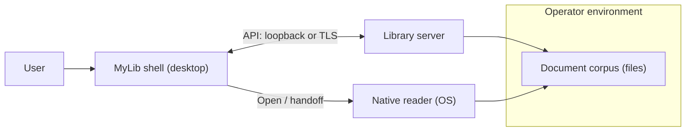

<!--
File: system-documentation/system-artifacts/hla.md

Purpose:
  High-Level Architecture (HLA) for MyLib — structural model and component
  boundaries derived from approved SRS v0.9.

Lifecycle authority:
  LIFECYCLE.md

Architecture encodes structural constraints and trust boundaries.
It does not replace Detailed Design (interfaces, schemas, algorithms).
-->

# High-Level Architecture (HLA)

**Project Name:** MyLib  
**Version:** 0.1  
**Date (YYYY-MM-DD):** 2026-04-06  
**Author(s):** Charles McKnight (draft; maintainers may revise)  
**Status:** Draft  
**Requirement Version Reference:** SRS v0.9 **Approved** ([`srs.md`](srs.md "Srs"))  
**RTM Version Reference:** 0.1 ([`rtm.md`](rtm.md "Rtm") draft)  

---

# 1. Architectural Authority Declaration

Confirm:

- Requirements phase approved? **Yes** — SRS v0.9, **2026-04-06**  
- Requirement IDs stable? **Yes** (change control per **LIFECYCLE.md** if IDs shift)  
- NFRs defined and measurable? **Partial** — quantitative test binding deferred to **Test Plan** / DD; **accepted** at Architecture entry per SRS **§16**  
- Advancement to Architecture authorized? **Yes** — **2026-04-06**  

If any mandatory “No” appears for a phase, architectural definition for that phase is prohibited. This document is a **draft** until **§15** and **§Approval** are satisfied.

---

# 2. Architecture Overview

## 2.1 System Purpose

MyLib is an **open-source electronic document management system** for **personal and small-team corpora**: a **desktop shell** on Windows, macOS, and Linux talks to a **library server** that **authoritatively** enforces **authentication**, **RBAC**, **tenant policy**, and **library operations**. Users **catalog**, **search**, and **govern access** to documents; **display and printing** are delegated to **native OS readers** where applicable ([`concept.md`](concept.md "Concept"), SRS [§2.2](srs.md#22-scope "2.2 Scope"), [§3](srs.md#3-system-overview "3. System Overview")).

**Alignment (representative):** catalog and metadata **FR-001–FR-003**; import and indexing **FR-004–FR-012**; security and deployment **FR-013–FR-019**; shell and preferences **FR-020–FR-022**; OCR and accessibility **FR-023–FR-025**; audit and logging **FR-026–FR-029**; administration and corpus **FR-031–FR-041**; NFRs **NFR-001–NFR-009**. Full enumeration is in **[§6](#6-major-components "6. Major Components")** and **[`rtm.md`](rtm.md "Rtm")**.

## 2.2 Architectural Drivers

| Driver | Requirement IDs (examples) | Architectural response |
|--------|-----------------------------|-------------------------|
| Server authority | FR-013, FR-016–FR-018, NFR-002 | All security decisions enforced in **server-side** domain; client is not trusted for authorization |
| Solo vs multi-user | FR-014, FR-015, NFR-009 | Same logical server; **loopback** solo vs **TLS** (or equivalent) for non-loopback remote |
| Catalog + search scale | FR-006–FR-008, FR-038–FR-039, NFR-001 | **Durable catalog** separate from **rebuildable full-text index**; design center **~100k** documents |
| Probabilistic text | FR-023, SRS [§6](srs.md#6-deterministicprobabilistic-requirements "6. Deterministic–Probabilistic Requirements") | Isolated **OCR / extraction** boundary with explicit fallbacks and observability |
| Privacy / logging | FR-028, FR-029, FR-026, NFR-008 | **Audit**, **operational**, and **diagnostic** streams separable; minimization and retention hooks |
| Accessibility / theme | FR-022, FR-024, NFR-006 | **Shell** conformance target WCAG 2.1 AA where applicable to chosen UI stack (DD selects stack) |
| Operator honesty | NFR-004, NFR-005 | Deployment, transport, and handoff to native readers documented without overstating guarantees |

Unjustified components are prohibited; **[§13](#13-traceability-summary "13. Traceability Summary")** ties components to requirements.

---

# 3. System Context and Boundaries

## 3.1 External Systems and Interfaces

**External actors and systems**

- **Human users** — interact via **MyLib shell** and **native reader** applications.  
- **Host operating system** — process model, file system, **default / preferred application** launch for [FR-019](srs.md#fr-019--open-in-native-reader "FR-019 Open in Native Reader").  
- **Document corpus** — files under **operator-configured** storage roots ([FR-036](srs.md#fr-036--library-corpus-and-storage-model "FR-036 Library Corpus and Storage Model")).  
- **Network** (multi-user) — clients reach server over **IP**; **TLS** (or equivalent) required for non-loopback ([NFR-009](srs.md#nfr-009--transport-security-remote-access "NFR-009 Transport Security (Remote Access)")).  
- **Time** — OS / NTP for log and audit timestamps (SRS [§8](srs.md#8-assumptions "8. Assumptions")).

**Out of scope (v1 product surfaces)** — SRS [§2.2](srs.md#22-scope "2.2 Scope"): **no** standalone browser SPA, **no** public HTTP API for end users, **no** mandatory maintainer SaaS.

## 3.2 System Scope Boundaries

| In scope (architecture) | Out of scope (v1) |
|-------------------------|-------------------|
| Client–server protocol (abstract), session model, RBAC enforcement locus | Web client, public scripting API |
| Catalog, index, ingest, OCR boundary, audit/log pipelines | Offline sync between installations |
| Desktop shell responsibilities for browse, search UI, Settings, Help entry | MyLib-rendered document print/export |
| Operator-configured certificates and trust for remote | Enterprise IdP / SSO ([§13 waiting room](srs.md#13-waiting-room-deferred-scope "13. Waiting Room Deferred Scope")) |

**Ownership:** **Operators** own exposure, backups, legal compliance, tenant membership configuration; the **product** owns **enforced** access policy and library semantics on the server (SRS [§2.2](srs.md#22-scope "2.2 Scope") ownership boundaries).

---

# 4. Deterministic–Probabilistic Boundary Model

**Probabilistic subsystem:** **OCR** and **layout-dependent text extraction** ([FR-023](srs.md#fr-023--ocr-for-searchability "FR-023 OCR for Searchability"), SRS [§6](srs.md#6-deterministicprobabilistic-requirements "6. Deterministic–Probabilistic Requirements")).

| Aspect | HLA position |
|--------|----------------|
| **Boundary ID** | **HLA-BOUND-OCR** — logical boundary around **HLA-OCR** and extraction adapters feeding **HLA-SEARCH** |
| **Invocation** | Ingest or re-index paths **invoke** OCR/extraction with **document identity** and **algorithm identifier** inputs (per SRS/FR-010 family); outputs are **search text** + **provenance flags** (DD specifies fields) |
| **Containment** | No silent success on failure; **observable** states for “index failed” / “OCR unreliable” (SRS §6) |
| **Validation** | Test Plan + fixtures characterize **tolerance**; reproducibility **within documented tolerance** across pipeline versions |
| **Fallback** | Keyword lists [FR-009](srs.md#fr-009--keywords-when-indexing-blocked "FR-009 Keywords When Indexing Blocked") when full text cannot be built lawfully or technically |

Silent blending of probabilistic outputs with deterministic catalog invariants is prohibited at the **requirements** level; DD defines APIs and storage.

---

# 5. Architectural Style and Structural Model

**Style:** **Client–server** with a **thick desktop client** and a **collocated or remote library server**. **Solo** deployment is the **same** security model with **loopback** (or documented local IPC) between shell and server ([FR-014](srs.md#fr-014--solo-co-located-deployment "FR-014 Solo Co-Located Deployment")).

**Layering (logical)**

1. **Presentation / shell** — **HLA-SHELL** (UI, accessibility, theme, local preferences, admin UI surfaces subject to RBAC).  
2. **Client access** — **HLA-CLIENT-ACCESS** (protocol client, credential/session holder, TLS for remote).  
3. **Server host** — **HLA-SERVER-HOST** (network binding, process lifecycle, configuration load, request dispatch).  
4. **Domain services** — **HLA-DOMAIN** (catalog records, metadata, tags, validation, optimistic concurrency coordination), **HLA-INGEST**, **HLA-SEARCH**, **HLA-STORAGE**, **HLA-SECURITY**, **HLA-OCR**, **HLA-AUDIT**, **HLA-OBSLOG**, **HLA-RELEASE**.

**Dependency direction:** Shell → Client-Access → Server-Host → domain services. **Security** checks apply at **API boundary** (and internally for defense in depth—DD). **No** “framework-first” mandate: **UI toolkit** and **language/runtime** are **DD** choices compatible with NFRs.

**Alternatives considered (HLA level)**

- **Single monolithic desktop app without server** — **Rejected** for v1: fails **FR-013** server authority for multi-user and complicates a consistent RBAC story for solo as a degenerate case.  
- **Browser-only client** — **Out of scope** per SRS.  
- **Embedded database per client with sync** — **Deferred** (no offline replication in v1).

---

# 6. Major Components

Each component **maps** to at least one SRS requirement; **[`rtm.md`](rtm.md "Rtm")** §3 lists per-requirement primary mappings.

| Component ID | Responsibility | Primary requirement IDs | Key interfaces (HLA) | Data ownership |
|--------------|----------------|---------------------------|----------------------|----------------|
| **HLA-SHELL** | Desktop UI: browse, search results, Settings, Help, admin screens (RBAC-gated), client log toggles; launches native readers | FR-019–FR-025, FR-029 (client), FR-031 (UI), FR-037, FR-039 (UI triggers) | To **HLA-CLIENT-ACCESS**; OS APIs for reader launch | **Client-local** preferences, theme, reader paths |
| **HLA-CLIENT-ACCESS** | API client, session/token handling, TLS for remote profiles | FR-013, FR-016, NFR-009 | To **HLA-SERVER-HOST** over loopback or TLS | Ephemeral session material on client (DD) |
| **HLA-SERVER-HOST** | Server process entry, listener(s), routing to domain services, solo vs multi binding | FR-014, FR-015, NFR-009 | Inbound API from client; internal calls to services | **None** (orchestration only) |
| **HLA-DOMAIN** | Catalog records, metadata, tags, validation rules, concurrent update policy | FR-001–FR-003, FR-040, FR-041 | CRUD/catalog APIs to ingest, search, storage | **Authoritative catalog** state (durable) |
| **HLA-INGEST** | Deliberate import, format handling, digest computation/storage, duplicate detection | FR-004, FR-005, FR-010 | Reads bytes via **HLA-STORAGE**; writes **HLA-DOMAIN**; may call **HLA-OCR** / **HLA-SEARCH** | Ingest job state (DD) |
| **HLA-SEARCH** | Full-text index build/rebuild, query execution, keywords, index admin operations | FR-006–FR-009, FR-038, FR-039 | Index stores; queries **HLA-DOMAIN** for record context | **Index** artifacts (rebuildable) |
| **HLA-STORAGE** | Corpus path resolution, mediated file access for open, relink, remove-vs-delete | FR-011, FR-012, FR-036, FR-019 (server-mediated path) | File system or future object backend (deferred) | **References** to bytes; bytes on disk owned by operator |
| **HLA-SECURITY** | Authentication, RBAC, tenant membership, sessions, throttling, password hashing, bootstrap admin | FR-016–FR-018, FR-027, FR-031–FR-035, FR-032 | Every mutating/catalog API path | **Accounts**, roles, session records (durable) |
| **HLA-OCR** | OCR and extraction pipeline behind **HLA-BOUND-OCR** | FR-023 | Invoked from **HLA-INGEST** / reindex | Derived text + metadata (DD) |
| **HLA-AUDIT** | Security-relevant audit events | FR-026 | Append-only or tamper-evident strategy (DD) | **Audit** log store |
| **HLA-OBSLOG** | Operational and diagnostic logging, retention configuration | FR-028, FR-029 (server), NFR-008 | Log sinks, rotation | **Log** files / streams |
| **HLA-RELEASE** | Build/version identity exposed per FR-030 | FR-030 | Shell “About” / server version endpoint (DD) | **Version** manifest |

**Solo packaging:** Shell and server **MAY** ship as **one installer** with **two processes** or **one process** hosting both **logical** roles—DD decides, provided **trust boundary** and **FR-014** loopback semantics remain clear in operator docs ([NFR-004](srs.md#nfr-004--operator-documentation "NFR-004 Operator Documentation")).

---

# 7. Data Architecture

| Topic | HLA decision |
|-------|----------------|
| **Persistence** | **Durable** catalog and security state; **rebuildable** full-text index (SRS [§10](srs.md#10-data-requirements "10. Data Requirements")) |
| **Catalog vs index** | **HLA-DOMAIN** owns canonical record; **HLA-SEARCH** owns derived index; rebuild procedures **online or maintenance mode** per FR-039 (DD) |
| **Digest** | Stored with catalog/ingest per **FR-010**; algorithm id recorded for migration |
| **Consistency** | **FR-041** optimistic concurrency at record level; no silent last-write-wins for metadata (SRS §11) |
| **Cross-boundary flow** | Bytes flow **server → client** only under **HLA-SECURITY** policy; open-in-reader may imply local file or download handoff (honest policy **NFR-005**) |
| **Secrets** | Passwords hashed (**FR-027**); no cleartext secrets in operational/diagnostic logs per **NFR-008** |

Hidden channels (undocumented file or network use) are prohibited at the architectural intent level; DD enumerates allowed paths.

---

# 8. Non-Functional Architecture

| NFR | Structural mechanism |
|-----|----------------------|
| **NFR-001** | Partition catalog/index; optional **horizontal scale** of **stateless API** instances with **shared** catalog+index stores (DD); not mandated in v1 |
| **NFR-002** | **Authorize** on server for every security-sensitive operation |
| **NFR-003** | **HLA-RELEASE** + notices in **HLA-SHELL**; Apache-2.0 alignment |
| **NFR-004** | Operator-facing topics: TLS setup, backup scope, log locations, solo vs multi — **documented**; server admin surface for log toggles when not in shell (**FR-029**) |
| **NFR-005** | UI and operator docs do not claim stronger guarantees than server enforcement and reader behavior allow |
| **NFR-006** | Themed shell contrast validated against WCAG 2.1 AA for **shipped** themes (test plan) |
| **NFR-007** | Help entry and manuals reach users via **HLA-SHELL** surfaces |
| **NFR-008** | **HLA-AUDIT** vs **HLA-OBSLOG** separation; redaction/minimization hooks (DD) |
| **NFR-009** | **TLS default** for remote; **loopback** exception documented for solo |

---

# 9. Failure Posture

| Area | HLA-level behavior |
|------|---------------------|
| **Server unavailable** | Client **degrades** with clear errors; no silent catalog mutation (DD defines offline vs error) |
| **Missing file** | **FR-011** paths: solo relink UX; multi-user notify admins / degraded access per SRS |
| **Index/OCR failure** | Surfaced to operators/users per SRS §6; rebuild **FR-039** |
| **Auth failure** | **FR-034** throttling; audit failed attempts **FR-026** |
| **Partial multi-instance** | Load balancer + sticky sessions or shared session store — **DD**; **FR-035** aggregate limits qualitative |

Rollback: scope or architecture change triggers **LIFECYCLE.md** rollback to earliest impacted phase.

---

# 10. Deployment and Packaging Alignment

- **Targets:** Windows, macOS, Linux **desktop** client; server **co-located** or **dedicated** host.  
- **Networking:** **localhost** / **Unix socket** / named pipe class IPC for solo (DD); **TLS** server for remote.  
- **Certificates:** Operator-provided; trust configuration per **NFR-004** / **NFR-009**.  
- **Artifacts:** Separate **client** and **server** packages **or** unified installer—**packaging plan** (future) refines.  
- **Auto-start server:** Optional background server at login/boot—**DD** per concept/SRS interfaces (platform-specific).

Architecture **SHALL** support **reproducible** builds (or documented build graph) in a later **packaging plan**; no specific CI vendor here.

---

# 11. Orchestration Alignment

- **Build:** Monorepo or multi-module acceptable (DD); **clean** CI build produces client+server artifacts.  
- **Tests:** Unit/integration/e2e harnesses **SHALL** run in automation; security checklist for **NFR-009** wire behavior.  
- **No** architectural conflict with “validation in pipeline” expectation.

---

# 12. Risk Assessment

| Risk | Class | Mitigation (HLA) |
|------|-------|------------------|
| Client bypass of server policy | **High** | Single API path; no “admin-only” features by UI hiding alone for remote |
| OCR / extraction quality | **Moderate–High** | **HLA-BOUND-OCR**, explicit UX and operator observability |
| TLS misconfiguration | **Moderate** | Defaults + operator docs **NFR-004** |
| Scale beyond single node | **Moderate** | Shared-store multi-instance path optional; stress in test plan **NFR-001** |
| Log privacy leakage | **Moderate** | **HLA-OBSLOG** / **HLA-AUDIT** separation and minimization **NFR-008** |

High-impact items feed **DD** mitigations before implementation.

---

# 13. Traceability Summary

- **[`rtm.md`](rtm.md "Rtm")** §3 maps **FR-001–FR-041** and **NFR-001–NFR-009** to **HLA component IDs** (comma-separated where multiple primaries apply).  
- **§4** of RTM records **HLA-BOUND-OCR** for **FR-023**.  
- Orphan components or orphan requirements **SHALL** be resolved before **HLA approval**.

---

# 14. Open Questions

| Topic | Owner | Notes |
|-------|--------|------|
| Exact **UI stack** (e.g. Qt vs Electron vs native) | DD | Must satisfy **FR-024**, **FR-022**, cross-platform ship |
| **IPC** mechanism for solo (loopback HTTP vs OS IPC) | DD | Must satisfy **FR-014**, **NFR-009** exception clarity |
| **Notification** channels for **FR-011** multi-user (in-app only vs optional email) | DD | SRS defers |
| **Online vs maintenance** index rebuild default | DD | **FR-039** |
| **Search engine** embedding vs external process | DD | Under **HLA-SEARCH** |
| **OCR engine** vendoring vs optional plugin | DD | SRS assumption third-party licenses **TBD** |

Unresolved **high-impact** items **block Detailed Design** closure until decided or risk-accepted in writing.

---

# 15. Phase Gate Declaration

Confirm readiness to proceed to **Detailed Design**:

- All mandatory sections completed? **Yes** (draft **v0.1**; subject to review)  
- Deterministic–probabilistic boundaries defined? **Yes** — **HLA-BOUND-OCR** / **HLA-OCR**  
- NFR-driven structure demonstrated? **Yes** — **[§8](#8-non-functional-architecture "8. Non-Functional Architecture")**  
- RTM updated? **Yes** — **[`rtm.md`](rtm.md "Rtm")** HLA column populated for this draft  
- Human approval granted? **No** — **pending**  

**Action:** Remain in **Architecture** until **stakeholder approval** of this HLA; then proceed to **DD** per **LIFECYCLE.md** and continue **RTM** (DD artifact column).

---

# Approval

Approved By: *— pending —*  
Role:  
Date (YYYY-MM-DD):  
Version Incremented: No (baseline **v0.1** draft until approved; increment on approved revisions)

---

End of High-Level Architecture (draft)
