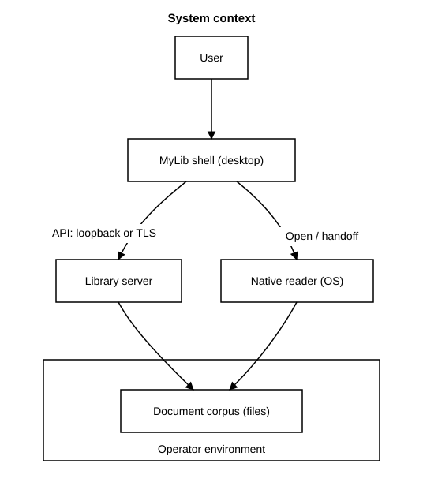
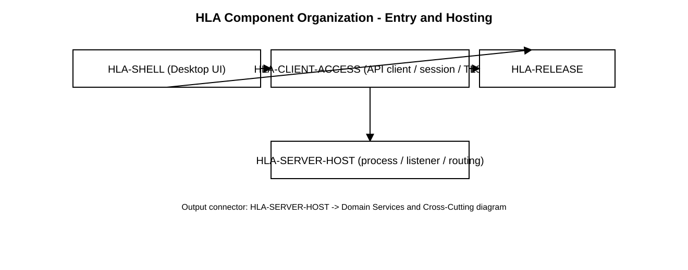
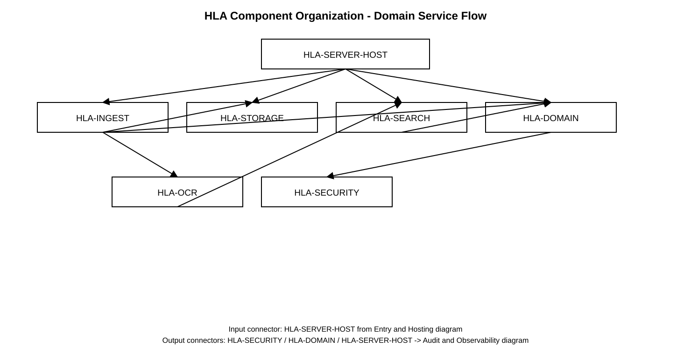
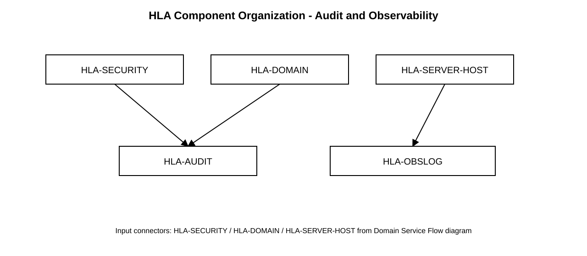
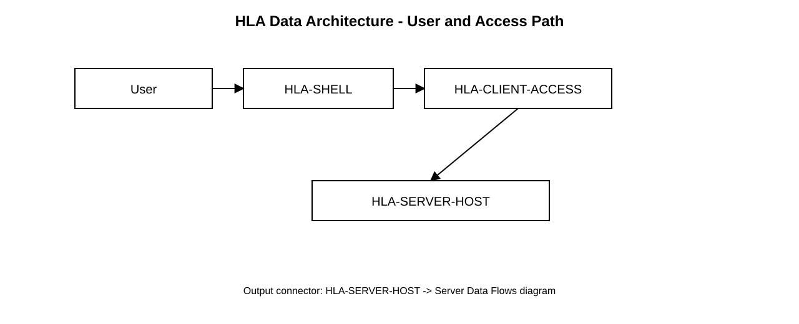
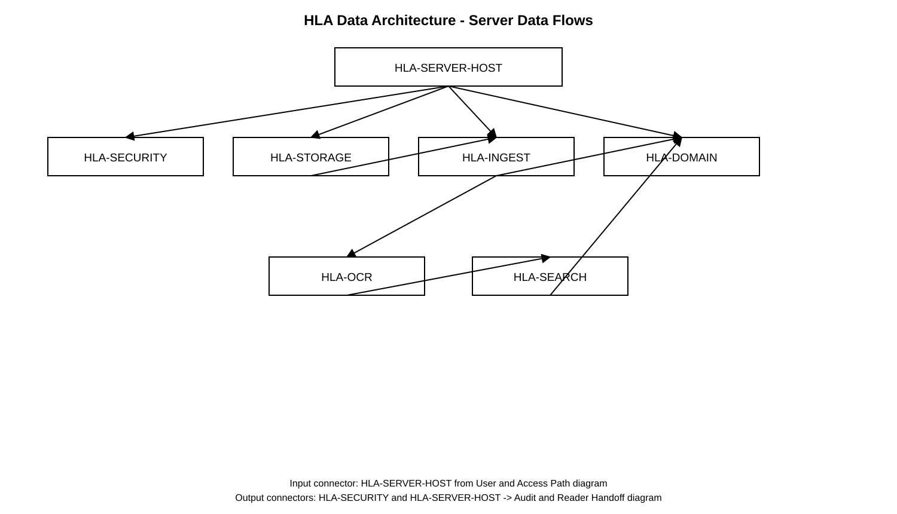
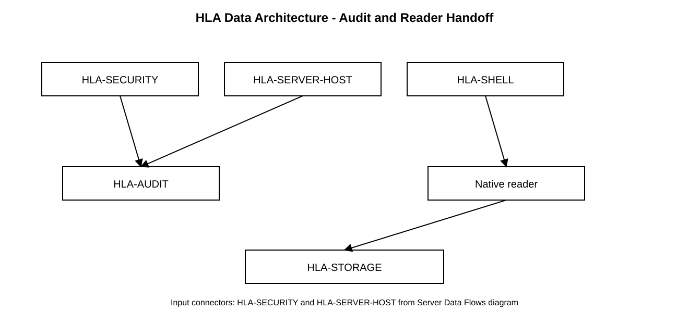

<!--
File: system-documentation/system-artifacts/hla.md

Purpose:
  High-Level Architecture (HLA) for MyLib — structural model and component
  boundaries derived from approved SRS v0.9.

Lifecycle authority:
  LIFECYCLE.md

Architecture encodes structural constraints and trust boundaries.
It does not replace Detailed Design (interfaces, schemas, algorithms).
-->

# High-Level Architecture (HLA)

**Project Name:** MyLib  
**Version:** 0.1.2  
**Date (YYYY-MM-DD):** 2026-04-06  
**Author(s):** Charles McKnight (maintainers may revise via change control)  
**Status:** Approved  
**Requirement Version Reference:** SRS v0.9 **Approved** ([`srs.md`](srs.md "Srs"))  
**RTM Version Reference:** 0.1 **Approved** ([`rtm.md`](rtm.md "Rtm"); approved 2026-04-28)  
**DD Version Reference:** 0.1 **Approved** ([`dd.md`](dd.md "Dd"); approved 2026-04-28)  
**Test Plan Version Reference:** 0.1 **Approved** ([`test-plan.md`](test-plan.md "Test Plan"); approved 2026-04-28)  

**Rendered viewing (e.g. GitHub):** Links to the SRS use **relative** URLs of the form [`srs.md#heading-anchor`](./srs.md#fr-023--ocr-for-searchability "FR-023 OCR for Searchability") with a **quoted title** for hover text. Fragment slugs match **GitHub’s heading anchor algorithm** (same as in-repo links inside [`srs.md`](srs.md "Srs")). From the repository root, the same targets are `system-documentation/system-artifacts/srs.md#…`.

**Decision log:** Significant architecture, design, framework/library, packaging, orchestration, and explicit deferral decisions are recorded in [`_process/discussion-log.md`](_process/discussion-log.md "Discussion Log") using the decision-log structure.

**Diagram rendering policy:** Mermaid source for HLA diagrams is maintained in [`img-src/`](img-src/ "Mermaid Sources") and rendered to SVG files in [`img/`](img/ "Diagram Assets") for broad Markdown viewer compatibility. Vertical orientation (`flowchart TB` with `direction TB`) is the default unless a documented exception is needed. Complex diagrams MAY be hand-authored/exported from external tools (including Omnigraffle) when readability or renderer compatibility requires manual layout control; those diagrams SHALL be treated as authoritative and protected from automated overwrite.

---

# 1. Architectural Authority Declaration

Confirm:

- Requirements phase approved? **Yes** — SRS v0.9, **2026-04-06**  
- Requirement IDs stable? **Yes** (change control per **[`LIFECYCLE.md`](LIFECYCLE.md "Lifecycle")** if IDs shift)  
- NFRs defined and measurable? **Partial** — quantitative test binding deferred to **Test Plan** / DD; **accepted** at Architecture entry per SRS [**§16**](./srs.md#16-phase-gate-declaration "16. Phase Gate Declaration")  
- Advancement to Architecture authorized? **Yes** — **2026-04-06**  

If any mandatory “No” appears for a phase, architectural definition for that phase is prohibited. This document is **Approved**; see [**§15**](./hla.md#15-phase-gate-declaration "15. Phase Gate Declaration") and [**§Approval**](./hla.md#approval "Approval").

---

# 2. Architecture Overview

## 2.1 System Purpose

MyLib is an **open-source electronic document management system** for **personal and small-team corpora**: a **desktop shell** on Windows, macOS, and Linux talks to a **library server** that **authoritatively** enforces **authentication**, **RBAC**, **tenant policy**, and **library operations**. Users **catalog**, **search**, and **govern access** to documents; **display and printing** are delegated to **native OS readers** where applicable ([`concept.md`](concept.md "Concept"), SRS [§2.2](./srs.md#22-scope "2.2 Scope"), [§3](./srs.md#3-system-overview "3. System Overview")).

**Alignment (representative):** catalog and metadata [FR-001](./srs.md#fr-001--catalog-records "FR-001 Catalog Records")–[FR-003](./srs.md#fr-003--tags "FR-003 Tags"); import and indexing [FR-004](./srs.md#fr-004--deliberate-import "FR-004 Deliberate Import")–[FR-012](./srs.md#fr-012--remove-from-catalog-vs-delete-on-disk "FR-012 Remove from Catalog vs. Delete on Disk"); security and deployment [FR-013](./srs.md#fr-013--server-authority-for-security "FR-013 Server Authority for Security")–[FR-019](./srs.md#fr-019--open-in-native-reader "FR-019 Open in Native Reader"); shell and preferences [FR-020](./srs.md#fr-020--settings-client-preferences "FR-020 Settings (Client Preferences)")–[FR-022](./srs.md#fr-022--application-theme "FR-022 Application Theme"); OCR and accessibility [FR-023](./srs.md#fr-023--ocr-for-searchability "FR-023 OCR for Searchability")–[FR-025](./srs.md#fr-025--english-ui-v1 "FR-025 English UI (v1)"); audit and logging [FR-026](./srs.md#fr-026--audit-logging "FR-026 Audit Logging")–[FR-029](./srs.md#fr-029--operational-and-diagnostic-logging-client-and-server "FR-029 Operational and Diagnostic Logging (Client and Server)"); administration and corpus [FR-031](./srs.md#fr-031--user-account-and-role-administration "FR-031 User Account and Role Administration")–[FR-041](./srs.md#fr-041--concurrent-metadata-updates "FR-041 Concurrent Metadata Updates"); NFRs [NFR-001](./srs.md#nfr-001--corpus-scale-qualitative "NFR-001 Corpus Scale (Qualitative)")–[NFR-009](./srs.md#nfr-009--transport-security-remote-access "NFR-009 Transport Security (Remote Access)"). Full enumeration is in **[§6](./hla.md#6-major-components "6. Major Components")** and **[`rtm.md`](rtm.md "Rtm")**.

## 2.2 Architectural Drivers

| Driver                 | Requirement IDs (examples)                                                                                       | Architectural response                                                                               |
| ---------------------- | ---------------------------------------------------------------------------------------------------------------- | ---------------------------------------------------------------------------------------------------- |
| Server authority       | [FR-013](./srs.md#fr-013--server-authority-for-security "FR-013 Server Authority for Security"), [FR-016](./srs.md#fr-016--authentication-v1 "FR-016 Authentication (v1)")–[FR-018](./srs.md#fr-018--tenant-boundary "FR-018 Tenant Boundary"), [NFR-002](./srs.md#nfr-002--server-side-enforcement "NFR-002 Server-Side Enforcement") | All security decisions enforced in **server-side** domain; client is not trusted for authorization   |
| Solo vs multi-user     | [FR-014](./srs.md#fr-014--solo-co-located-deployment "FR-014 Solo Co-Located Deployment"), [FR-015](./srs.md#fr-015--multi-user-server-deployment "FR-015 Multi-User Server Deployment"), [NFR-009](./srs.md#nfr-009--transport-security-remote-access "NFR-009 Transport Security (Remote Access)") | Same logical server; **loopback** solo vs **TLS** (or equivalent) for non-loopback remote            |
| Catalog + search scale | [FR-006](./srs.md#fr-006--full-text-indexing-when-permitted "FR-006 Full-Text Indexing (when permitted)")–[FR-008](./srs.md#fr-008--tag-filtering "FR-008 Tag Filtering"), [FR-038](./srs.md#fr-038--search-query-semantics-and-results "FR-038 Search Query Semantics and Results")–[FR-039](./srs.md#fr-039--full-text-index-administration "FR-039 Full-Text Index Administration"), [NFR-001](./srs.md#nfr-001--corpus-scale-qualitative "NFR-001 Corpus Scale (Qualitative)") | **Durable catalog** separate from **rebuildable full-text index**; design center **~100k** documents |
| Probabilistic text     | [FR-023](./srs.md#fr-023--ocr-for-searchability "FR-023 OCR for Searchability"), SRS [§6](./srs.md#6-deterministicprobabilistic-requirements "6. Deterministic–Probabilistic Requirements") | Isolated **OCR / extraction** boundary with explicit fallbacks and observability                     |
| Privacy / logging      | [FR-028](./srs.md#fr-028--configurable-log-retention "FR-028 Configurable Log Retention"), [FR-029](./srs.md#fr-029--operational-and-diagnostic-logging-client-and-server "FR-029 Operational and Diagnostic Logging (Client and Server)"), [FR-026](./srs.md#fr-026--audit-logging "FR-026 Audit Logging"), [NFR-008](./srs.md#nfr-008--logging-privacy-and-jurisdictional-readiness "NFR-008 Logging: Privacy and Jurisdictional Readiness") | **Audit**, **operational**, and **diagnostic** streams separable; minimization and retention hooks   |
| Accessibility / theme  | [FR-022](./srs.md#fr-022--application-theme "FR-022 Application Theme"), [FR-024](./srs.md#fr-024--shell-accessibility "FR-024 Shell Accessibility"), [NFR-006](./srs.md#nfr-006--themed-shell-contrast "NFR-006 Themed Shell Contrast") | **Shell** conformance target WCAG 2.1 AA where applicable to chosen UI stack (DD selects stack)      |
| Operator honesty       | [NFR-004](./srs.md#nfr-004--operator-documentation "NFR-004 Operator Documentation"), [NFR-005](./srs.md#nfr-005--honest-policy-communication "NFR-005 Honest Policy Communication") | Deployment, transport, and handoff to native readers documented without overstating guarantees       |

Unjustified components are prohibited; **[§13](./hla.md#13-traceability-summary "13. Traceability Summary")** ties components to requirements.

---

# 3. System Context and Boundaries

## 3.1 External Systems and Interfaces

**External actors and systems**

- **Human users** — interact via **MyLib shell** and **native reader** applications.  
- **Host operating system** — process model, file system, **default / preferred application** launch for [FR-019](./srs.md#fr-019--open-in-native-reader "FR-019 Open in Native Reader").  
- **Document corpus** — files under **operator-configured** storage roots ([FR-036](./srs.md#fr-036--library-corpus-and-storage-model "FR-036 Library Corpus and Storage Model")).  
- **Network** (multi-user) — clients reach server over **IP**; **TLS** (or equivalent) required for non-loopback ([NFR-009](./srs.md#nfr-009--transport-security-remote-access "NFR-009 Transport Security (Remote Access)")).  
- **Time** — OS / NTP for log and audit timestamps (SRS [§8](./srs.md#8-assumptions "8. Assumptions")).

**Out of scope (v1 product surfaces)** — SRS [§2.2](./srs.md#22-scope "2.2 Scope"): **no** standalone browser SPA, **no** public HTTP API for end users, **no** mandatory maintainer SaaS.

Source: [`img/hla-system-context.svg`](img/hla-system-context.svg "Hla System Context Hand Authored Svg")

## 3.2 System Scope Boundaries

| In scope (architecture)                                                    | Out of scope (v1)                                                                                                  |
| -------------------------------------------------------------------------- | ------------------------------------------------------------------------------------------------------------------ |
| Client–server protocol (abstract), session model, RBAC enforcement locus   | Web client, public scripting API                                                                                   |
| Catalog, index, ingest, OCR boundary, audit/log pipelines                  | Offline sync between installations                                                                                 |
| Desktop shell responsibilities for browse, search UI, Settings, Help entry | MyLib-rendered document print/export                                                                               |
| Operator-configured certificates and trust for remote                      | Enterprise IdP / SSO ([§13 waiting room](./srs.md#13-waiting-room-deferred-scope "13. Waiting Room Deferred Scope")) |

**Ownership:** **Operators** own exposure, backups, legal compliance, tenant membership configuration; the **product** owns **enforced** access policy and library semantics on the server (SRS [§2.2](./srs.md#22-scope "2.2 Scope") ownership boundaries).

---

# 4. Deterministic–Probabilistic Boundary Model

**Probabilistic subsystem:** **OCR** and **layout-dependent text extraction** ([FR-023](./srs.md#fr-023--ocr-for-searchability "FR-023 OCR for Searchability"), SRS [§6](./srs.md#6-deterministicprobabilistic-requirements "6. Deterministic–Probabilistic Requirements")).

| Aspect          | HLA position                                                                                                                                                                                                        |
| --------------- | ------------------------------------------------------------------------------------------------------------------------------------------------------------------------------------------------------------------- |
| **Boundary ID** | **HLA-BOUND-OCR** — logical boundary around **HLA-OCR** and extraction adapters feeding **HLA-SEARCH**                                                                                                              |
| **Invocation**  | Ingest or re-index paths **invoke** OCR/extraction with **document identity** and **algorithm identifier** inputs (per SRS / [FR-010](./srs.md#fr-010--duplicate-detection-digest "FR-010 Duplicate Detection (Digest)") family); outputs are **search text** + **provenance flags** (DD specifies fields) |
| **Containment** | No silent success on failure; **observable** states for “index failed” / “OCR unreliable” (SRS [§6](./srs.md#6-deterministicprobabilistic-requirements "6. Deterministic–Probabilistic Requirements"))                                                                                                                  |
| **Validation**  | Test Plan + fixtures characterize **tolerance**; reproducibility **within documented tolerance** across pipeline versions                                                                                           |
| **Fallback**    | Keyword lists [FR-009](./srs.md#fr-009--keywords-when-indexing-blocked "FR-009 Keywords When Indexing Blocked") when full text cannot be built lawfully or technically                                                |

Silent blending of probabilistic outputs with deterministic catalog invariants is prohibited at the **requirements** level; DD defines APIs and storage.

---

# 5. Architectural Style and Structural Model

**Style:** **Client–server** with a **thick desktop client** and a **collocated or remote library server**. **Solo** deployment is the **same** security model with **loopback** (or documented local IPC) between shell and server ([FR-014](./srs.md#fr-014--solo-co-located-deployment "FR-014 Solo Co-Located Deployment")).

**Layering (logical)**

1. **Presentation / shell** — **HLA-SHELL** (UI, accessibility, theme, local preferences, admin UI surfaces subject to RBAC).  
2. **Client access** — **HLA-CLIENT-ACCESS** (protocol client, credential/session holder, TLS for remote).  
3. **Server host** — **HLA-SERVER-HOST** (network binding, process lifecycle, configuration load, request dispatch).  
4. **Domain services** — **HLA-DOMAIN** (catalog records, metadata, tags, validation, optimistic concurrency coordination), **HLA-INGEST**, **HLA-SEARCH**, **HLA-STORAGE**, **HLA-SECURITY**, **HLA-OCR**, **HLA-AUDIT**, **HLA-OBSLOG**, **HLA-RELEASE**.

**Dependency direction:** Shell → Client-Access → Server-Host → domain services. **Security** checks apply at **API boundary** (and internally for defense in depth—DD). **No** “framework-first” mandate: **UI toolkit** and **language/runtime** are **DD** choices compatible with NFRs.

Interim readability note: these split component-organization views are temporary hand-authored structural references. Planned Omnigraffle-routed replacements MAY supersede them without changing architectural intent.

Sources:
- [`img/hla-component-organization-entry.svg`](img/hla-component-organization-entry.svg "Hla Component Organization Entry")
- [`img/hla-component-organization-domain.svg`](img/hla-component-organization-domain.svg "Hla Component Organization Domain")
- [`img/hla-component-organization-cross-cutting.svg`](img/hla-component-organization-cross-cutting.svg "Hla Component Organization Cross Cutting")
- decomposition reference: [`img-src/hla-component-organization.mmd`](img-src/hla-component-organization.mmd "Hla Component Organization Mermaid Source")

**Alternatives considered (HLA level)**

- **Single monolithic desktop app without server** — **Rejected** for v1: fails [FR-013](./srs.md#fr-013--server-authority-for-security "FR-013 Server Authority for Security") server authority for multi-user and complicates a consistent RBAC story for solo as a degenerate case.  
- **Browser-only client** — **Out of scope** per SRS ([§2.2](./srs.md#22-scope "2.2 Scope")).  
- **Embedded database per client with sync** — **Deferred** (no offline replication in v1).

---

# 6. Major Components

Each component **maps** to at least one SRS requirement; **[`rtm.md`](rtm.md "Rtm")** §3 lists per-requirement primary mappings.

| Component ID          | Responsibility                                                                                                              | Primary requirement IDs                                                   | Key interfaces (HLA)                                                                          | Data ownership                                           |
| --------------------- | --------------------------------------------------------------------------------------------------------------------------- | ------------------------------------------------------------------------- | --------------------------------------------------------------------------------------------- | -------------------------------------------------------- |
| **HLA-SHELL**         | Desktop UI: browse, search results, Settings, Help, admin screens (RBAC-gated), client log toggles; launches native readers | [FR-019](./srs.md#fr-019--open-in-native-reader "FR-019 Open in Native Reader")–[FR-025](./srs.md#fr-025--english-ui-v1 "FR-025 English UI (v1)"), [FR-029](./srs.md#fr-029--operational-and-diagnostic-logging-client-and-server "FR-029 Operational and Diagnostic Logging (Client and Server)") (client), [FR-031](./srs.md#fr-031--user-account-and-role-administration "FR-031 User Account and Role Administration") (UI), [FR-037](./srs.md#fr-037--catalog-browse-sort-and-pagination "FR-037 Catalog Browse, Sort, and Pagination"), [FR-039](./srs.md#fr-039--full-text-index-administration "FR-039 Full-Text Index Administration") (UI triggers) | To **HLA-CLIENT-ACCESS**; OS APIs for reader launch                                           | **Client-local** preferences, theme, reader paths        |
| **HLA-CLIENT-ACCESS** | API client, session/token handling, TLS for remote profiles                                                                 | [FR-013](./srs.md#fr-013--server-authority-for-security "FR-013 Server Authority for Security"), [FR-016](./srs.md#fr-016--authentication-v1 "FR-016 Authentication (v1)"), [NFR-009](./srs.md#nfr-009--transport-security-remote-access "NFR-009 Transport Security (Remote Access)")                                                   | To **HLA-SERVER-HOST** over loopback or TLS                                                   | Ephemeral session material on client (DD)                |
| **HLA-SERVER-HOST**   | Server process entry, listener(s), routing to domain services, solo vs multi binding                                        | [FR-014](./srs.md#fr-014--solo-co-located-deployment "FR-014 Solo Co-Located Deployment"), [FR-015](./srs.md#fr-015--multi-user-server-deployment "FR-015 Multi-User Server Deployment"), [NFR-009](./srs.md#nfr-009--transport-security-remote-access "NFR-009 Transport Security (Remote Access)")                                                   | Inbound API from client; internal calls to services                                           | **None** (orchestration only)                            |
| **HLA-DOMAIN**        | Catalog records, metadata, tags, validation rules, concurrent update policy                                                 | [FR-001](./srs.md#fr-001--catalog-records "FR-001 Catalog Records")–[FR-003](./srs.md#fr-003--tags "FR-003 Tags"), [FR-040](./srs.md#fr-040--metadata-validation "FR-040 Metadata Validation"), [FR-041](./srs.md#fr-041--concurrent-metadata-updates "FR-041 Concurrent Metadata Updates")                                             | CRUD/catalog APIs to ingest, search, storage                                                  | **Authoritative catalog** state (durable)                |
| **HLA-INGEST**        | Deliberate import, format handling, digest computation/storage, duplicate detection                                         | [FR-004](./srs.md#fr-004--deliberate-import "FR-004 Deliberate Import"), [FR-005](./srs.md#fr-005--supported-document-types-v1 "FR-005 Supported Document Types (v1)"), [FR-010](./srs.md#fr-010--duplicate-detection-digest "FR-010 Duplicate Detection (Digest)")                                                    | Reads bytes via **HLA-STORAGE**; writes **HLA-DOMAIN**; may call **HLA-OCR** / **HLA-SEARCH** | Ingest job state (DD)                                    |
| **HLA-SEARCH**        | Full-text index build/rebuild, query execution, keywords, index admin operations                                            | [FR-006](./srs.md#fr-006--full-text-indexing-when-permitted "FR-006 Full-Text Indexing (when permitted)")–[FR-009](./srs.md#fr-009--keywords-when-indexing-blocked "FR-009 Keywords When Indexing Blocked"), [FR-038](./srs.md#fr-038--search-query-semantics-and-results "FR-038 Search Query Semantics and Results"), [FR-039](./srs.md#fr-039--full-text-index-administration "FR-039 Full-Text Index Administration")                                             | Index stores; queries **HLA-DOMAIN** for record context                                       | **Index** artifacts (rebuildable)                        |
| **HLA-STORAGE**       | Corpus path resolution, mediated file access for open, relink, remove-vs-delete                                             | [FR-011](./srs.md#fr-011--missing-file-detection-and-relink "FR-011 Missing File Detection and Relink"), [FR-012](./srs.md#fr-012--remove-from-catalog-vs-delete-on-disk "FR-012 Remove from Catalog vs. Delete on Disk"), [FR-036](./srs.md#fr-036--library-corpus-and-storage-model "FR-036 Library Corpus and Storage Model"), [FR-019](./srs.md#fr-019--open-in-native-reader "FR-019 Open in Native Reader") (server-mediated path)                     | File system or future object backend (deferred)                                               | **References** to bytes; bytes on disk owned by operator |
| **HLA-SECURITY**      | Authentication, RBAC, tenant membership, sessions, throttling, password hashing, bootstrap admin                            | [FR-016](./srs.md#fr-016--authentication-v1 "FR-016 Authentication (v1)")–[FR-018](./srs.md#fr-018--tenant-boundary "FR-018 Tenant Boundary"), [FR-027](./srs.md#fr-027--password-storage "FR-027 Password Storage"), [FR-031](./srs.md#fr-031--user-account-and-role-administration "FR-031 User Account and Role Administration")–[FR-035](./srs.md#fr-035--session-management "FR-035 Session Management"), [FR-032](./srs.md#fr-032--initial-administrator-bootstrap "FR-032 Initial Administrator Bootstrap")                              | Every mutating/catalog API path                                                               | **Accounts**, roles, session records (durable)           |
| **HLA-OCR**           | OCR and extraction pipeline behind **HLA-BOUND-OCR**                                                                        | [FR-023](./srs.md#fr-023--ocr-for-searchability "FR-023 OCR for Searchability")                                                                    | Invoked from **HLA-INGEST** / reindex                                                         | Derived text + metadata (DD)                             |
| **HLA-AUDIT**         | Security-relevant audit events                                                                                              | [FR-026](./srs.md#fr-026--audit-logging "FR-026 Audit Logging")                                                                    | Append-only or tamper-evident strategy (DD)                                                   | **Audit** log store                                      |
| **HLA-OBSLOG**        | Operational and diagnostic logging, retention configuration                                                                 | [FR-028](./srs.md#fr-028--configurable-log-retention "FR-028 Configurable Log Retention"), [FR-029](./srs.md#fr-029--operational-and-diagnostic-logging-client-and-server "FR-029 Operational and Diagnostic Logging (Client and Server)") (server), [NFR-008](./srs.md#nfr-008--logging-privacy-and-jurisdictional-readiness "NFR-008 Logging: Privacy and Jurisdictional Readiness")                                          | Log sinks, rotation                                                                           | **Log** files / streams                                  |
| **HLA-RELEASE**       | Build/version identity exposed per **FR-030**                                                                                   | [FR-030](./srs.md#fr-030--release-information "FR-030 Release Information")                                                                    | Shell “About” / server version endpoint (DD)                                                  | **Version** manifest                                     |

**Solo packaging:** Shell and server **MAY** ship as **one installer** with **two processes** or **one process** hosting both **logical** roles—DD decides, provided **trust boundary** and **FR-014** loopback semantics remain clear in operator docs ([NFR-004](./srs.md#nfr-004--operator-documentation "NFR-004 Operator Documentation")).

---

# 7. Data Architecture

| Topic                   | HLA decision                                                                                                                                           |
| ----------------------- | ------------------------------------------------------------------------------------------------------------------------------------------------------ |
| **Persistence**         | **Durable** catalog and security state; **rebuildable** full-text index (SRS [§10](./srs.md#10-data-requirements "10. Data Requirements"))               |
| **Catalog vs index**    | **HLA-DOMAIN** owns canonical record; **HLA-SEARCH** owns derived index; rebuild procedures **online or maintenance mode** per [FR-039](./srs.md#fr-039--full-text-index-administration "FR-039 Full-Text Index Administration") (DD)             |
| **Digest**              | Stored with catalog/ingest per [FR-010](./srs.md#fr-010--duplicate-detection-digest "FR-010 Duplicate Detection (Digest)"); algorithm id recorded for migration                                                                         |
| **Consistency**         | [FR-041](./srs.md#fr-041--concurrent-metadata-updates "FR-041 Concurrent Metadata Updates") optimistic concurrency at record level; no silent last-write-wins for metadata (see SRS [§11](./srs.md#11-error-handling-and-edge-conditions "11. Error Handling and Edge Conditions"))                                                    |
| **Cross-boundary flow** | Bytes flow **server → client** only under **HLA-SECURITY** policy; open-in-reader may imply local file or download handoff (honest policy [NFR-005](./srs.md#nfr-005--honest-policy-communication "NFR-005 Honest Policy Communication")) |
| **Secrets**             | Passwords hashed ([FR-027](./srs.md#fr-027--password-storage "FR-027 Password Storage")); no cleartext secrets in operational/diagnostic logs per [NFR-008](./srs.md#nfr-008--logging-privacy-and-jurisdictional-readiness "NFR-008 Logging: Privacy and Jurisdictional Readiness")                                                     |

Hidden channels (undocumented file or network use) are prohibited at the architectural intent level; DD enumerates allowed paths.

Interim readability note: these split data-architecture views are temporary hand-authored structural references. Planned Omnigraffle-routed replacements MAY supersede them without changing architectural intent.

Sources:
- [`img/hla-data-architecture-user-access.svg`](img/hla-data-architecture-user-access.svg "Hla Data Architecture User Access")
- [`img/hla-data-architecture-server-data.svg`](img/hla-data-architecture-server-data.svg "Hla Data Architecture Server Data")
- [`img/hla-data-architecture-audit-reader.svg`](img/hla-data-architecture-audit-reader.svg "Hla Data Architecture Audit Reader")
- decomposition reference: [`img-src/hla-data-architecture.mmd`](img-src/hla-data-architecture.mmd "Hla Data Architecture Mermaid Source")

---

# 8. Non-Functional Architecture

| NFR | Structural mechanism |
| --- | -------------------- |
| <nobr>**NFR-001**</nobr> | Partition catalog/index; optional **horizontal scale** of **stateless API** instances with **shared** catalog+index stores (DD); not mandated in v1 — see [NFR-001](./srs.md#nfr-001--corpus-scale-qualitative "NFR-001 Corpus Scale (Qualitative)") |
| <nobr>**NFR-002**</nobr> | **Authorize** on server for every security-sensitive operation — [NFR-002](./srs.md#nfr-002--server-side-enforcement "NFR-002 Server-Side Enforcement") |
| <nobr>**NFR-003**</nobr> | **HLA-RELEASE** + notices in **HLA-SHELL**; GPL-3.0-or-later alignment — [NFR-003](./srs.md#nfr-003--licensing-and-notices "NFR-003 Licensing and Notices") |
| <nobr>**NFR-004**</nobr> | Operator-facing topics: TLS setup, backup scope, log locations, solo vs multi — **documented**; server admin surface for log toggles when not in shell ([FR-029](./srs.md#fr-029--operational-and-diagnostic-logging-client-and-server "FR-029 Operational and Diagnostic Logging (Client and Server)")) — [NFR-004](./srs.md#nfr-004--operator-documentation "NFR-004 Operator Documentation") |
| <nobr>**NFR-005**</nobr> | UI and operator docs do not claim stronger guarantees than server enforcement and reader behavior allow — [NFR-005](./srs.md#nfr-005--honest-policy-communication "NFR-005 Honest Policy Communication") |
| <nobr>**NFR-006**</nobr> | Themed shell contrast validated against WCAG 2.1 AA for **shipped** themes (test plan) — [NFR-006](./srs.md#nfr-006--themed-shell-contrast "NFR-006 Themed Shell Contrast") |
| <nobr>**NFR-007**</nobr> | Help entry and manuals reach users via **HLA-SHELL** surfaces — [NFR-007](./srs.md#nfr-007--end-user-documentation-and-help "NFR-007 End-User Documentation and Help") |
| <nobr>**NFR-008**</nobr> | **HLA-AUDIT** vs **HLA-OBSLOG** separation; redaction/minimization hooks (DD) — [NFR-008](./srs.md#nfr-008--logging-privacy-and-jurisdictional-readiness "NFR-008 Logging: Privacy and Jurisdictional Readiness") |
| <nobr>**NFR-009**</nobr> | **TLS default** for remote; **loopback** exception documented for solo — [NFR-009](./srs.md#nfr-009--transport-security-remote-access "NFR-009 Transport Security (Remote Access)") |

---

# 9. Failure Posture

| Area                       | HLA-level behavior                                                                                        |
| -------------------------- | --------------------------------------------------------------------------------------------------------- |
| **Server unavailable**     | Client **degrades** with clear errors; no silent catalog mutation (DD defines offline vs error)           |
| **Missing file**           | [FR-011](./srs.md#fr-011--missing-file-detection-and-relink "FR-011 Missing File Detection and Relink") paths: solo relink UX; multi-user notify admins / degraded access per SRS                      |
| **Index/OCR failure**      | Surfaced to operators/users per SRS [§6](./srs.md#6-deterministicprobabilistic-requirements "6. Deterministic–Probabilistic Requirements"); rebuild [FR-039](./srs.md#fr-039--full-text-index-administration "FR-039 Full-Text Index Administration")                                                |
| **Auth failure**           | [FR-034](./srs.md#fr-034--authentication-throttling "FR-034 Authentication Throttling") throttling; audit failed attempts [FR-026](./srs.md#fr-026--audit-logging "FR-026 Audit Logging")                                                   |
| **Partial multi-instance** | Load balancer + sticky sessions or shared session store — **DD**; [FR-035](./srs.md#fr-035--session-management "FR-035 Session Management") aggregate limits qualitative |

Rollback: scope or architecture change triggers **[`LIFECYCLE.md`](LIFECYCLE.md "Lifecycle")** rollback to earliest impacted phase.

---

# 10. Deployment and Packaging Alignment

- **Targets:** Windows, macOS, Linux **desktop** client; server **co-located** or **dedicated** host.  
- **Networking:** **localhost** / **Unix socket** / named pipe class IPC for solo (DD); **TLS** server for remote.  
- **Certificates:** Operator-provided; trust configuration per [NFR-004](./srs.md#nfr-004--operator-documentation "NFR-004 Operator Documentation") / [NFR-009](./srs.md#nfr-009--transport-security-remote-access "NFR-009 Transport Security (Remote Access)").  
- **Artifacts:** Separate **client** and **server** packages **or** unified installer—**packaging plan** (future) refines.  
- **Auto-start server:** Optional background server at login/boot—**DD** per concept/SRS interfaces (platform-specific).

Architecture **SHALL** support **reproducible** builds (or documented build graph) in a later **packaging plan**; no specific CI vendor here.

Source: [`img-src/hla-deployment-topology.mmd`](img-src/hla-deployment-topology.mmd "Hla Deployment Topology Mermaid Source")

---

# 11. Orchestration Alignment

- **Build:** Monorepo or multi-module acceptable (DD); **clean** CI build produces client+server artifacts.  
- **Tests:** Unit/integration/e2e harnesses **SHALL** run in automation; security checklist for [NFR-009](./srs.md#nfr-009--transport-security-remote-access "NFR-009 Transport Security (Remote Access)") wire behavior.  
- **No** architectural conflict with “validation in pipeline” expectation.

---

# 12. Risk Assessment

| Risk                           | Class             | Mitigation (HLA)                                                           |
| ------------------------------ | ----------------- | -------------------------------------------------------------------------- |
| Client bypass of server policy | **High**          | Single API path; no “admin-only” features by UI hiding alone for remote    |
| OCR / extraction quality       | **Moderate–High** | **HLA-BOUND-OCR**, explicit UX and operator observability                  |
| TLS misconfiguration           | **Moderate**      | Defaults + operator docs [NFR-004](./srs.md#nfr-004--operator-documentation "NFR-004 Operator Documentation")                                       |
| Scale beyond single node       | **Moderate**      | Shared-store multi-instance path optional; stress in test plan [NFR-001](./srs.md#nfr-001--corpus-scale-qualitative "NFR-001 Corpus Scale (Qualitative)") |
| Log privacy leakage            | **Moderate**      | **HLA-OBSLOG** / **HLA-AUDIT** separation and minimization [NFR-008](./srs.md#nfr-008--logging-privacy-and-jurisdictional-readiness "NFR-008 Logging: Privacy and Jurisdictional Readiness")     |

High-impact items feed **DD** mitigations before implementation.

---

# 13. Traceability Summary

- **[`rtm.md`](rtm.md "Rtm")** §3 maps **FR-001–FR-041** and **NFR-001–NFR-009** to **HLA component IDs** (comma-separated where multiple primaries apply).  
- **§4** of RTM records **HLA-BOUND-OCR** for **FR-023**.  
- Orphan components or orphan requirements **SHALL** be resolved before **HLA approval**.

---

# 14. DD-Carried Decisions

The following items are **not HLA approval blockers** because the architectural boundaries and owning HLA components are already defined. They are carried into **Detailed Design** for concrete technology, interface, policy, and operational choices. If a DD decision would alter an HLA boundary, dependency direction, trust boundary, or component responsibility, it requires lifecycle rollback to Architecture.

| Topic                                                                               | DD owner / component | HLA boundary already established | DD decision required |
| ----------------------------------------------------------------------------------- | -------------------- | -------------------------------- | -------------------- |
| Exact **UI stack** (e.g. Qt vs Electron vs native)                                  | **HLA-SHELL**        | Desktop shell owns UI, accessibility, theme, local preferences, and admin surfaces | **Resolved in DD:** Qt Quick/QML shell with C++ bridge layer; fallback/revisit criteria captured in [`dd.md`](dd.md "Dd") §4.1 and DD-carried decisions |
| **IPC** mechanism for solo (loopback HTTP vs OS IPC)                                | **HLA-CLIENT-ACCESS**, **HLA-SERVER-HOST** | Solo uses the same server-authoritative model with loopback or documented local IPC | Select IPC/protocol mechanics while preserving [FR-014](./srs.md#fr-014--solo-co-located-deployment "FR-014 Solo Co-Located Deployment") and [NFR-009](./srs.md#nfr-009--transport-security-remote-access "NFR-009 Transport Security (Remote Access)") exception clarity |
| **Notification** channels for [FR-011](./srs.md#fr-011--missing-file-detection-and-relink "FR-011 Missing File Detection and Relink") multi-user (in-app only vs optional email) | **HLA-SHELL**, **HLA-STORAGE**, **HLA-OBSLOG** | Missing-file detection and remediation are server-mediated, with admin notification/degraded access per SRS | Define notification channels, event payloads, and user/admin UX |
| **Online vs maintenance** index rebuild default                                     | **HLA-SEARCH**       | Search owns rebuildable index artifacts; catalog remains authoritative | Define rebuild mode, locking/concurrency behavior, operator controls, and failure semantics for [FR-039](./srs.md#fr-039--full-text-index-administration "FR-039 Full-Text Index Administration") |
| **Search engine** embedding vs external process                                     | **HLA-SEARCH**       | Search is isolated behind HLA-SEARCH and queries HLA-DOMAIN for record context | Select engine/process model, schema/index layout, query grammar implementation, and operational constraints |
| **OCR engine** vendoring vs optional plugin                                         | **HLA-OCR**, **HLA-BOUND-OCR** | OCR is contained behind the probabilistic boundary and feeds derived text/provenance into search | Select engine/plugin model, license posture, reproducibility expectations, fallback behavior, and observability |

Unresolved **high-impact** DD-carried decisions block **Detailed Design** closure until decided or risk-accepted in writing. They do **not** block HLA approval unless review identifies a missing or incorrect HLA boundary.

---

# 15. Phase Gate Declaration

Confirm readiness to proceed to **Detailed Design**:

- All mandatory sections completed? **Yes** (**v0.1.2**)  
- Deterministic–probabilistic boundaries defined? **Yes** — **HLA-BOUND-OCR** / **HLA-OCR**  
- NFR-driven structure demonstrated? **Yes** — **[§8](./hla.md#8-non-functional-architecture "8. Non-Functional Architecture")**  
- RTM updated? **Yes** — **[`rtm.md`](rtm.md "Rtm")** HLA column populated for approved **v0.1.2**  
- Human approval granted? **Yes** — Charles McKnight, project owner / sole stakeholder, **2026-04-25**  

**Action:** Proceed to **Detailed Design** per **[`LIFECYCLE.md`](LIFECYCLE.md "Lifecycle")** and continue **RTM** (DD artifact column). Implementation remains blocked until approved DD and RTM readiness per project rules.

---

# Approval

Approved By: Charles McKnight  
Role: Project owner (sole stakeholder)  
Date (YYYY-MM-DD): 2026-04-25  
Version Incremented: No (approved baseline remains **v0.1.2**; increment on future approved HLA revisions per change control)

---

End of High-Level Architecture
