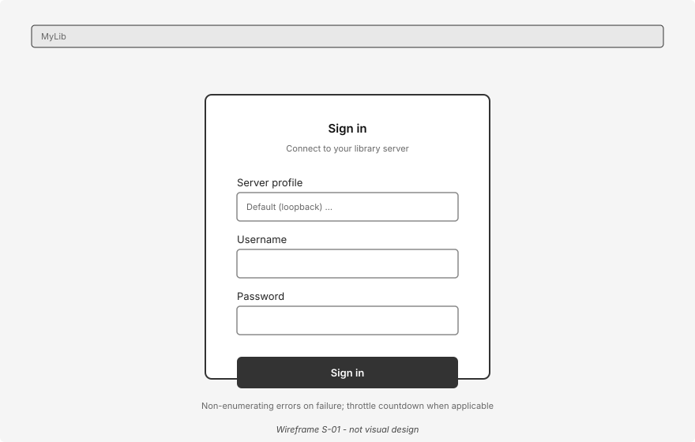
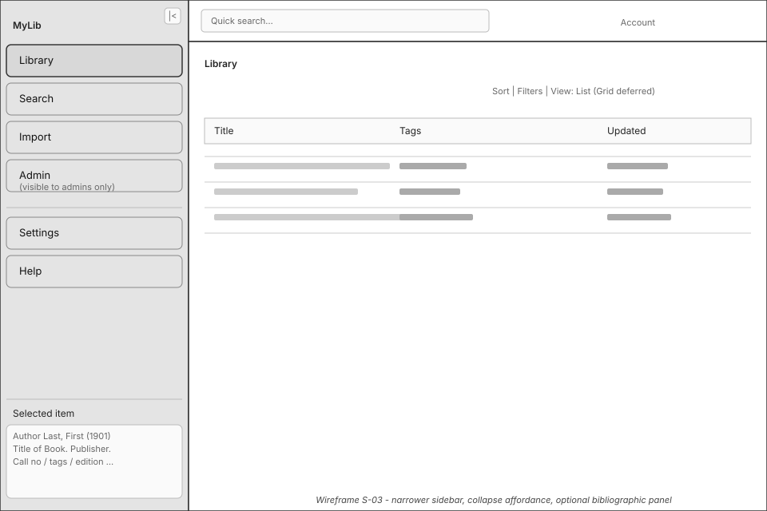
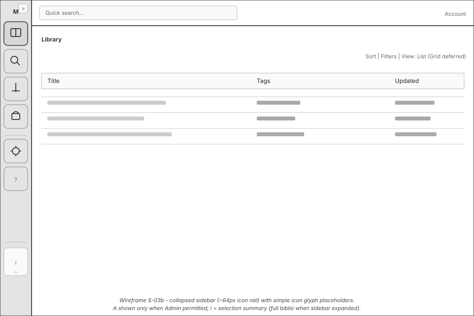
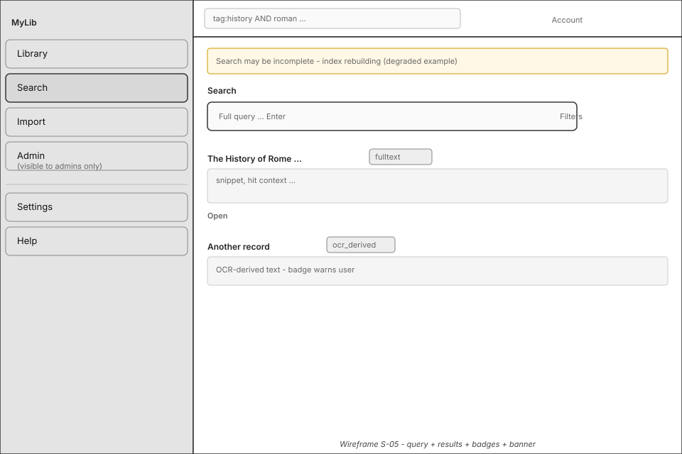
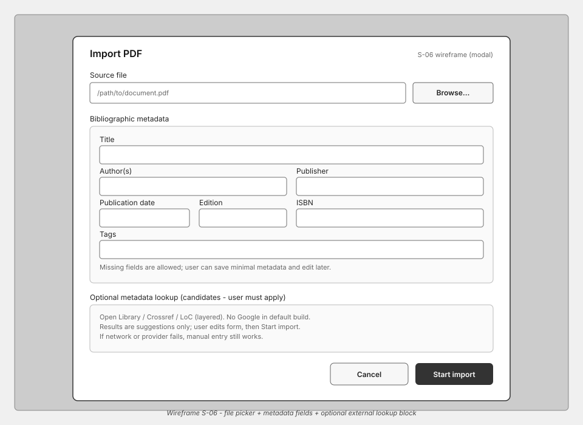

<!--
File: system-documentation/system-artifacts/shell-ui-ux-design.md

Purpose:
  Iterative UI/UX design record for HLA-SHELL (Qt Quick/QML + C++ bridge).
  Not a rigid template: sections grow as wireframes, flows, and decisions land.

Lifecycle:
  Subordinate to approved SRS, HLA, and DD. Authoritative for screen-level UX
  and visual/interaction design before HLA-SHELL UI implementation starts.
-->

# Shell UI/UX Design (HLA-SHELL)

**Project Name:** MyLib  
**Version:** 0.1  
**Date (YYYY-MM-DD):** 2026-04-28  
**Last revised (UTC):** 2026-04-28 — import metadata policy: user-confirmed only; optional lookups (Open Library, Crossref, LoC; **not** Google by default) per **DD §4.1.2.1**  
**Author(s):** Charles McKnight (maintainers may revise via change control)  
**Status:** Draft (SVG wireframes for gate screens; visual design not final)  
**Component:** **HLA-SHELL** — see [`dd.md`](dd.md "Dd") **§4.1**, [`hla.md`](hla.md "Hla") component table  

**Architecture Version Reference:** HLA v0.1.2 **Approved** ([`hla.md`](hla.md "Hla"))  
**Detailed Design Reference:** DD **§4.1 HLA-SHELL** ([`dd.md`](dd.md "Dd"))  
**Requirement touchpoints:** FR-019, FR-020, FR-021, FR-022, FR-024, FR-025, FR-029, FR-030, FR-031, FR-037, FR-039; NFR-006, NFR-007 (see DD §4.1 header for links)

---

## 1. Purpose and scope

This document captures **user-facing design intent** for the desktop shell: navigation, primary surfaces, critical flows, accessibility/theming expectations, and **decisions that are cheaper to revise here than in code**. It exists because **architecture and DD** specify *structure and authority boundaries*, not *wireframes, density, or interaction nuance*—where surprises typically appear.

**In scope:** Presentation and interaction for **HLA-SHELL** only (browse, search, document actions, settings, help/about/admin-visible surfaces, session UX).  

**Out of scope:** Server APIs (**DD §5**), non-shell components, and generic UI template methodology for other projects.

**Implementation gate (project rule until revised):** **HLA-SHELL** UI implementation SHOULD NOT begin until **§7** contains wireframe evidence for **S-01, S-03, S-05** *or* an explicit waiver in **§11**. **§4.4** provides **SVG wireframes** (structural, not brand/visual design). **§4**, **§6**, and **§11** contain **v1 baseline text**; additional screens can follow the same pattern.

---

## 2. Design goals and principles

Align with DD **§4.1** guardrails:

| Principle | Implication for UX |
| --------- | ------------------- |
| Server authority | Never imply “hidden UI = secure”; show honest locked/disabled states tied to server policy. |
| C++/bridge owns policy | QML expresses intent; labels and enabled states reflect **bridge-supplied** capability flags, not ad-hoc rules in `.qml`. |
| Accessibility (FR-024, NFR-006) | Critical paths keyboard-operable; shipped themes meet contrast targets; no sole reliance on color for state. |
| Honest degraded states (NFR-005) | Search/index/OCR/storage degradation visible without overstating quality or hiding failures. |
| Native reader handoff (FR-019–FR-021) | Clear affordance when opening externally; predictable fallback when in-app precision is insufficient (DD PDF/search-highlight posture). |

**Product personality (v1 baseline):** Calm, **library-first** density: prioritize scanability of lists and search results over decorative chrome. Administrator affordances stay **secondary** (separate nav section, no clutter on default paths). Default emotional tone: **neutral-professional**—errors are explicit, not playful. Solo deployments should not feel “enterprise heavy”; hide or soften multi-tenant labels when the bridge reports a single-tenant or solo profile.

---

## 3. Personas and modes

| Actor | Shell posture | Notes |
| ----- | ------------- | ----- |
| Standard user | Browse, search, open, preferences, help | Tenant-scoped visibility per server |
| Administrator | Above + admin surfaces (FR-031, FR-039, …) | RBAC reflects server; UI mirrors **effective_permissions** (informational only—server decides) |
| Solo operator | Same patterns; deployment assumed loopback | Prefer concise copy; optional “Advanced” disclosure for tenant/admin chrome |

**Session modes:** logged out → authenticated → optional **must-change-password** restricted mode (align with **DD §5** auth payloads). In **must-change-password**, **Library** and **Search** remain reachable only if server policy allows restricted sessions; otherwise show only password-change surface (**S-01** variant).

---

## 4. Information architecture (navigation model)

### 4.1 v1 baseline: persistent sidebar + content stack

| Element | Decision |
| ------- | -------- |
| **Primary navigation** | **Left sidebar**, fixed width **default ~220–240 px**, **collapsible** to icons-only (≈64 px) for small displays; explicit collapse affordance shown near sidebar header; collapse state persisted as client preference. |
| **Content area** | Single **stack** of main surfaces; **no** permanent split document pane in v1 (record detail uses full content width or overlay drawer—see **S-04**). |
| **Top bar** | Thin **command strip**: global search query box (quick entry to **S-05**), account/session menu (avatar or initials), optional sync/status indicator when server degraded. |
| **Ordering (top → bottom)** | Library · Search · Import · Admin (if visible) · spacer · Settings · Help — **Admin** is hidden for non-admin users and placed before utility items so default user journeys remain uncluttered. |

### 4.2 Routes / default landing

| Route | Screen ID | When |
| ----- | --------- | ---- |
| After successful login | **S-03 Library** | Unless **must-change-password** forces password UI only |
| App cold start, session valid | **S-03** | Restore last sidebar selection if persisted; else Library |
| App cold start, no session | **S-01 Login** | |
| Deep links | *Deferred* | Log in **§11** if product later supports URI open |

### 4.3 Import placement

**Import** keeps a dedicated sidebar entry so **duplicate-decision** and long-running ingest status remain discoverable (**FR-004**, **FR-010**). To reduce redundancy in v1, **S-03** no longer repeats Import as a primary toolbar button; Import starts from the nav item.

### 4.3.1 Sidebar bottom context area (optional in v1)

A compact, read-only bibliographic snippet block may appear at the **bottom of the sidebar** for the currently selected record (author/title/publisher or equivalent citation fragment). This helps justify moderate sidebar width without adding extra panels in main content. Keep this area non-editable in v1. When the rail is **collapsed** to icon-only, the same information may appear as a **compact info affordance** (e.g. tooltip, popover, or icon) until the user expands the sidebar; see **S-03b** in **§4.4**.

### 4.4 Wireframe figures (SVG, v1 structural)

Grayscale **layout** wireframes only—box-and-label fidelity for engineering alignment, not final branding, spacing, or typography. Source files live in [`img/`](img/ "Diagram Assets").

**S-01 — Login**

**S-03a — Library, expanded sidebar (default width)**

**S-03b — Library, collapsed sidebar (icon rail ~64px)**

**S-05 — Search (selected nav, results, degraded banner example)**

**S-06 — Import dialog (file chooser + bibliographic metadata)**

---

## 5. Screen and surface inventory (v1)

| ID | Surface | Purpose | Primary FR/NFR | Wireframe ref | Status |
| -- | ------- | ------- | ---------------- | ------------- | ------ |
| S-01 | Login / session recovery | Credentials, server profile picker if multi-endpoint, throttle messaging | FR-016 UX | [`img/shell-login.svg`](img/shell-login.svg) · §4.4 | Baseline spec §6.1 |
| S-02 | Bootstrap / first admin | Only when server reports bootstrap incomplete; else hidden | FR-032 | | Baseline (rare path) |
| S-03 | Library browse | Paginated list or grid; sort; filters; opening detail | FR-037 | [`img/shell-library.svg`](img/shell-library.svg) (expanded), [`img/shell-library-collapsed.svg`](img/shell-library-collapsed.svg) (collapsed) · §4.4 | Baseline spec |
| S-04 | Record detail / metadata | Title, tags, fields, version indicator; edit vs view | FR-002–003, FR-040–041 | | Baseline spec |
| S-05 | Search | Query bar (synced with top bar), results list, snippets, match-type badges | FR-007–008, FR-038 | [`img/shell-search.svg`](img/shell-search.svg) · §4.4 | Baseline spec §6.2 |
| S-06 | Import & ingest | Start import; job list; **duplicate decision** modal/sheet when gated | FR-004, FR-010 | [`img/shell-import.svg`](img/shell-import.svg) · §4.4 | Baseline spec §6.3 |
| S-07 | Open / reader handoff | Confirmation when launching external reader; preference hints FR-021 | FR-019–FR-021 | | Baseline spec |
| S-08 | Missing file / relink | Banner or inline block on **S-04** + guided relink flow | FR-011 | | Baseline spec |
| S-09 | Settings | Tabs: General, Appearance (theme FR-022), Readers (FR-021), Client logging (FR-029), Connection | FR-020, FR-022, FR-029 | | Baseline spec |
| S-10 | Help / About / release | Help entry (NFR-007); version/legal (FR-030, NFR-003) | FR-030, NFR-007 | | Baseline spec |
| S-11 | Admin hub | Landing cards or sub-nav: Users, Roles/Tenants as applicable, Index ops (FR-039), ops shortcuts | FR-031, FR-039 | | Baseline spec §6.5–§6.6 |
| S-12 | Global patterns | Toasts for transient success; **blocking modal** for destructive confirm; **inline banner** for degraded server/search | cross-cutting | | Pattern doc below |

**S-04 layout note:** v1 uses **detail as main column**; metadata editor inline. If vertical space is tight, **tags** may wrap; long text fields use expandable sections.

---

## 6. Critical user flows (v1)

Shell maps server envelope statuses to DD **§4.1.2** presentation (no new status names in QML).

### 6.1 Login → library

**Preconditions:** Server reachable (or solo offline discovery per client profile); user has credentials unless bootstrap path.

**Happy path:**

1. User opens app → **S-01** if no valid session; else **S-03**.
2. On **S-01**, user enters username/password (and profile if applicable) → submit.
3. Bridge calls login; on **`completed`**, bridge stores session material, exposes **session policy** (roles, `must_change_password`).
4. If normal session → navigate **S-03 Library**, focus first list item or “empty library” state.
5. Sidebar reflects **Admin** visibility from bridge capability flags.

**Branches:**

| Condition | UX |
| --------- | -- |
| `rejected_validation` | Inline field errors; no generic “login failed” if fields invalid |
| `rejected_authentication` / throttle | Single non-enumerating message per **FR-016** / **FR-034**; optional backoff countdown |
| `must_change_password` | Modal or dedicated panel: forced password change; limited nav until **`completed`** from password API |
| `failed_unavailable` | Full-page friendly outage; Retry button; preserve correlation id in copy-to-support |
| Bootstrap incomplete | Route to **S-02** if offered by server; otherwise message to complete bootstrap per operator docs |

### 6.2 Search → open result → native reader

**Preconditions:** Authenticated session with **search.query** permission (bridge).

**Happy path:**

1. User types query in **top bar** or navigates to **S-05** → submits search.
2. **S-05** shows results with **snippet**, **match_type** badge (fulltext / keyword_fallback / ocr_derived), optional tenant scope chip.
3. User selects row → **preview** optional (snippet expand); primary action **Open**.
4. Bridge requests **storage/open** per **DD §5**; on success, shell invokes OS handoff (FR-019); show transient toast “Opening in …” when reader identity known.

**Branches:**

| Condition | UX |
| --------- | -- |
| `completed_with_warnings` / degraded index | Banner on **S-05**: “Search may be incomplete” + `next_action_hint` if present |
| OCR-derived hit | Badge + tooltip “text from OCR”; never imply pixel-perfect location |
| Open **`failed_unavailable`** | Dialog: file missing / unreadable; link **Resolve** → **S-08** path |
| PDF in-app highlight insufficient (DD posture) | Offer **Open in reader** with page/snippet context; no silent failure |

### 6.3 Import → duplicate decision → completion

1. User opens **S-06** → chooses PDF source via file picker, reviews/edits bibliographic fields (title, author, publisher, publication date, edition, tags, ISBN), then submits **import**.
2. Bridge shows job row; poll or push refresh for state **`awaiting_duplicate_decision`**.
3. Present **duplicate summary** (non-sensitive): existing record title/id class, digest match statement without leaking paths.
4. User selects **cancel / use existing / proceed with new copy** per **DD §5.3.16** vocabulary → POST decision.
5. On completion, toast + optional “View record” → **S-04**.

**Failure:** `rejected_forbidden` → explain admin/import permission; `deferred` → show **resume** hint from envelope.

**Metadata enrichment (optional, user-gated):** Hints may come from (1) embedded PDF metadata when credible, (2) lightweight text-extraction heuristics, (3) **layered** external catalog queries. Shipped default provider set targets **Open Library**, **Crossref** (DOI / scholarly), and **Library of Congress**-style search where applicable. **Google Books is excluded** from the default product path (operational pain); operators MAY add custom connectors outside defaults. **Nothing auto-commits:** every lookup returns **candidates**; the user edits the form and explicitly starts import. v1 MUST keep a complete manual path and MUST NOT block import when the network or providers are unavailable.

### 6.4 Edit metadata → optimistic conflict

1. From **S-04**, user edits fields → **Save**.
2. Bridge sends PATCH with **version_token**; on **`rejected_conflict`**, show diff-style message: “Record changed elsewhere”; actions **Reload** (discard edits) / **Retry** after refresh.

### 6.5 Admin: account / role change

1. **S-11** → Users → list/search users → select → edit roles/tenant memberships per **§5.3.12** admin payloads.
2. **Last-admin** safeguards: blocking dialog referencing policy code **`last_admin_blocked`**—no dismiss-only workaround copy.

### 6.6 Index rebuild (admin surface)

1. **S-11** → Index / search maintenance → show current index health from API if exposed.
2. **Trigger rebuild** → confirm modal (maintenance vs online per DD); show **operation_id** and link to progress or poll status.
3. Non-admin: **Admin** nav hidden; direct navigation attempts show **rejected_forbidden** styled consistently with **S-12**.

---

## 7. Wireframes, mockups, and design artifacts

**Rule:** Log each iteration so the team does not debate “which frame is current.”

| Date | Artifact | Tool / location | Notes |
| ---- | -------- | ---------------- | ----- |
| 2026-04-28 | Text baseline (this doc §4–§6) | Markdown | IA + flows |
| 2026-04-28 | SVG structural wireframes | [`img/shell-login.svg`](img/shell-login.svg), [`img/shell-library.svg`](img/shell-library.svg), [`img/shell-search.svg`](img/shell-search.svg) | Embedded in **§4.4**; revise SVG or replace with hi-fi later |
| 2026-04-28 | S-03 revision pass (feedback) | [`img/shell-library.svg`](img/shell-library.svg) | Narrower sidebar, explicit collapse affordance, optional bibliographic sidebar footer, Admin visibility note, Import de-duplicated from page toolbar |
| 2026-04-28 | S-03b collapsed rail | [`img/shell-library-collapsed.svg`](img/shell-library-collapsed.svg) | Paired with expanded **S-03a**; ~64px icon column, same main list |
| 2026-04-28 | S-06 import dialog | [`img/shell-import.svg`](img/shell-import.svg) | Modal includes file chooser, manual metadata entry, optional lookup block |
| 2026-04-28 | S-06 lookup policy | [`img/shell-import.svg`](img/shell-import.svg) | Layered providers named (Open Library, Crossref, LoC); Google excluded from defaults; user confirms all fields |

---

## 8. Qt Quick / QML direction (non-code binding)

Not implementation authorization—naming guidance for engineering alignment with DD **§4.1** bridge.

| Shell area | Suggested QML owner / loader | Notes |
| ---------- | --------------------------- | ----- |
| App shell | `AppWindow.qml` | Hosts sidebar + stack |
| Navigation | `SidebarNav.qml` | Data-driven `ListModel` from bridge (id, label, icon, visible) |
| Library | `LibraryPage.qml`, `RecordListView.qml` | Virtualized list |
| Search | `SearchPage.qml`, `SearchResultsView.qml` | Shared query binding with top bar |
| Detail | `RecordDetailPage.qml` | Metadata form components |
| Modals | `ConfirmDialog.qml`, `ErrorBanner.qml` | Map status taxonomy |

**Shared controls:** `TagChip`, `StatusBadge` (match_type, degraded), `CorrelationFooter` (support copy, optional), `ServerHealthBanner`.

**Theming (FR-022):** Three shipped themes **Light**, **Dark**, **Sepia/Warm**—implement as **Qt Quick Controls 2** `Universal`/`Fusion` style + **singleton `Theme` QObject** exposing palette properties consumed by QML `Qt.styleHints` / custom `ColorSet`. Contrast checks per **NFR-006** against **§9** matrix.

---

## 9. Accessibility and theme (verification hooks)

**FR-024 — keyboard / AT**

- **Tab order:** Sidebar → content primary action → destructive actions last within surface.
- **Focus:** Visible focus ring on all interactive controls (not hairline-only).
- **Labels:** Every icon-only control exposes `Accessible.name` (Import, Admin, Account).
- **Live regions:** Use polite announcements for async search complete / import job state change.

**NFR-006 — contrast matrix (to verify on implementation builds)**

| Theme | Normal text | Large text | Non-text UI |
| ----- | ------------- | ---------- | ----------- |
| Light | TBD measured | TBD | Focus, buttons, tags |
| Dark | TBD | TBD | Same |
| Sepia | TBD | TBD | Same |

**NFR-007 — Help discoverability:** **Help** always last in sidebar; optional **F1** shortcut (platform-standard); first-run optional tip points to Help (bridge flag `first_run`).

---

## 10. Copy and terminology

| Term | UI usage |
| ---- | -------- |
| Library | Default product metaphor for the corpus; “Catalog” acceptable in technical admin copy |
| Record | Single indexed item; not “document” if format-ambiguous |
| Tenant | Shown when multi-tenant; hide label in solo |
| Index | User-facing for search index; admins see rebuild ops |

English v1 (**FR-025**). Error strings follow server safe summaries; never echo raw policy tokens to end users unless designated operator mode.

---

## 11. Open questions and decisions log

| Date | Topic | Decision | Follow-up |
| ---- | ----- | -------- | --------- |
| 2026-04-28 | Document created | Shell UX deferred until this artifact matures | Ongoing |
| 2026-04-28 | Navigation pattern | **Left sidebar + top query strip + content stack** | Wireframes §7 |
| 2026-04-28 | Default landing | **S-03 Library** after login | — |
| 2026-04-28 | Import discoverability | Dedicated sidebar **Import**; removed redundant Library toolbar Import in v1 | Validate with usability pass |
| 2026-04-28 | Import metadata strategy | Manual entry baseline; layered lookups (Open Library, Crossref, LoC); **no auto-commit**; **Google excluded** from defaults | Align implementation with **DD §4.1.2.1** |
| 2026-04-28 | Implementation gate | SVG wireframes for **S-01, S-03, S-05** added **§4.4** | Gate satisfied for structural shell; hi-fi optional |
| 2026-04-28 | Admin nav visibility | **Admin hidden for non-admin users**; bridge capability flags remain source of truth | Covered by RBAC verification |
| 2026-04-28 | Sidebar expanded vs collapsed | **S-03a** + **S-03b** wireframes in **§4.4** document both states | — |
| *Open* | Grid/shelf view vs list default for Library | Start **list** for accessibility predictability; **thumbnail bookshelf/grid deferred as nice-to-have** | User research / preference |
| *Open* | In-app PDF preview for v1? | *Deferred* — handoff-first per DD; revisit if scope adds viewer | §11 |
| *Open* | Notification channel for FR-011 multi-user | In-app banner + **S-11** digest vs email — **product decision** | HLA DD-carried |

---

## 12. Traceability to tests

Shell-related tests include **`TP-NFR-003`**, **`TP-NFR-004`**, and catalog/search/admin suites — see [`test-plan.md`](test-plan.md "Test Plan"). Executable steps SHOULD reference **screen IDs (S-xx)** from **§5** once wireframes stabilize.

---

## 13. Approval

This document uses **rolling approval**: minor iterations do not require full re-approval; **material navigation or flow changes** SHOULD be noted in **§11** and synced with DD **§4.1** if boundaries shift.

Approved By: *— optional sign-off after review of §4.4 SVGs —*  
Role:  
Date:  

---

End of Shell UI/UX Design
